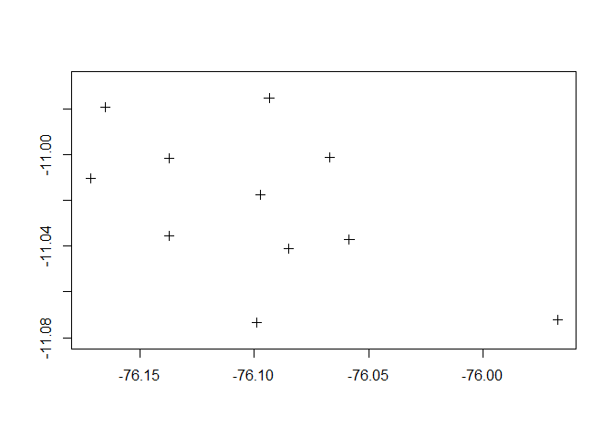

Operaciones con tables
================

``` r
#Institución: Unidades Tecnológicas de Santander
# Programa: Ingenieria en Topografía
# Autor: "Aponte Saravia Jhonathan"
```

### Descripción de contexto

A continuación, se muestra la réplica de la ejecución de las operaciones
básicas con la tabla de atributos desarrollados por Donovan (2019),
aplicando la librería dplyr, y utilizando las tablas compartidas en su
Github del mismo autor, el propósito difundir las bondades que brinda el
programa R Package en la organización de los datos contenida en la
estructura de tabla. Además, se intenta de mostrar los pasos a seguir
para importar valores de coordenadas para convertir en datos de tipo
shapefile.

``` r
library(dplyr)
```

    ## 
    ## Attaching package: 'dplyr'

    ## The following objects are masked from 'package:stats':
    ## 
    ##     filter, lag

    ## The following objects are masked from 'package:base':
    ## 
    ##     intersect, setdiff, setequal, union

``` r
excel_data <- read.csv("E:/A_UTS/2021-II/Curso geografia y sistemas de informacion geografica II/Modulo 3 Fundamentos de infraestructura de datos espaciales/Taller/data/AOSI_small.csv", na.strings=c(".", " "))
excel_data
```

    ##    Identifiers  GROUP Study_Site Gender V06.aosi.Candidate_Age
    ## 1            1 HR_ASD        PHI   Male                    7.1
    ## 2            2 HR_ASD        PHI   Male                    6.1
    ## 3            3 HR_ASD        PHI   Male                    6.6
    ## 4            4 HR_ASD        PHI   Male                     NA
    ## 5            5 HR_neg        PHI   Male                    6.8
    ## 6            6 HR_neg        PHI   Male                     NA
    ## 7            7 HR_ASD        PHI   Male                    6.2
    ## 8            8 HR_ASD        PHI   Male                    6.2
    ## 9            9 HR_neg        PHI   Male                     NA
    ## 10          10 HR_ASD        PHI   Male                     NA
    ##    V06.aosi.total_score_1_18 V12.aosi.Candidate_Age V12.aosi.total_score_1_18
    ## 1                          8                   12.5                         3
    ## 2                         18                   12.4                        10
    ## 3                          4                   12.9                         2
    ## 4                         NA                   12.7                         3
    ## 5                          6                     NA                        NA
    ## 6                         NA                   12.1                         4
    ## 7                         16                   12.3                         4
    ## 8                         10                   12.2                        14
    ## 9                         NA                   12.4                         1
    ## 10                        NA                   12.2                         7

``` r
# Seleccionando datos por filto 
select(excel_data, Identifiers, GROUP)
```

    ##    Identifiers  GROUP
    ## 1            1 HR_ASD
    ## 2            2 HR_ASD
    ## 3            3 HR_ASD
    ## 4            4 HR_ASD
    ## 5            5 HR_neg
    ## 6            6 HR_neg
    ## 7            7 HR_ASD
    ## 8            8 HR_ASD
    ## 9            9 HR_neg
    ## 10          10 HR_ASD

``` r
# Remover  columnas de la tabla
select(excel_data, -Gender, -Study_Site)
```

    ##    Identifiers  GROUP V06.aosi.Candidate_Age V06.aosi.total_score_1_18
    ## 1            1 HR_ASD                    7.1                         8
    ## 2            2 HR_ASD                    6.1                        18
    ## 3            3 HR_ASD                    6.6                         4
    ## 4            4 HR_ASD                     NA                        NA
    ## 5            5 HR_neg                    6.8                         6
    ## 6            6 HR_neg                     NA                        NA
    ## 7            7 HR_ASD                    6.2                        16
    ## 8            8 HR_ASD                    6.2                        10
    ## 9            9 HR_neg                     NA                        NA
    ## 10          10 HR_ASD                     NA                        NA
    ##    V12.aosi.Candidate_Age V12.aosi.total_score_1_18
    ## 1                    12.5                         3
    ## 2                    12.4                        10
    ## 3                    12.9                         2
    ## 4                    12.7                         3
    ## 5                      NA                        NA
    ## 6                    12.1                         4
    ## 7                    12.3                         4
    ## 8                    12.2                        14
    ## 9                    12.4                         1
    ## 10                   12.2                         7

``` r
# Incluyendo solo observaciones asociados a un dato de cierta columna 

filter(excel_data, GROUP=="HR_ASD")
```

    ##   Identifiers  GROUP Study_Site Gender V06.aosi.Candidate_Age
    ## 1           1 HR_ASD        PHI   Male                    7.1
    ## 2           2 HR_ASD        PHI   Male                    6.1
    ## 3           3 HR_ASD        PHI   Male                    6.6
    ## 4           4 HR_ASD        PHI   Male                     NA
    ## 5           7 HR_ASD        PHI   Male                    6.2
    ## 6           8 HR_ASD        PHI   Male                    6.2
    ## 7          10 HR_ASD        PHI   Male                     NA
    ##   V06.aosi.total_score_1_18 V12.aosi.Candidate_Age V12.aosi.total_score_1_18
    ## 1                         8                   12.5                         3
    ## 2                        18                   12.4                        10
    ## 3                         4                   12.9                         2
    ## 4                        NA                   12.7                         3
    ## 5                        16                   12.3                         4
    ## 6                        10                   12.2                        14
    ## 7                        NA                   12.2                         7

``` r
# incluyendo solo los datos donde selelecione un rango de valores 

filter(excel_data, GROUP=="HR_ASD" & V06.aosi.total_score_1_18>=10)
```

    ##   Identifiers  GROUP Study_Site Gender V06.aosi.Candidate_Age
    ## 1           2 HR_ASD        PHI   Male                    6.1
    ## 2           7 HR_ASD        PHI   Male                    6.2
    ## 3           8 HR_ASD        PHI   Male                    6.2
    ##   V06.aosi.total_score_1_18 V12.aosi.Candidate_Age V12.aosi.total_score_1_18
    ## 1                        18                   12.4                        10
    ## 2                        16                   12.3                         4
    ## 3                        10                   12.2                        14

``` r
# filtrar las observaciones que consideren solo a genero femenino
filter(excel_data, Gender=="Female") 
```

    ## [1] Identifiers               GROUP                    
    ## [3] Study_Site                Gender                   
    ## [5] V06.aosi.Candidate_Age    V06.aosi.total_score_1_18
    ## [7] V12.aosi.Candidate_Age    V12.aosi.total_score_1_18
    ## <0 rows> (or 0-length row.names)

``` r
filter(excel_data, Gender=="Male") 
```

    ##    Identifiers  GROUP Study_Site Gender V06.aosi.Candidate_Age
    ## 1            1 HR_ASD        PHI   Male                    7.1
    ## 2            2 HR_ASD        PHI   Male                    6.1
    ## 3            3 HR_ASD        PHI   Male                    6.6
    ## 4            4 HR_ASD        PHI   Male                     NA
    ## 5            5 HR_neg        PHI   Male                    6.8
    ## 6            6 HR_neg        PHI   Male                     NA
    ## 7            7 HR_ASD        PHI   Male                    6.2
    ## 8            8 HR_ASD        PHI   Male                    6.2
    ## 9            9 HR_neg        PHI   Male                     NA
    ## 10          10 HR_ASD        PHI   Male                     NA
    ##    V06.aosi.total_score_1_18 V12.aosi.Candidate_Age V12.aosi.total_score_1_18
    ## 1                          8                   12.5                         3
    ## 2                         18                   12.4                        10
    ## 3                          4                   12.9                         2
    ## 4                         NA                   12.7                         3
    ## 5                          6                     NA                        NA
    ## 6                         NA                   12.1                         4
    ## 7                         16                   12.3                         4
    ## 8                         10                   12.2                        14
    ## 9                         NA                   12.4                         1
    ## 10                        NA                   12.2                         7

``` r
# Reordenada la edad de manea creciente
arrange(excel_data, GROUP, V12.aosi.Candidate_Age) 
```

    ##    Identifiers  GROUP Study_Site Gender V06.aosi.Candidate_Age
    ## 1            8 HR_ASD        PHI   Male                    6.2
    ## 2           10 HR_ASD        PHI   Male                     NA
    ## 3            7 HR_ASD        PHI   Male                    6.2
    ## 4            2 HR_ASD        PHI   Male                    6.1
    ## 5            1 HR_ASD        PHI   Male                    7.1
    ## 6            4 HR_ASD        PHI   Male                     NA
    ## 7            3 HR_ASD        PHI   Male                    6.6
    ## 8            6 HR_neg        PHI   Male                     NA
    ## 9            9 HR_neg        PHI   Male                     NA
    ## 10           5 HR_neg        PHI   Male                    6.8
    ##    V06.aosi.total_score_1_18 V12.aosi.Candidate_Age V12.aosi.total_score_1_18
    ## 1                         10                   12.2                        14
    ## 2                         NA                   12.2                         7
    ## 3                         16                   12.3                         4
    ## 4                         18                   12.4                        10
    ## 5                          8                   12.5                         3
    ## 6                         NA                   12.7                         3
    ## 7                          4                   12.9                         2
    ## 8                         NA                   12.1                         4
    ## 9                         NA                   12.4                         1
    ## 10                         6                     NA                        NA

``` r
#de menera decreciente 
arrange(excel_data, GROUP, desc(V06.aosi.Candidate_Age)) 
```

    ##    Identifiers  GROUP Study_Site Gender V06.aosi.Candidate_Age
    ## 1            1 HR_ASD        PHI   Male                    7.1
    ## 2            3 HR_ASD        PHI   Male                    6.6
    ## 3            7 HR_ASD        PHI   Male                    6.2
    ## 4            8 HR_ASD        PHI   Male                    6.2
    ## 5            2 HR_ASD        PHI   Male                    6.1
    ## 6            4 HR_ASD        PHI   Male                     NA
    ## 7           10 HR_ASD        PHI   Male                     NA
    ## 8            5 HR_neg        PHI   Male                    6.8
    ## 9            6 HR_neg        PHI   Male                     NA
    ## 10           9 HR_neg        PHI   Male                     NA
    ##    V06.aosi.total_score_1_18 V12.aosi.Candidate_Age V12.aosi.total_score_1_18
    ## 1                          8                   12.5                         3
    ## 2                          4                   12.9                         2
    ## 3                         16                   12.3                         4
    ## 4                         10                   12.2                        14
    ## 5                         18                   12.4                        10
    ## 6                         NA                   12.7                         3
    ## 7                         NA                   12.2                         7
    ## 8                          6                     NA                        NA
    ## 9                         NA                   12.1                         4
    ## 10                        NA                   12.4                         1

``` r
## Mutar y resumir 
# estas funciones nos permiten  crear nuevas variables para agregar al conjunto de los datos

HR_data <- read.csv("E:/A_UTS/2021-II/Curso geografia y sistemas de informacion geografica II/Modulo 3 Fundamentos de infraestructura de datos espaciales/Taller/data//Cross-sec_full.csv", na.strings=c(".", " ")) 
HR_data <- filter(HR_data, V24.demographics.Risk=="HR")
HR_data
```

    ##     Identifiers SSM_ASD_v24 V24.demographics.Risk  GROUP Study_Site Gender
    ## 1             1     YES_ASD                    HR HR_ASD        PHI   Male
    ## 2             2     YES_ASD                    HR HR_ASD        PHI   Male
    ## 3             3     YES_ASD                    HR HR_ASD        PHI   Male
    ## 4             4     YES_ASD                    HR HR_ASD        PHI   Male
    ## 5             5      NO_ASD                    HR HR_neg        PHI   Male
    ## 6             6      NO_ASD                    HR HR_neg        PHI   Male
    ## 7             7     YES_ASD                    HR HR_ASD        PHI   Male
    ## 8             8     YES_ASD                    HR HR_ASD        PHI   Male
    ## 9             9      NO_ASD                    HR HR_neg        PHI   Male
    ## 10           10     YES_ASD                    HR HR_ASD        PHI   Male
    ## 11           11      NO_ASD                    HR HR_neg        PHI   Male
    ## 12           12      NO_ASD                    HR HR_neg        PHI   Male
    ## 13           13      NO_ASD                    HR HR_neg        PHI Female
    ## 14           14      NO_ASD                    HR HR_neg        PHI   Male
    ## 15           16      NO_ASD                    HR HR_neg        PHI Female
    ## 16           17     YES_ASD                    HR HR_ASD        PHI   Male
    ## 17           18      NO_ASD                    HR HR_neg        PHI   Male
    ## 18           19      NO_ASD                    HR HR_neg        PHI Female
    ## 19           20      NO_ASD                    HR HR_neg        PHI Female
    ## 20           21      NO_ASD                    HR HR_neg        PHI   Male
    ## 21           22      NO_ASD                    HR HR_neg        PHI   Male
    ## 22           23      NO_ASD                    HR HR_neg        PHI Female
    ## 23           24     YES_ASD                    HR HR_ASD        PHI   Male
    ## 24           25     YES_ASD                    HR HR_ASD        PHI   Male
    ## 25           26      NO_ASD                    HR HR_neg        PHI   Male
    ## 26           27      NO_ASD                    HR HR_neg        PHI Female
    ## 27           30      NO_ASD                    HR HR_neg        PHI Female
    ## 28           31      NO_ASD                    HR HR_neg        PHI   Male
    ## 29           34      NO_ASD                    HR HR_neg        PHI Female
    ## 30           36      NO_ASD                    HR HR_neg        PHI Female
    ## 31           38      NO_ASD                    HR HR_neg        PHI   Male
    ## 32           39     YES_ASD                    HR HR_ASD        PHI Female
    ## 33           40      NO_ASD                    HR HR_neg        PHI Female
    ## 34           44      NO_ASD                    HR HR_neg        PHI Female
    ## 35           45      NO_ASD                    HR HR_neg        PHI Female
    ## 36           46      NO_ASD                    HR HR_neg        PHI   Male
    ## 37           47      NO_ASD                    HR HR_neg        PHI Female
    ## 38           48      NO_ASD                    HR HR_neg        PHI   Male
    ## 39           55     YES_ASD                    HR HR_ASD        PHI   Male
    ## 40           56      NO_ASD                    HR HR_neg        PHI   Male
    ## 41           59      NO_ASD                    HR HR_neg        PHI Female
    ## 42           60      NO_ASD                    HR HR_neg        PHI Female
    ## 43           61      NO_ASD                    HR HR_neg        PHI Female
    ## 44           63     YES_ASD                    HR HR_ASD        PHI   Male
    ## 45           64     YES_ASD                    HR HR_ASD        PHI   Male
    ## 46           65     YES_ASD                    HR HR_ASD        PHI   Male
    ## 47           67      NO_ASD                    HR HR_neg        PHI   Male
    ## 48           68      NO_ASD                    HR HR_neg        PHI   Male
    ## 49           69      NO_ASD                    HR HR_neg        PHI Female
    ## 50           70     YES_ASD                    HR HR_ASD        PHI   Male
    ## 51           71     YES_ASD                    HR HR_ASD        PHI   Male
    ## 52           74     YES_ASD                    HR HR_ASD        PHI   Male
    ## 53           77      NO_ASD                    HR HR_neg        PHI   Male
    ## 54           78      NO_ASD                    HR HR_neg        PHI   Male
    ## 55           80      NO_ASD                    HR HR_neg        PHI   Male
    ## 56           81      NO_ASD                    HR HR_neg        PHI Female
    ## 57           82      NO_ASD                    HR HR_neg        PHI   Male
    ## 58           83      NO_ASD                    HR HR_neg        PHI Female
    ## 59           84      NO_ASD                    HR HR_neg        PHI   Male
    ## 60           86      NO_ASD                    HR HR_neg        PHI Female
    ## 61           87     YES_ASD                    HR HR_ASD        PHI   Male
    ## 62           88      NO_ASD                    HR HR_neg        PHI Female
    ## 63           89     YES_ASD                    HR HR_ASD        PHI   Male
    ## 64           90      NO_ASD                    HR HR_neg        PHI Female
    ## 65           91      NO_ASD                    HR HR_neg        PHI Female
    ## 66           93      NO_ASD                    HR HR_neg        PHI Female
    ## 67           94      NO_ASD                    HR HR_neg        PHI   Male
    ## 68           95      NO_ASD                    HR HR_neg        PHI   Male
    ## 69           97      NO_ASD                    HR HR_neg        PHI   Male
    ## 70           98      NO_ASD                    HR HR_neg        PHI   Male
    ## 71           99      NO_ASD                    HR HR_neg        PHI   Male
    ## 72          100      NO_ASD                    HR HR_neg        PHI   Male
    ## 73          101      NO_ASD                    HR HR_neg        PHI Female
    ## 74          102      NO_ASD                    HR HR_neg        PHI   Male
    ## 75          104      NO_ASD                    HR HR_neg        PHI   Male
    ## 76          105      NO_ASD                    HR HR_neg        PHI   Male
    ## 77          106      NO_ASD                    HR HR_neg        PHI Female
    ## 78          108      NO_ASD                    HR HR_neg        PHI   Male
    ## 79          109      NO_ASD                    HR HR_neg        PHI   Male
    ## 80          110      NO_ASD                    HR HR_neg        PHI Female
    ## 81          111      NO_ASD                    HR HR_neg        PHI Female
    ## 82          112      NO_ASD                    HR HR_neg        PHI Female
    ## 83          113      NO_ASD                    HR HR_neg        PHI Female
    ## 84          114      NO_ASD                    HR HR_neg        PHI Female
    ## 85          115      NO_ASD                    HR HR_neg        PHI Female
    ## 86          116     YES_ASD                    HR HR_ASD        PHI   Male
    ## 87          117      NO_ASD                    HR HR_neg        PHI   Male
    ## 88          118      NO_ASD                    HR HR_neg        PHI Female
    ## 89          119      NO_ASD                    HR HR_neg        PHI Female
    ## 90          120      NO_ASD                    HR HR_neg        PHI   Male
    ## 91          121     YES_ASD                    HR HR_ASD        PHI   Male
    ## 92          122      NO_ASD                    HR HR_neg        PHI   Male
    ## 93          123     YES_ASD                    HR HR_ASD        PHI   Male
    ## 94          124      NO_ASD                    HR HR_neg        PHI Female
    ## 95          125      NO_ASD                    HR HR_neg        PHI Female
    ## 96          126      NO_ASD                    HR HR_neg        PHI   Male
    ## 97          127      NO_ASD                    HR HR_neg        PHI   Male
    ## 98          129      NO_ASD                    HR HR_neg        PHI Female
    ## 99          130      NO_ASD                    HR HR_neg        PHI Female
    ## 100         131      NO_ASD                    HR HR_neg        PHI   Male
    ## 101         132     YES_ASD                    HR HR_ASD        PHI Female
    ## 102         142      NO_ASD                    HR HR_neg        PHI Female
    ## 103         143      NO_ASD                    HR HR_neg        PHI   Male
    ## 104         144     YES_ASD                    HR HR_ASD        PHI   Male
    ## 105         145      NO_ASD                    HR HR_neg        PHI   Male
    ## 106         146      NO_ASD                    HR HR_neg        PHI Female
    ## 107         148     YES_ASD                    HR HR_ASD        PHI Female
    ## 108         149     YES_ASD                    HR HR_ASD        PHI   Male
    ## 109         150     YES_ASD                    HR HR_ASD        SEA   Male
    ## 110         152      NO_ASD                    HR HR_neg        SEA   Male
    ## 111         153      NO_ASD                    HR HR_neg        SEA   Male
    ## 112         154      NO_ASD                    HR HR_neg        SEA   Male
    ## 113         155      NO_ASD                    HR HR_neg        SEA   Male
    ## 114         156      NO_ASD                    HR HR_neg        SEA   Male
    ## 115         157      NO_ASD                    HR HR_neg        SEA   Male
    ## 116         158     YES_ASD                    HR HR_ASD        SEA Female
    ## 117         159      NO_ASD                    HR HR_neg        SEA   Male
    ## 118         160      NO_ASD                    HR HR_neg        SEA   Male
    ## 119         161      NO_ASD                    HR HR_neg        SEA   Male
    ## 120         162      NO_ASD                    HR HR_neg        SEA Female
    ## 121         163      NO_ASD                    HR HR_neg        SEA Female
    ## 122         164      NO_ASD                    HR HR_neg        SEA   Male
    ## 123         165     YES_ASD                    HR HR_ASD        SEA   Male
    ## 124         166      NO_ASD                    HR HR_neg        SEA Female
    ## 125         167     YES_ASD                    HR HR_ASD        SEA Female
    ## 126         168      NO_ASD                    HR HR_neg        SEA   Male
    ## 127         172      NO_ASD                    HR HR_neg        SEA Female
    ## 128         173      NO_ASD                    HR HR_neg        SEA Female
    ## 129         174      NO_ASD                    HR HR_neg        SEA   Male
    ## 130         175     YES_ASD                    HR HR_ASD        SEA Female
    ## 131         177      NO_ASD                    HR HR_neg        SEA   Male
    ## 132         178      NO_ASD                    HR HR_neg        SEA Female
    ## 133         180      NO_ASD                    HR HR_neg        SEA   Male
    ## 134         182     YES_ASD                    HR HR_ASD        SEA Female
    ## 135         185      NO_ASD                    HR HR_neg        SEA Female
    ## 136         186     YES_ASD                    HR HR_ASD        SEA   Male
    ## 137         187      NO_ASD                    HR HR_neg        SEA   Male
    ## 138         188      NO_ASD                    HR HR_neg        SEA   Male
    ## 139         191      NO_ASD                    HR HR_neg        SEA Female
    ## 140         192      NO_ASD                    HR HR_neg        SEA   Male
    ## 141         197      NO_ASD                    HR HR_neg        SEA   Male
    ## 142         199      NO_ASD                    HR HR_neg        SEA Female
    ## 143         200      NO_ASD                    HR HR_neg        SEA   Male
    ## 144         201      NO_ASD                    HR HR_neg        SEA   Male
    ## 145         202      NO_ASD                    HR HR_neg        SEA   Male
    ## 146         203      NO_ASD                    HR HR_neg        SEA   Male
    ## 147         205      NO_ASD                    HR HR_neg        SEA Female
    ## 148         208      NO_ASD                    HR HR_neg        SEA Female
    ## 149         209      NO_ASD                    HR HR_neg        SEA   Male
    ## 150         210      NO_ASD                    HR HR_neg        SEA   Male
    ## 151         211      NO_ASD                    HR HR_neg        SEA Female
    ## 152         212      NO_ASD                    HR HR_neg        SEA   Male
    ## 153         213      NO_ASD                    HR HR_neg        SEA Female
    ## 154         214      NO_ASD                    HR HR_neg        SEA   Male
    ## 155         220      NO_ASD                    HR HR_neg        SEA   Male
    ## 156         221      NO_ASD                    HR HR_neg        SEA Female
    ## 157         222      NO_ASD                    HR HR_neg        SEA Female
    ## 158         223     YES_ASD                    HR HR_ASD        SEA   Male
    ## 159         224      NO_ASD                    HR HR_neg        SEA Female
    ## 160         226     YES_ASD                    HR HR_ASD        SEA   Male
    ## 161         231      NO_ASD                    HR HR_neg        SEA   Male
    ## 162         232     YES_ASD                    HR HR_ASD        SEA Female
    ## 163         233      NO_ASD                    HR HR_neg        SEA   Male
    ## 164         235      NO_ASD                    HR HR_neg        SEA   Male
    ## 165         236      NO_ASD                    HR HR_neg        SEA   Male
    ## 166         237     YES_ASD                    HR HR_ASD        SEA   Male
    ## 167         240     YES_ASD                    HR HR_ASD        SEA   Male
    ## 168         245     YES_ASD                    HR HR_ASD        SEA   Male
    ## 169         246      NO_ASD                    HR HR_neg        SEA Female
    ## 170         247     YES_ASD                    HR HR_ASD        SEA   Male
    ## 171         248      NO_ASD                    HR HR_neg        SEA Female
    ## 172         249      NO_ASD                    HR HR_neg        SEA   Male
    ## 173         250      NO_ASD                    HR HR_neg        SEA Female
    ## 174         251      NO_ASD                    HR HR_neg        SEA Female
    ## 175         253      NO_ASD                    HR HR_neg        SEA   Male
    ## 176         254      NO_ASD                    HR HR_neg        SEA Female
    ## 177         255     YES_ASD                    HR HR_ASD        SEA   Male
    ## 178         256      NO_ASD                    HR HR_neg        SEA Female
    ## 179         258      NO_ASD                    HR HR_neg        SEA   Male
    ## 180         260      NO_ASD                    HR HR_neg        SEA   Male
    ## 181         261      NO_ASD                    HR HR_neg        SEA   Male
    ## 182         262     YES_ASD                    HR HR_ASD        SEA   Male
    ## 183         263     YES_ASD                    HR HR_ASD        SEA Female
    ## 184         264     YES_ASD                    HR HR_ASD        SEA   Male
    ## 185         265     YES_ASD                    HR HR_ASD        SEA Female
    ## 186         266     YES_ASD                    HR HR_ASD        SEA   Male
    ## 187         267      NO_ASD                    HR HR_neg        SEA   Male
    ## 188         268     YES_ASD                    HR HR_ASD        SEA   Male
    ## 189         273      NO_ASD                    HR HR_neg        SEA   Male
    ## 190         276      NO_ASD                    HR HR_neg        SEA   Male
    ## 191         277      NO_ASD                    HR HR_neg        SEA Female
    ## 192         278      NO_ASD                    HR HR_neg        SEA   Male
    ## 193         279     YES_ASD                    HR HR_ASD        SEA Female
    ## 194         280      NO_ASD                    HR HR_neg        SEA   Male
    ## 195         282      NO_ASD                    HR HR_neg        SEA Female
    ## 196         283     YES_ASD                    HR HR_ASD        SEA   Male
    ## 197         286      NO_ASD                    HR HR_neg        SEA   Male
    ## 198         287     YES_ASD                    HR HR_ASD        SEA   Male
    ## 199         288      NO_ASD                    HR HR_neg        SEA Female
    ## 200         289     YES_ASD                    HR HR_ASD        SEA   Male
    ## 201         290     YES_ASD                    HR HR_ASD        SEA   Male
    ## 202         291      NO_ASD                    HR HR_neg        SEA Female
    ## 203         292      NO_ASD                    HR HR_neg        SEA   Male
    ## 204         293      NO_ASD                    HR HR_neg        SEA Female
    ## 205         295     YES_ASD                    HR HR_ASD        SEA   Male
    ## 206         296     YES_ASD                    HR HR_ASD        SEA Female
    ## 207         297      NO_ASD                    HR HR_neg        SEA Female
    ## 208         299      NO_ASD                    HR HR_neg        SEA Female
    ## 209         300      NO_ASD                    HR HR_neg        SEA   Male
    ## 210         301      NO_ASD                    HR HR_neg        STL Female
    ## 211         302      NO_ASD                    HR HR_neg        STL Female
    ## 212         303      NO_ASD                    HR HR_neg        STL Female
    ## 213         304      NO_ASD                    HR HR_neg        STL Female
    ## 214         305      NO_ASD                    HR HR_neg        STL   Male
    ## 215         306      NO_ASD                    HR HR_neg        STL   Male
    ## 216         307      NO_ASD                    HR HR_neg        STL   Male
    ## 217         308      NO_ASD                    HR HR_neg        STL   Male
    ## 218         309      NO_ASD                    HR HR_neg        STL Female
    ## 219         310      NO_ASD                    HR HR_neg        STL   Male
    ## 220         311      NO_ASD                    HR HR_neg        STL Female
    ## 221         312      NO_ASD                    HR HR_neg        STL   Male
    ## 222         313      NO_ASD                    HR HR_neg        STL   Male
    ## 223         314      NO_ASD                    HR HR_neg        STL   Male
    ## 224         315      NO_ASD                    HR HR_neg        STL   Male
    ## 225         316      NO_ASD                    HR HR_neg        STL Female
    ## 226         317      NO_ASD                    HR HR_neg        STL Female
    ## 227         318     YES_ASD                    HR HR_ASD        STL   Male
    ## 228         319     YES_ASD                    HR HR_ASD        STL   Male
    ## 229         320      NO_ASD                    HR HR_neg        STL Female
    ## 230         321      NO_ASD                    HR HR_neg        STL   Male
    ## 231         322      NO_ASD                    HR HR_neg        STL Female
    ## 232         323      NO_ASD                    HR HR_neg        STL Female
    ## 233         324      NO_ASD                    HR HR_neg        STL   Male
    ## 234         325     YES_ASD                    HR HR_ASD        STL   Male
    ## 235         326      NO_ASD                    HR HR_neg        STL Female
    ## 236         327      NO_ASD                    HR HR_neg        STL Female
    ## 237         328      NO_ASD                    HR HR_neg        STL   Male
    ## 238         329      NO_ASD                    HR HR_neg        STL   Male
    ## 239         330      NO_ASD                    HR HR_neg        STL   Male
    ## 240         331      NO_ASD                    HR HR_neg        STL Female
    ## 241         332      NO_ASD                    HR HR_neg        STL Female
    ## 242         333      NO_ASD                    HR HR_neg        STL   Male
    ## 243         334      NO_ASD                    HR HR_neg        STL   Male
    ## 244         335     YES_ASD                    HR HR_ASD        STL   Male
    ## 245         336      NO_ASD                    HR HR_neg        STL   Male
    ## 246         337      NO_ASD                    HR HR_neg        STL Female
    ## 247         339      NO_ASD                    HR HR_neg        STL   Male
    ## 248         340      NO_ASD                    HR HR_neg        STL   Male
    ## 249         341      NO_ASD                    HR HR_neg        STL   Male
    ## 250         342      NO_ASD                    HR HR_neg        STL   Male
    ## 251         343      NO_ASD                    HR HR_neg        STL   Male
    ## 252         344      NO_ASD                    HR HR_neg        STL   Male
    ## 253         345      NO_ASD                    HR HR_neg        STL   Male
    ## 254         347     YES_ASD                    HR HR_ASD        STL   Male
    ## 255         350      NO_ASD                    HR HR_neg        STL Female
    ## 256         351      NO_ASD                    HR HR_neg        STL Female
    ## 257         352     YES_ASD                    HR HR_ASD        STL Female
    ## 258         354      NO_ASD                    HR HR_neg        STL Female
    ## 259         355      NO_ASD                    HR HR_neg        STL Female
    ## 260         356      NO_ASD                    HR HR_neg        STL   Male
    ## 261         357      NO_ASD                    HR HR_neg        STL Female
    ## 262         358      NO_ASD                    HR HR_neg        STL Female
    ## 263         359     YES_ASD                    HR HR_ASD        STL Female
    ## 264         360      NO_ASD                    HR HR_neg        STL Female
    ## 265         361      NO_ASD                    HR HR_neg        STL   Male
    ## 266         362      NO_ASD                    HR HR_neg        STL Female
    ## 267         363     YES_ASD                    HR HR_ASD        STL Female
    ## 268         364      NO_ASD                    HR HR_neg        STL   Male
    ## 269         365      NO_ASD                    HR HR_neg        STL   Male
    ## 270         366      NO_ASD                    HR HR_neg        STL Female
    ## 271         367      NO_ASD                    HR HR_neg        STL Female
    ## 272         368      NO_ASD                    HR HR_neg        STL Female
    ## 273         369      NO_ASD                    HR HR_neg        STL   Male
    ## 274         370      NO_ASD                    HR HR_neg        STL   Male
    ## 275         371      NO_ASD                    HR HR_neg        STL Female
    ## 276         374     YES_ASD                    HR HR_ASD        STL   Male
    ## 277         375      NO_ASD                    HR HR_neg        STL   Male
    ## 278         376      NO_ASD                    HR HR_neg        STL   Male
    ## 279         377      NO_ASD                    HR HR_neg        STL Female
    ## 280         378      NO_ASD                    HR HR_neg        STL   Male
    ## 281         379      NO_ASD                    HR HR_neg        STL   Male
    ## 282         380      NO_ASD                    HR HR_neg        STL   Male
    ## 283         381     YES_ASD                    HR HR_ASD        STL   Male
    ## 284         382     YES_ASD                    HR HR_ASD        STL   Male
    ## 285         384      NO_ASD                    HR HR_neg        STL   Male
    ## 286         385     YES_ASD                    HR HR_ASD        STL   Male
    ## 287         387     YES_ASD                    HR HR_ASD        STL Female
    ## 288         388      NO_ASD                    HR HR_neg        STL   Male
    ## 289         389      NO_ASD                    HR HR_neg        STL Female
    ## 290         390      NO_ASD                    HR HR_neg        STL Female
    ## 291         392      NO_ASD                    HR HR_neg        STL Female
    ## 292         398      NO_ASD                    HR HR_neg        STL Female
    ## 293         403      NO_ASD                    HR HR_neg        STL   Male
    ## 294         408     YES_ASD                    HR HR_ASD        STL   Male
    ## 295         411      NO_ASD                    HR HR_neg        STL   Male
    ## 296         412     YES_ASD                    HR HR_ASD        STL   Male
    ## 297         413      NO_ASD                    HR HR_neg        STL   Male
    ## 298         414     YES_ASD                    HR HR_ASD        STL   Male
    ## 299         415      NO_ASD                    HR HR_neg        STL   Male
    ## 300         416      NO_ASD                    HR HR_neg        STL   Male
    ## 301         418     YES_ASD                    HR HR_ASD        STL   Male
    ## 302         419     YES_ASD                    HR HR_ASD        STL Female
    ## 303         420      NO_ASD                    HR HR_neg        STL Female
    ## 304         421      NO_ASD                    HR HR_neg        STL   Male
    ## 305         422      NO_ASD                    HR HR_neg        STL   Male
    ## 306         423      NO_ASD                    HR HR_neg        STL   Male
    ## 307         424      NO_ASD                    HR HR_neg        STL Female
    ## 308         425      NO_ASD                    HR HR_neg        STL Female
    ## 309         426      NO_ASD                    HR HR_neg        STL Female
    ## 310         427      NO_ASD                    HR HR_neg        STL   Male
    ## 311         429      NO_ASD                    HR HR_neg        STL   Male
    ## 312         437      NO_ASD                    HR HR_neg        STL   Male
    ## 313         439      NO_ASD                    HR HR_neg        STL Female
    ## 314         440      NO_ASD                    HR HR_neg        STL Female
    ## 315         441      NO_ASD                    HR HR_neg        STL Female
    ## 316         442     YES_ASD                    HR HR_ASD        STL   Male
    ## 317         443      NO_ASD                    HR HR_neg        STL   Male
    ## 318         444      NO_ASD                    HR HR_neg        STL Female
    ## 319         445      NO_ASD                    HR HR_neg        STL   Male
    ## 320         446      NO_ASD                    HR HR_neg        UNC Female
    ## 321         447      NO_ASD                    HR HR_neg        UNC Female
    ## 322         448      NO_ASD                    HR HR_neg        UNC Female
    ## 323         449     YES_ASD                    HR HR_ASD        UNC Female
    ## 324         450     YES_ASD                    HR HR_ASD        UNC   Male
    ## 325         451      NO_ASD                    HR HR_neg        UNC   Male
    ## 326         452      NO_ASD                    HR HR_neg        UNC Female
    ## 327         453     YES_ASD                    HR HR_ASD        UNC   Male
    ## 328         456     YES_ASD                    HR HR_ASD        UNC   Male
    ## 329         458      NO_ASD                    HR HR_neg        UNC   Male
    ## 330         459     YES_ASD                    HR HR_ASD        UNC   Male
    ## 331         461      NO_ASD                    HR HR_neg        UNC Female
    ## 332         462      NO_ASD                    HR HR_neg        UNC   Male
    ## 333         463      NO_ASD                    HR HR_neg        UNC   Male
    ## 334         464      NO_ASD                    HR HR_neg        UNC   Male
    ## 335         465      NO_ASD                    HR HR_neg        UNC   Male
    ## 336         467     YES_ASD                    HR HR_ASD        UNC   Male
    ## 337         470      NO_ASD                    HR HR_neg        UNC   Male
    ## 338         471      NO_ASD                    HR HR_neg        UNC   Male
    ## 339         473      NO_ASD                    HR HR_neg        UNC   Male
    ## 340         475      NO_ASD                    HR HR_neg        UNC Female
    ## 341         476      NO_ASD                    HR HR_neg        UNC Female
    ## 342         481      NO_ASD                    HR HR_neg        UNC Female
    ## 343         483      NO_ASD                    HR HR_neg        UNC   Male
    ## 344         485      NO_ASD                    HR HR_neg        UNC Female
    ## 345         486      NO_ASD                    HR HR_neg        UNC   Male
    ## 346         487      NO_ASD                    HR HR_neg        UNC   Male
    ## 347         489      NO_ASD                    HR HR_neg        UNC   Male
    ## 348         490     YES_ASD                    HR HR_ASD        UNC   Male
    ## 349         491     YES_ASD                    HR HR_ASD        UNC   Male
    ## 350         492      NO_ASD                    HR HR_neg        UNC Female
    ## 351         493      NO_ASD                    HR HR_neg        UNC Female
    ## 352         494     YES_ASD                    HR HR_ASD        UNC   Male
    ## 353         495      NO_ASD                    HR HR_neg        UNC Female
    ## 354         496     YES_ASD                    HR HR_ASD        UNC   Male
    ## 355         497      NO_ASD                    HR HR_neg        UNC   Male
    ## 356         498      NO_ASD                    HR HR_neg        UNC Female
    ## 357         499      NO_ASD                    HR HR_neg        UNC   Male
    ## 358         500     YES_ASD                    HR HR_ASD        UNC   Male
    ## 359         501      NO_ASD                    HR HR_neg        UNC   Male
    ## 360         502      NO_ASD                    HR HR_neg        UNC Female
    ## 361         503      NO_ASD                    HR HR_neg        UNC Female
    ## 362         504      NO_ASD                    HR HR_neg        UNC   Male
    ## 363         505      NO_ASD                    HR HR_neg        UNC   Male
    ## 364         507     YES_ASD                    HR HR_ASD        UNC   Male
    ## 365         508      NO_ASD                    HR HR_neg        UNC Female
    ## 366         513     YES_ASD                    HR HR_ASD        UNC Female
    ## 367         514     YES_ASD                    HR HR_ASD        UNC   Male
    ## 368         516      NO_ASD                    HR HR_neg        UNC Female
    ## 369         517      NO_ASD                    HR HR_neg        UNC Female
    ## 370         518     YES_ASD                    HR HR_ASD        UNC   Male
    ## 371         519      NO_ASD                    HR HR_neg        UNC Female
    ## 372         520      NO_ASD                    HR HR_neg        UNC Female
    ## 373         521      NO_ASD                    HR HR_neg        UNC   Male
    ## 374         525      NO_ASD                    HR HR_neg        UNC   Male
    ## 375         526      NO_ASD                    HR HR_neg        UNC Female
    ## 376         527     YES_ASD                    HR HR_ASD        UNC   Male
    ## 377         529      NO_ASD                    HR HR_neg        UNC   Male
    ## 378         531      NO_ASD                    HR HR_neg        UNC Female
    ## 379         533      NO_ASD                    HR HR_neg        UNC   Male
    ## 380         537      NO_ASD                    HR HR_neg        UNC   Male
    ## 381         538      NO_ASD                    HR HR_neg        UNC Female
    ## 382         540      NO_ASD                    HR HR_neg        UNC Female
    ## 383         542     YES_ASD                    HR HR_ASD        UNC   Male
    ## 384         546      NO_ASD                    HR HR_neg        UNC Female
    ## 385         548     YES_ASD                    HR HR_ASD        UNC   Male
    ## 386         549     YES_ASD                    HR HR_ASD        UNC Female
    ## 387         551      NO_ASD                    HR HR_neg        UNC   Male
    ## 388         552      NO_ASD                    HR HR_neg        UNC   Male
    ## 389         553      NO_ASD                    HR HR_neg        UNC   Male
    ## 390         556      NO_ASD                    HR HR_neg        UNC Female
    ## 391         557      NO_ASD                    HR HR_neg        UNC   Male
    ## 392         558     YES_ASD                    HR HR_ASD        UNC   Male
    ## 393         559      NO_ASD                    HR HR_neg        UNC Female
    ## 394         560      NO_ASD                    HR HR_neg        UNC   Male
    ## 395         561      NO_ASD                    HR HR_neg        UNC Female
    ## 396         562      NO_ASD                    HR HR_neg        UNC   Male
    ## 397         563      NO_ASD                    HR HR_neg        UNC   Male
    ## 398         564      NO_ASD                    HR HR_neg        UNC   Male
    ## 399         565      NO_ASD                    HR HR_neg        UNC Female
    ## 400         566      NO_ASD                    HR HR_neg        UNC   Male
    ## 401         567      NO_ASD                    HR HR_neg        UNC Female
    ## 402         570      NO_ASD                    HR HR_neg        UNC   Male
    ## 403         573      NO_ASD                    HR HR_neg        UNC   Male
    ## 404         576      NO_ASD                    HR HR_neg        UNC   Male
    ## 405         578     YES_ASD                    HR HR_ASD        UNC   Male
    ## 406         579      NO_ASD                    HR HR_neg        UNC Female
    ## 407         580      NO_ASD                    HR HR_neg        UNC Female
    ## 408         582      NO_ASD                    HR HR_neg        UNC Female
    ## 409         584      NO_ASD                    HR HR_neg        UNC   Male
    ##     V06.aosi.Candidate_Age V12.aosi.Candidate_Age V06.aosi.total_score_1_18
    ## 1                      7.1                   12.5                         8
    ## 2                      6.1                   12.4                        18
    ## 3                      6.6                   12.9                         4
    ## 4                       NA                   12.7                        NA
    ## 5                      6.8                     NA                         6
    ## 6                       NA                   12.1                        NA
    ## 7                      6.2                   12.3                        16
    ## 8                      6.2                   12.2                        10
    ## 9                       NA                   12.4                        NA
    ## 10                      NA                   12.2                        NA
    ## 11                     6.5                   12.7                         8
    ## 12                     6.0                   12.3                        10
    ## 13                      NA                   13.0                        NA
    ## 14                     6.3                   12.2                         9
    ## 15                     7.3                   11.9                        11
    ## 16                      NA                   12.9                        NA
    ## 17                      NA                   12.6                        NA
    ## 18                     6.8                   12.4                         3
    ## 19                     6.4                   12.0                        18
    ## 20                     6.4                   12.2                        14
    ## 21                      NA                   12.3                        NA
    ## 22                     6.9                   12.4                        12
    ## 23                     6.0                   11.8                        14
    ## 24                     6.4                   12.6                        18
    ## 25                      NA                   13.0                        NA
    ## 26                      NA                   12.1                        NA
    ## 27                     6.5                   12.0                         5
    ## 28                     5.9                   13.0                        12
    ## 29                     6.0                   12.7                         7
    ## 30                     6.0                   12.2                        12
    ## 31                     6.2                   15.1                         8
    ## 32                     7.1                   12.7                         9
    ## 33                     7.3                   12.9                        11
    ## 34                     6.4                   12.4                        18
    ## 35                     6.4                   12.2                        12
    ## 36                     7.3                   12.2                        11
    ## 37                     6.2                   12.2                        13
    ## 38                     6.1                   11.9                        16
    ## 39                     6.1                   12.1                         8
    ## 40                     6.4                   12.2                        13
    ## 41                     6.2                   14.5                        15
    ## 42                     6.0                   12.2                        10
    ## 43                     6.0                   12.4                         8
    ## 44                     6.5                   12.2                         5
    ## 45                     7.2                   12.9                         9
    ## 46                     6.0                   12.7                        12
    ## 47                     5.9                     NA                        12
    ## 48                     5.8                   13.0                        10
    ## 49                     6.8                   12.9                        12
    ## 50                     6.1                   12.4                        12
    ## 51                     6.2                   12.2                        12
    ## 52                     6.8                   12.3                        12
    ## 53                     6.4                   12.8                         9
    ## 54                      NA                   12.5                        NA
    ## 55                     7.0                   12.0                        10
    ## 56                     7.3                   12.1                        10
    ## 57                     7.1                   12.2                         3
    ## 58                      NA                   14.2                        NA
    ## 59                     8.1                   12.4                         2
    ## 60                     6.4                   12.3                        19
    ## 61                     6.5                   12.6                        10
    ## 62                     6.2                   12.4                        10
    ## 63                     6.6                   12.5                        11
    ## 64                     7.5                   14.5                        11
    ## 65                     5.8                   12.2                         8
    ## 66                     6.1                   11.9                        18
    ## 67                     6.9                   12.5                         6
    ## 68                     8.0                   12.2                         8
    ## 69                      NA                   12.5                        NA
    ## 70                     7.0                   13.0                        15
    ## 71                     6.5                   12.2                         9
    ## 72                     6.7                   11.8                        12
    ## 73                     8.0                   13.0                        16
    ## 74                     6.7                   12.4                         9
    ## 75                     6.9                   12.2                        12
    ## 76                     6.0                   12.4                        15
    ## 77                     5.8                     NA                        11
    ## 78                     6.3                   12.5                        10
    ## 79                     6.9                   12.4                        20
    ## 80                     7.3                   12.3                         8
    ## 81                     6.0                   12.2                         4
    ## 82                     6.2                   12.5                        14
    ## 83                     6.4                   12.5                        11
    ## 84                     6.2                   12.9                        15
    ## 85                     6.5                   12.3                        22
    ## 86                     6.1                     NA                        16
    ## 87                      NA                     NA                        NA
    ## 88                      NA                   13.0                        NA
    ## 89                     5.7                     NA                         9
    ## 90                     5.8                   12.1                        14
    ## 91                     5.8                     NA                        12
    ## 92                     5.9                   12.2                        13
    ## 93                     6.4                     NA                        22
    ## 94                     6.0                     NA                        20
    ## 95                     6.7                     NA                        10
    ## 96                     6.2                     NA                        12
    ## 97                     6.0                   13.6                        12
    ## 98                     6.7                   12.5                         6
    ## 99                     6.6                     NA                        14
    ## 100                    6.4                     NA                        20
    ## 101                    5.7                   12.2                        12
    ## 102                     NA                   12.0                        NA
    ## 103                    7.1                   12.7                        12
    ## 104                     NA                     NA                        NA
    ## 105                     NA                   12.8                        NA
    ## 106                    6.6                   12.8                        14
    ## 107                    6.7                   12.7                         9
    ## 108                    6.9                     NA                        19
    ## 109                    5.9                   12.0                        12
    ## 110                    6.1                   12.1                         6
    ## 111                    6.1                   12.6                         7
    ## 112                    6.2                   12.5                         9
    ## 113                    6.0                   12.0                        11
    ## 114                     NA                   12.2                        NA
    ## 115                    6.0                   12.2                        15
    ## 116                    6.3                   12.2                        10
    ## 117                    6.3                   12.7                        13
    ## 118                    6.0                   12.2                        10
    ## 119                    6.0                   12.4                        19
    ## 120                    6.3                   13.0                         7
    ## 121                    6.3                   12.0                         8
    ## 122                    6.0                   12.7                         8
    ## 123                    6.1                   12.0                        15
    ## 124                    6.1                   12.2                         5
    ## 125                    6.3                   12.4                        17
    ## 126                    6.1                   12.2                         5
    ## 127                    6.0                   13.1                        12
    ## 128                    6.3                   12.7                         8
    ## 129                    6.0                   12.3                        17
    ## 130                    6.4                   12.0                         8
    ## 131                    6.9                   13.6                         8
    ## 132                    6.1                   13.7                        15
    ## 133                    6.2                   13.0                         6
    ## 134                    6.0                   12.5                         5
    ## 135                    6.7                   13.3                         9
    ## 136                    6.9                   13.0                         7
    ## 137                    6.3                   13.1                         5
    ## 138                    6.6                   12.4                        15
    ## 139                    7.0                   13.1                         9
    ## 140                    6.7                   13.5                         6
    ## 141                    6.1                   12.5                         4
    ## 142                    7.1                   15.9                         9
    ## 143                    6.4                   12.3                        24
    ## 144                     NA                   12.2                        NA
    ## 145                    6.7                     NA                        12
    ## 146                     NA                   11.9                        NA
    ## 147                     NA                   12.7                        NA
    ## 148                     NA                   12.5                        NA
    ## 149                    7.0                   12.2                         5
    ## 150                    6.4                   11.8                        15
    ## 151                    9.0                   13.4                         9
    ## 152                    6.3                   11.8                        10
    ## 153                    6.0                   12.4                         7
    ## 154                    6.3                   12.3                        10
    ## 155                    6.7                   12.4                        12
    ## 156                     NA                   13.3                        NA
    ## 157                    6.0                   13.9                         6
    ## 158                    6.9                   13.1                         3
    ## 159                    5.9                   13.0                         3
    ## 160                     NA                   14.5                        NA
    ## 161                     NA                   12.7                        NA
    ## 162                    6.1                   12.8                         6
    ## 163                    6.0                   12.4                        11
    ## 164                     NA                   13.2                        NA
    ## 165                    8.0                   12.5                        12
    ## 166                    6.5                   12.3                         5
    ## 167                    7.5                   14.0                        11
    ## 168                    6.3                   11.9                        12
    ## 169                    7.0                   15.1                         8
    ## 170                    6.5                   12.5                        10
    ## 171                    6.4                   11.9                        10
    ## 172                    6.0                   12.3                        11
    ## 173                    6.6                   12.8                        11
    ## 174                    6.5                   11.8                        12
    ## 175                    6.9                   12.4                         5
    ## 176                    6.4                   12.8                         8
    ## 177                    6.2                   13.5                        14
    ## 178                     NA                     NA                        NA
    ## 179                    6.3                   12.1                         8
    ## 180                    6.1                   12.2                         3
    ## 181                    6.1                     NA                         5
    ## 182                    6.3                   12.3                        14
    ## 183                    5.6                   11.9                        12
    ## 184                     NA                     NA                        NA
    ## 185                    6.2                     NA                        10
    ## 186                    6.7                     NA                        12
    ## 187                    7.2                     NA                         4
    ## 188                    6.7                   12.2                         7
    ## 189                    6.2                   12.5                        12
    ## 190                     NA                   12.3                        NA
    ## 191                    6.6                   11.6                        10
    ## 192                    6.7                   11.4                        15
    ## 193                    6.1                     NA                        12
    ## 194                    5.6                     NA                        12
    ## 195                    8.1                   12.5                         2
    ## 196                    7.4                     NA                         7
    ## 197                     NA                   13.2                        NA
    ## 198                     NA                     NA                        NA
    ## 199                    7.6                   12.5                         2
    ## 200                    6.3                   12.7                        11
    ## 201                    6.2                     NA                        11
    ## 202                     NA                   12.5                        NA
    ## 203                    6.4                   13.1                         9
    ## 204                    6.5                   14.5                        15
    ## 205                     NA                   12.9                        NA
    ## 206                     NA                   12.7                        NA
    ## 207                    6.8                   12.8                         7
    ## 208                    5.8                   11.8                        17
    ## 209                    6.0                     NA                         4
    ## 210                    5.9                   12.2                         6
    ## 211                    6.0                   12.4                         6
    ## 212                     NA                   12.4                        NA
    ## 213                    6.8                     NA                        11
    ## 214                    6.3                   11.8                        12
    ## 215                     NA                   12.4                        NA
    ## 216                     NA                   12.1                        NA
    ## 217                     NA                     NA                        NA
    ## 218                    5.9                   12.1                        11
    ## 219                    6.1                   11.8                        14
    ## 220                    6.3                   12.1                        15
    ## 221                    6.2                   12.2                        11
    ## 222                    5.9                   11.9                        14
    ## 223                    6.3                   11.8                        17
    ## 224                    6.4                   12.1                         6
    ## 225                     NA                   12.1                        NA
    ## 226                    6.5                     NA                        10
    ## 227                    6.2                   12.3                         4
    ## 228                    6.5                   12.2                         5
    ## 229                    6.4                   12.4                         9
    ## 230                    8.0                   12.1                         7
    ## 231                    6.2                   12.3                         7
    ## 232                     NA                   11.8                        NA
    ## 233                     NA                   11.8                        NA
    ## 234                    5.9                   12.1                        18
    ## 235                    6.1                   12.2                         9
    ## 236                     NA                   12.3                        NA
    ## 237                     NA                   12.0                        NA
    ## 238                     NA                   12.3                        NA
    ## 239                     NA                   11.9                        NA
    ## 240                    6.3                   12.0                        17
    ## 241                    5.9                   12.2                         9
    ## 242                     NA                   12.4                        NA
    ## 243                    5.9                   12.5                        13
    ## 244                    6.3                   13.4                        11
    ## 245                    6.2                   12.3                        16
    ## 246                    6.2                   12.4                         7
    ## 247                    6.4                   12.6                        17
    ## 248                     NA                   12.2                        NA
    ## 249                    6.3                   12.5                        11
    ## 250                    6.2                   12.5                        11
    ## 251                    6.3                   12.7                        12
    ## 252                    6.0                   13.3                         8
    ## 253                    6.3                   12.3                         3
    ## 254                    6.1                   12.2                         9
    ## 255                    6.1                   13.4                        14
    ## 256                    6.7                   12.2                        11
    ## 257                     NA                   12.2                        NA
    ## 258                    5.8                   12.7                        17
    ## 259                     NA                   12.4                        NA
    ## 260                     NA                   12.2                        NA
    ## 261                    5.8                   12.5                        28
    ## 262                    6.0                   12.5                        16
    ## 263                    6.3                   12.3                        11
    ## 264                    6.0                   12.1                        11
    ## 265                    5.8                   12.5                         7
    ## 266                    7.7                   12.5                        15
    ## 267                     NA                   12.5                        NA
    ## 268                     NA                   12.9                        NA
    ## 269                    6.6                   12.4                         4
    ## 270                    5.9                   12.1                        21
    ## 271                    5.8                   12.4                         6
    ## 272                    6.2                   13.2                         8
    ## 273                    6.0                   12.1                        10
    ## 274                    5.5                   12.5                         5
    ## 275                    6.4                   11.7                         9
    ## 276                    6.6                   12.5                        12
    ## 277                    6.6                   12.3                         7
    ## 278                    5.9                   12.3                        10
    ## 279                     NA                   12.0                        NA
    ## 280                    6.5                   12.4                        15
    ## 281                    7.3                   12.4                         7
    ## 282                     NA                   12.7                        NA
    ## 283                     NA                   12.5                        NA
    ## 284                    6.0                   12.4                         8
    ## 285                    7.1                   12.6                         7
    ## 286                    6.2                   12.2                        12
    ## 287                    6.0                   12.2                         9
    ## 288                    7.7                   12.4                         8
    ## 289                    5.8                   11.6                        11
    ## 290                    7.4                   12.5                         6
    ## 291                    6.0                   13.1                         9
    ## 292                    6.2                   14.0                        14
    ## 293                    6.0                   12.5                         9
    ## 294                    6.1                   12.4                         8
    ## 295                    6.0                   13.1                         7
    ## 296                    6.9                   13.6                        19
    ## 297                    6.5                   12.5                        15
    ## 298                    6.6                   12.4                        18
    ## 299                    6.7                   12.3                        10
    ## 300                    6.7                   12.5                        12
    ## 301                     NA                     NA                        NA
    ## 302                    6.6                   12.2                         5
    ## 303                     NA                   13.0                        NA
    ## 304                    7.1                     NA                         7
    ## 305                    6.3                   12.4                         9
    ## 306                     NA                   12.6                        NA
    ## 307                     NA                     NA                        NA
    ## 308                     NA                   12.2                        NA
    ## 309                    6.5                     NA                        14
    ## 310                    5.9                   12.0                        11
    ## 311                    6.3                     NA                         6
    ## 312                     NA                     NA                        NA
    ## 313                    6.4                     NA                        17
    ## 314                     NA                     NA                        NA
    ## 315                    6.6                   12.5                         9
    ## 316                     NA                   12.8                        NA
    ## 317                     NA                   12.6                        NA
    ## 318                     NA                     NA                        NA
    ## 319                    5.9                     NA                        13
    ## 320                     NA                   13.0                        NA
    ## 321                    6.7                   12.4                        11
    ## 322                    6.8                   12.5                         9
    ## 323                     NA                   13.7                        NA
    ## 324                     NA                   12.5                        NA
    ## 325                     NA                   14.2                        NA
    ## 326                    7.4                   13.6                         2
    ## 327                    6.8                   12.9                        13
    ## 328                    9.0                   13.1                         7
    ## 329                    7.6                   13.1                         4
    ## 330                    7.2                   14.9                         9
    ## 331                    7.0                   13.0                         5
    ## 332                     NA                   12.5                        NA
    ## 333                    7.5                   13.7                         7
    ## 334                     NA                   12.4                        NA
    ## 335                    8.4                   13.9                         6
    ## 336                    6.7                   12.9                        15
    ## 337                    6.4                   13.5                         5
    ## 338                     NA                   13.3                        NA
    ## 339                    6.2                   13.8                         9
    ## 340                    7.9                   12.5                         6
    ## 341                    8.9                   13.0                         6
    ## 342                    8.5                   12.8                         2
    ## 343                    7.9                   13.0                        11
    ## 344                    7.0                   12.6                         9
    ## 345                    7.5                   12.8                         5
    ## 346                    8.4                   12.7                        10
    ## 347                    7.5                   12.9                        16
    ## 348                     NA                   12.8                        NA
    ## 349                    8.6                   13.0                         7
    ## 350                    9.0                   13.1                         4
    ## 351                    8.7                   13.4                         8
    ## 352                    8.1                     NA                         9
    ## 353                     NA                   13.0                        NA
    ## 354                    8.1                   15.6                        17
    ## 355                    6.7                   12.7                         7
    ## 356                    7.2                   13.8                         8
    ## 357                    8.3                   14.7                         7
    ## 358                     NA                   12.5                        NA
    ## 359                    6.9                   12.0                         8
    ## 360                     NA                   12.8                        NA
    ## 361                    7.4                   11.8                         4
    ## 362                    7.0                   13.2                         9
    ## 363                     NA                   12.9                        NA
    ## 364                    6.2                     NA                        13
    ## 365                    7.3                   12.5                         5
    ## 366                    6.3                   12.0                         5
    ## 367                     NA                   14.0                        NA
    ## 368                    7.0                   12.7                         8
    ## 369                    6.6                   12.4                         9
    ## 370                    5.8                   12.7                         6
    ## 371                    6.9                   12.4                         6
    ## 372                    6.9                   12.8                         9
    ## 373                    7.0                   12.7                         7
    ## 374                    6.1                   14.0                        11
    ## 375                    6.7                   14.0                         7
    ## 376                    5.9                   14.1                        14
    ## 377                     NA                   12.6                        NA
    ## 378                    6.5                   12.6                         8
    ## 379                    7.0                   12.2                         7
    ## 380                    6.3                   11.6                        12
    ## 381                    6.9                   12.4                        10
    ## 382                    6.2                     NA                         9
    ## 383                    7.4                   13.9                        10
    ## 384                     NA                   12.6                        NA
    ## 385                     NA                   12.5                        NA
    ## 386                     NA                   13.0                        NA
    ## 387                     NA                   13.2                        NA
    ## 388                    6.3                   12.2                        11
    ## 389                    8.5                   12.6                         3
    ## 390                    7.0                   12.3                         6
    ## 391                    7.4                   12.2                         3
    ## 392                    6.1                   11.9                         7
    ## 393                    6.7                   12.3                        13
    ## 394                    6.4                   12.3                         7
    ## 395                    6.2                   12.0                         8
    ## 396                    6.7                   13.2                         4
    ## 397                    6.0                   12.1                        13
    ## 398                    5.1                     NA                        15
    ## 399                     NA                   13.2                        NA
    ## 400                     NA                   12.2                        NA
    ## 401                    6.4                   12.7                         8
    ## 402                    6.9                   12.0                         3
    ## 403                    7.2                     NA                         2
    ## 404                    7.3                   12.5                        16
    ## 405                     NA                   12.8                        NA
    ## 406                    6.3                   12.5                        12
    ## 407                     NA                     NA                        NA
    ## 408                    6.4                     NA                         7
    ## 409                    6.9                     NA                         5
    ##     V12.aosi.total_score_1_18 V36.mullen.Candidate_Age V24.mullen.Candidate_Age
    ## 1                           3                     46.0                     25.0
    ## 2                          10                     45.3                     24.4
    ## 3                           2                     42.4                     23.8
    ## 4                           3                     42.8                     24.4
    ## 5                          NA                     39.1                     24.6
    ## 6                           4                     40.2                     25.0
    ## 7                           4                     41.9                     23.8
    ## 8                          14                     42.3                     24.2
    ## 9                           1                       NA                     24.6
    ## 10                          7                       NA                     24.3
    ## 11                          2                     42.4                     24.2
    ## 12                          3                     43.2                     24.4
    ## 13                          5                     41.4                     24.3
    ## 14                          8                     36.5                     24.4
    ## 15                          5                       NA                     24.0
    ## 16                          7                     41.6                     24.0
    ## 17                          9                       NA                     24.1
    ## 18                          2                       NA                     24.0
    ## 19                          5                     36.1                     24.4
    ## 20                         15                       NA                     24.1
    ## 21                          6                     39.4                     24.2
    ## 22                          3                       NA                     23.9
    ## 23                         11                     38.0                     24.0
    ## 24                          7                       NA                       NA
    ## 25                          9                     43.4                     24.0
    ## 26                          6                     42.1                     23.6
    ## 27                         14                       NA                     24.5
    ## 28                          4                     38.3                     25.1
    ## 29                          2                     39.6                     24.4
    ## 30                          5                     41.2                     25.1
    ## 31                          6                     36.6                     24.1
    ## 32                          4                     36.2                     24.3
    ## 33                          1                     37.0                     24.7
    ## 34                         10                     36.4                     24.7
    ## 35                          5                       NA                     25.1
    ## 36                          4                     36.8                     24.1
    ## 37                         10                       NA                     26.0
    ## 38                          3                     36.2                     23.6
    ## 39                         16                     36.0                     25.0
    ## 40                          8                     36.1                     24.4
    ## 41                          2                     35.9                     24.8
    ## 42                          1                     36.4                     24.5
    ## 43                          3                     36.5                     24.3
    ## 44                          2                     36.7                     24.7
    ## 45                         12                     36.3                     25.8
    ## 46                          8                     36.6                     24.7
    ## 47                         NA                     36.2                     26.3
    ## 48                          2                     36.9                     24.1
    ## 49                          2                     35.7                     24.6
    ## 50                          9                     35.8                     24.0
    ## 51                         10                     36.1                     24.0
    ## 52                         13                     37.3                     24.2
    ## 53                          3                       NA                     25.6
    ## 54                          2                     37.1                     26.3
    ## 55                          4                     38.5                     24.3
    ## 56                          4                     36.8                     24.1
    ## 57                         11                     36.6                     24.3
    ## 58                          5                     35.7                     24.5
    ## 59                          1                     36.3                     23.9
    ## 60                         12                     36.0                     24.3
    ## 61                          0                     38.2                     25.1
    ## 62                          3                     35.6                     24.4
    ## 63                          6                     36.3                     24.2
    ## 64                          4                     52.4                     25.5
    ## 65                         10                     36.3                     24.1
    ## 66                          3                     36.1                     25.3
    ## 67                          8                     36.1                     24.4
    ## 68                          6                     36.4                     24.1
    ## 69                          6                     36.6                     24.2
    ## 70                          4                     36.3                     24.7
    ## 71                          2                     36.4                     23.9
    ## 72                         11                     36.0                     24.7
    ## 73                          6                     35.7                     24.4
    ## 74                          4                     36.3                     24.1
    ## 75                          4                     35.0                     24.2
    ## 76                         10                     41.9                     24.3
    ## 77                         NA                     37.1                     24.3
    ## 78                         15                     36.6                     24.0
    ## 79                         10                     41.2                     25.1
    ## 80                          4                     41.7                     24.4
    ## 81                          4                       NA                     25.1
    ## 82                          7                     37.1                     24.6
    ## 83                          3                     36.5                     24.7
    ## 84                          4                       NA                     23.7
    ## 85                          2                       NA                     23.7
    ## 86                         NA                       NA                       NA
    ## 87                         NA                       NA                     25.1
    ## 88                         11                       NA                     24.1
    ## 89                         NA                       NA                     24.4
    ## 90                          2                       NA                     23.9
    ## 91                         NA                       NA                     24.5
    ## 92                          5                       NA                     24.4
    ## 93                         NA                       NA                     24.8
    ## 94                         NA                       NA                     24.9
    ## 95                         NA                       NA                     25.0
    ## 96                         NA                       NA                     25.1
    ## 97                          3                       NA                     25.0
    ## 98                          4                       NA                     25.5
    ## 99                         NA                       NA                     24.7
    ## 100                        NA                       NA                     24.3
    ## 101                         5                       NA                     23.9
    ## 102                         6                       NA                     25.5
    ## 103                        12                       NA                     24.2
    ## 104                        NA                       NA                     24.1
    ## 105                         1                       NA                     23.6
    ## 106                         3                       NA                     24.1
    ## 107                        14                       NA                     23.7
    ## 108                        NA                       NA                     24.8
    ## 109                         3                     36.4                     24.0
    ## 110                         3                     40.6                     24.4
    ## 111                         3                     38.3                     24.1
    ## 112                         2                     36.4                     24.2
    ## 113                        10                     37.4                     24.3
    ## 114                         2                       NA                     24.6
    ## 115                         4                     36.3                     24.8
    ## 116                        11                     34.1                     22.1
    ## 117                         0                     38.0                     25.0
    ## 118                         0                     36.6                     24.4
    ## 119                        10                     38.0                     25.0
    ## 120                         4                     36.8                     24.5
    ## 121                         0                     38.8                     27.9
    ## 122                         2                     39.7                     26.0
    ## 123                         1                     35.9                     24.6
    ## 124                        10                     36.8                     26.0
    ## 125                         8                     37.7                     24.2
    ## 126                         2                     38.1                     24.3
    ## 127                         4                     36.0                     24.2
    ## 128                         3                     39.8                     26.5
    ## 129                         8                     37.2                     24.3
    ## 130                         6                     41.0                     25.4
    ## 131                        12                     38.2                     30.0
    ## 132                         3                     37.4                     24.9
    ## 133                         3                     38.8                     23.9
    ## 134                         2                     36.5                     23.9
    ## 135                         3                     36.9                     24.3
    ## 136                        14                     46.0                     24.1
    ## 137                         5                     42.2                     25.4
    ## 138                         2                     36.8                     23.7
    ## 139                         2                       NA                     28.4
    ## 140                         2                       NA                     24.9
    ## 141                         0                     40.1                     24.2
    ## 142                         8                     51.3                     25.0
    ## 143                         6                     36.2                     24.5
    ## 144                         8                     51.3                       NA
    ## 145                        NA                     49.5                     25.0
    ## 146                        11                     50.1                       NA
    ## 147                         3                       NA                     23.8
    ## 148                         5                     37.8                     25.5
    ## 149                         2                     50.3                     26.2
    ## 150                         8                     40.7                     24.1
    ## 151                         5                     38.5                     24.9
    ## 152                         1                     39.8                     24.3
    ## 153                        22                     47.3                     23.2
    ## 154                         3                     39.7                     24.8
    ## 155                         8                     37.5                     23.6
    ## 156                         7                     51.9                     26.0
    ## 157                         0                     53.5                     24.3
    ## 158                         4                     38.0                     23.9
    ## 159                         1                     35.3                     25.2
    ## 160                         1                     45.5                     23.9
    ## 161                         1                       NA                     30.7
    ## 162                        12                     35.2                     25.5
    ## 163                         1                     59.2                     24.9
    ## 164                        13                     36.8                     24.0
    ## 165                         7                       NA                     23.8
    ## 166                         4                     42.5                     24.1
    ## 167                         6                       NA                     23.6
    ## 168                         7                     57.8                     23.9
    ## 169                         2                     36.8                     24.8
    ## 170                         5                       NA                     26.8
    ## 171                         4                       NA                     23.9
    ## 172                         3                       NA                     23.9
    ## 173                         2                     42.6                     24.8
    ## 174                         5                       NA                     24.9
    ## 175                         5                       NA                     24.8
    ## 176                         9                       NA                     26.0
    ## 177                        10                       NA                     23.6
    ## 178                        NA                     37.4                     23.6
    ## 179                         6                       NA                     26.2
    ## 180                         2                       NA                     25.6
    ## 181                        NA                     37.2                     24.5
    ## 182                         9                     36.7                     24.4
    ## 183                         5                     36.4                     24.2
    ## 184                        NA                     36.6                     26.3
    ## 185                        NA                     46.6                     25.2
    ## 186                        NA                     51.2                     31.3
    ## 187                        NA                     37.7                     24.6
    ## 188                         3                     36.8                     25.6
    ## 189                         7                     36.1                     25.1
    ## 190                         0                     36.9                     24.8
    ## 191                         7                       NA                     24.0
    ## 192                         2                       NA                     25.6
    ## 193                        NA                     37.3                     24.3
    ## 194                        NA                       NA                     27.9
    ## 195                         3                     42.2                     27.5
    ## 196                        NA                     36.6                     23.8
    ## 197                         5                       NA                     22.7
    ## 198                        NA                       NA                     27.3
    ## 199                         3                     45.1                     24.4
    ## 200                         5                       NA                     24.4
    ## 201                        NA                       NA                     24.6
    ## 202                         8                     43.0                     24.6
    ## 203                         0                       NA                     26.0
    ## 204                         5                       NA                     23.7
    ## 205                        12                       NA                     25.3
    ## 206                         2                     43.0                     24.7
    ## 207                         7                     36.7                     24.7
    ## 208                        15                       NA                     27.0
    ## 209                        NA                       NA                     24.0
    ## 210                         7                       NA                     24.4
    ## 211                         4                       NA                     24.5
    ## 212                        17                       NA                     24.5
    ## 213                        NA                     46.7                     24.0
    ## 214                         2                       NA                     24.7
    ## 215                         4                       NA                     23.9
    ## 216                         3                       NA                     24.2
    ## 217                        NA                       NA                     24.5
    ## 218                         4                       NA                     24.4
    ## 219                         4                     38.5                     24.4
    ## 220                         9                     43.6                     24.3
    ## 221                         4                     41.2                     24.5
    ## 222                         4                       NA                     24.5
    ## 223                         7                       NA                     24.1
    ## 224                         2                       NA                     24.7
    ## 225                         0                       NA                     24.2
    ## 226                        NA                       NA                     24.5
    ## 227                         3                       NA                     24.3
    ## 228                         7                       NA                     23.8
    ## 229                         6                       NA                     24.3
    ## 230                         7                       NA                     24.2
    ## 231                         3                       NA                     23.8
    ## 232                         0                       NA                     24.5
    ## 233                         7                       NA                     24.4
    ## 234                         5                     36.7                     24.0
    ## 235                         1                       NA                     24.1
    ## 236                         1                       NA                     23.8
    ## 237                         1                       NA                     23.9
    ## 238                         3                       NA                     24.5
    ## 239                         6                       NA                     24.6
    ## 240                         6                     39.9                     24.7
    ## 241                         1                       NA                     24.2
    ## 242                        10                       NA                     24.5
    ## 243                         4                       NA                     24.5
    ## 244                         3                       NA                     24.5
    ## 245                         5                       NA                     24.4
    ## 246                         8                       NA                     23.6
    ## 247                         9                       NA                     24.5
    ## 248                        14                       NA                     24.1
    ## 249                         6                       NA                     24.7
    ## 250                         2                       NA                     26.9
    ## 251                        11                     36.8                     24.7
    ## 252                         8                       NA                     25.3
    ## 253                         9                       NA                     24.3
    ## 254                        15                     38.1                     26.6
    ## 255                         9                       NA                     25.0
    ## 256                         4                     35.6                     23.7
    ## 257                         4                     38.9                     24.9
    ## 258                         4                       NA                     23.9
    ## 259                         1                       NA                     25.1
    ## 260                         0                     40.9                     26.2
    ## 261                        10                       NA                     24.6
    ## 262                         8                     36.6                     24.6
    ## 263                         3                     35.7                     24.2
    ## 264                         5                       NA                       NA
    ## 265                         5                       NA                     24.5
    ## 266                         8                       NA                     24.7
    ## 267                         8                     37.4                     23.9
    ## 268                         2                     36.4                     24.6
    ## 269                         2                       NA                     24.1
    ## 270                         1                       NA                     25.1
    ## 271                         2                       NA                     24.1
    ## 272                         1                     36.2                     25.1
    ## 273                         0                       NA                     24.5
    ## 274                         1                       NA                     24.2
    ## 275                         0                       NA                     24.7
    ## 276                         8                     37.8                     29.6
    ## 277                         7                     36.9                     24.3
    ## 278                         4                       NA                     24.3
    ## 279                         5                     36.2                     23.9
    ## 280                         2                     37.2                     24.2
    ## 281                         1                       NA                     25.6
    ## 282                         7                       NA                     24.7
    ## 283                         7                       NA                     25.0
    ## 284                         8                     36.6                     24.4
    ## 285                         5                     36.5                     25.5
    ## 286                         9                     36.0                     24.6
    ## 287                         8                     36.3                     23.9
    ## 288                        10                     36.1                     24.5
    ## 289                         9                       NA                     25.2
    ## 290                         3                       NA                     26.0
    ## 291                         9                     36.7                     24.5
    ## 292                         1                     58.6                     29.9
    ## 293                         5                     59.6                     24.6
    ## 294                         7                       NA                     24.0
    ## 295                         4                     36.6                     24.7
    ## 296                        13                       NA                     25.7
    ## 297                         6                       NA                     24.5
    ## 298                         6                       NA                     24.2
    ## 299                         4                     43.9                     23.9
    ## 300                         2                       NA                     24.0
    ## 301                        NA                       NA                     24.8
    ## 302                         5                       NA                     24.5
    ## 303                         3                     36.3                     24.6
    ## 304                        NA                       NA                     24.8
    ## 305                        11                       NA                     25.3
    ## 306                         5                       NA                     24.7
    ## 307                        NA                       NA                     24.9
    ## 308                         7                       NA                     24.4
    ## 309                        NA                       NA                     24.2
    ## 310                         0                     37.7                     24.1
    ## 311                        NA                       NA                     23.9
    ## 312                        NA                       NA                     24.5
    ## 313                        NA                       NA                     24.4
    ## 314                        NA                       NA                     24.6
    ## 315                         4                       NA                     24.1
    ## 316                         7                       NA                     24.5
    ## 317                         1                       NA                     25.0
    ## 318                        NA                       NA                     24.0
    ## 319                        NA                       NA                     29.0
    ## 320                         1                       NA                     25.0
    ## 321                         6                       NA                     26.9
    ## 322                         4                       NA                     25.9
    ## 323                         6                       NA                     24.2
    ## 324                         7                       NA                     24.5
    ## 325                        10                       NA                     24.5
    ## 326                         4                     48.7                     25.9
    ## 327                        12                       NA                     25.8
    ## 328                        10                     47.2                     24.8
    ## 329                         6                       NA                     26.0
    ## 330                         4                       NA                     26.3
    ## 331                         4                       NA                     24.4
    ## 332                         8                     46.1                     24.5
    ## 333                         1                       NA                     24.7
    ## 334                         5                       NA                     24.6
    ## 335                         5                       NA                     25.0
    ## 336                         7                     40.3                     24.9
    ## 337                         3                     45.9                     24.8
    ## 338                         7                       NA                     24.3
    ## 339                         5                       NA                     24.9
    ## 340                         7                       NA                     25.4
    ## 341                         4                       NA                     24.6
    ## 342                         9                     38.6                     24.7
    ## 343                         3                       NA                     24.9
    ## 344                         7                       NA                     28.1
    ## 345                         4                     38.6                     26.0
    ## 346                         4                     38.5                     24.9
    ## 347                        10                       NA                     27.2
    ## 348                         3                       NA                     24.7
    ## 349                        13                     39.9                     24.4
    ## 350                         5                       NA                     26.0
    ## 351                         4                       NA                     26.0
    ## 352                        NA                       NA                     32.1
    ## 353                         3                       NA                     23.8
    ## 354                        20                       NA                     25.1
    ## 355                         7                     38.0                     25.2
    ## 356                         4                       NA                     25.7
    ## 357                         4                       NA                     27.5
    ## 358                        10                       NA                     25.3
    ## 359                         3                     38.9                     25.0
    ## 360                         3                       NA                     24.3
    ## 361                         4                     36.1                     25.3
    ## 362                         2                     37.3                     25.6
    ## 363                         9                     41.2                     24.6
    ## 364                        NA                       NA                     24.4
    ## 365                         3                       NA                     24.5
    ## 366                         6                     37.5                     24.0
    ## 367                         8                     41.1                     24.4
    ## 368                         4                       NA                     26.8
    ## 369                         2                       NA                     24.1
    ## 370                        10                     50.6                     24.8
    ## 371                         4                       NA                     24.5
    ## 372                         1                       NA                     24.5
    ## 373                         2                       NA                     24.5
    ## 374                         3                       NA                     26.5
    ## 375                         3                       NA                     24.6
    ## 376                        14                     34.8                     24.2
    ## 377                         3                       NA                     26.2
    ## 378                         5                       NA                     23.9
    ## 379                         8                       NA                     24.2
    ## 380                         8                       NA                     23.6
    ## 381                         5                     41.8                     23.9
    ## 382                        NA                       NA                     24.4
    ## 383                        11                     38.8                     25.9
    ## 384                        13                       NA                     24.3
    ## 385                         2                     38.2                     24.4
    ## 386                         4                     36.8                     24.2
    ## 387                         4                     36.2                     24.4
    ## 388                         1                       NA                     24.7
    ## 389                         8                     39.3                     24.2
    ## 390                         2                       NA                     24.8
    ## 391                         1                       NA                     24.1
    ## 392                         7                     38.6                     24.6
    ## 393                         4                       NA                     24.6
    ## 394                         4                     45.5                     24.2
    ## 395                         1                       NA                     24.3
    ## 396                         6                       NA                     24.7
    ## 397                         1                     41.8                     24.5
    ## 398                        NA                     36.1                     24.8
    ## 399                         1                       NA                     24.3
    ## 400                         7                       NA                     24.2
    ## 401                         1                       NA                     24.6
    ## 402                         4                     38.4                     24.2
    ## 403                        NA                       NA                     24.3
    ## 404                         2                       NA                     24.0
    ## 405                        10                       NA                     31.0
    ## 406                         4                       NA                     24.0
    ## 407                        NA                       NA                     25.7
    ## 408                        NA                       NA                     24.9
    ## 409                        NA                       NA                     24.7
    ##     V06.mullen.Candidate_Age V12.mullen.Candidate_Age
    ## 1                        7.1                     12.5
    ## 2                        6.1                     12.4
    ## 3                        6.6                     12.9
    ## 4                         NA                     12.7
    ## 5                        6.8                       NA
    ## 6                         NA                     12.1
    ## 7                        6.2                     12.3
    ## 8                        6.2                     12.2
    ## 9                         NA                     12.4
    ## 10                        NA                     12.2
    ## 11                       6.5                     12.7
    ## 12                       6.0                     12.3
    ## 13                        NA                     13.0
    ## 14                       6.3                     12.2
    ## 15                       6.7                     11.9
    ## 16                        NA                     12.9
    ## 17                        NA                     12.6
    ## 18                       6.9                     12.4
    ## 19                       6.4                     11.9
    ## 20                       6.4                     12.2
    ## 21                        NA                     12.3
    ## 22                       6.9                     12.5
    ## 23                       6.0                     11.8
    ## 24                       6.4                     12.6
    ## 25                        NA                     13.0
    ## 26                        NA                     12.1
    ## 27                       6.5                     12.0
    ## 28                       5.9                     13.0
    ## 29                       6.0                     12.7
    ## 30                       6.5                     12.2
    ## 31                       6.7                     15.1
    ## 32                       7.1                     12.7
    ## 33                       7.3                     12.9
    ## 34                       6.4                     12.4
    ## 35                       6.4                     12.2
    ## 36                       7.3                     12.2
    ## 37                       6.2                     12.2
    ## 38                       6.1                     11.9
    ## 39                       6.1                     12.1
    ## 40                       6.4                     12.2
    ## 41                       6.9                     14.2
    ## 42                       6.0                     12.2
    ## 43                       6.2                     12.4
    ## 44                       6.5                     12.2
    ## 45                       7.2                     12.9
    ## 46                       6.0                     12.7
    ## 47                       5.9                       NA
    ## 48                       5.8                     13.0
    ## 49                       6.8                     12.9
    ## 50                       6.1                     12.4
    ## 51                       6.2                     12.2
    ## 52                       6.8                     12.3
    ## 53                       6.4                     12.8
    ## 54                        NA                     12.5
    ## 55                       7.0                     12.0
    ## 56                       7.3                     12.1
    ## 57                       7.1                     12.2
    ## 58                        NA                     14.2
    ## 59                       8.1                     12.4
    ## 60                       6.4                     12.3
    ## 61                       6.5                     12.6
    ## 62                       6.2                     12.4
    ## 63                       6.6                     12.5
    ## 64                       7.5                     14.5
    ## 65                       5.8                     12.2
    ## 66                       6.1                     11.9
    ## 67                       6.9                     12.5
    ## 68                       8.0                     12.2
    ## 69                        NA                     12.5
    ## 70                       7.0                     13.0
    ## 71                       6.5                     12.2
    ## 72                       6.7                     11.8
    ## 73                       8.0                     13.0
    ## 74                       6.7                     12.4
    ## 75                       6.9                     12.2
    ## 76                       6.0                     12.4
    ## 77                       5.8                       NA
    ## 78                       6.3                     12.5
    ## 79                       6.9                     12.4
    ## 80                       7.3                     12.3
    ## 81                       6.0                     12.2
    ## 82                       6.2                     12.5
    ## 83                       6.4                     12.5
    ## 84                       6.2                     12.9
    ## 85                       6.5                     13.1
    ## 86                       6.1                       NA
    ## 87                        NA                       NA
    ## 88                       6.3                     13.0
    ## 89                       5.9                       NA
    ## 90                       5.8                     12.1
    ## 91                       5.8                       NA
    ## 92                       6.0                     12.2
    ## 93                       6.4                       NA
    ## 94                       6.0                     12.8
    ## 95                       6.7                       NA
    ## 96                       6.2                       NA
    ## 97                       6.5                     13.6
    ## 98                       6.7                     12.5
    ## 99                       6.6                     13.1
    ## 100                      6.4                       NA
    ## 101                      5.7                     12.2
    ## 102                       NA                     12.0
    ## 103                      7.1                     12.7
    ## 104                       NA                       NA
    ## 105                       NA                     12.8
    ## 106                      6.6                     12.8
    ## 107                      6.7                     12.7
    ## 108                      6.7                       NA
    ## 109                      5.9                     12.0
    ## 110                      6.1                     12.1
    ## 111                      6.1                     12.6
    ## 112                      6.3                     12.5
    ## 113                      6.0                     12.0
    ## 114                       NA                     12.2
    ## 115                      6.0                     12.2
    ## 116                      6.3                     12.2
    ## 117                      6.3                     12.7
    ## 118                      6.0                     12.2
    ## 119                      6.0                     12.4
    ## 120                      6.3                     13.0
    ## 121                      6.3                     12.0
    ## 122                      6.0                     12.7
    ## 123                      6.1                     12.0
    ## 124                      6.1                     12.2
    ## 125                      6.3                     12.4
    ## 126                      6.1                     12.2
    ## 127                      6.0                     13.1
    ## 128                      6.3                     12.7
    ## 129                      6.0                     12.3
    ## 130                      6.4                     12.0
    ## 131                      6.9                     13.6
    ## 132                      6.1                     13.7
    ## 133                      6.2                     13.0
    ## 134                      6.0                     12.5
    ## 135                      6.7                     13.3
    ## 136                      6.9                     13.0
    ## 137                      6.3                     13.1
    ## 138                      6.6                     12.4
    ## 139                      7.0                     13.1
    ## 140                      6.7                     13.5
    ## 141                      6.1                     12.5
    ## 142                      7.1                     15.9
    ## 143                      6.4                     12.3
    ## 144                       NA                     12.2
    ## 145                      6.7                       NA
    ## 146                       NA                     11.9
    ## 147                       NA                     12.7
    ## 148                       NA                     12.5
    ## 149                      7.0                     12.2
    ## 150                      6.4                     11.8
    ## 151                      9.0                     12.2
    ## 152                      6.3                     11.8
    ## 153                      6.0                     12.4
    ## 154                      6.3                     12.3
    ## 155                      6.7                     12.4
    ## 156                       NA                     13.3
    ## 157                      6.0                     13.9
    ## 158                      6.9                     13.1
    ## 159                      5.9                     13.0
    ## 160                       NA                     14.2
    ## 161                       NA                     12.7
    ## 162                      6.2                     12.8
    ## 163                      6.0                     12.4
    ## 164                       NA                     13.2
    ## 165                      8.0                     12.5
    ## 166                      6.5                     12.8
    ## 167                      7.5                     14.0
    ## 168                      6.3                     11.9
    ## 169                      7.0                     15.1
    ## 170                      6.5                     12.5
    ## 171                      6.4                     12.0
    ## 172                      6.0                     12.3
    ## 173                      6.3                     12.9
    ## 174                      6.5                     11.8
    ## 175                      6.9                     12.4
    ## 176                      6.4                     12.8
    ## 177                      6.2                     13.5
    ## 178                       NA                       NA
    ## 179                      6.3                     12.1
    ## 180                      6.1                     12.2
    ## 181                      6.1                       NA
    ## 182                      6.3                     12.3
    ## 183                      5.6                     11.9
    ## 184                       NA                       NA
    ## 185                      6.2                       NA
    ## 186                      6.7                       NA
    ## 187                      7.2                       NA
    ## 188                      6.7                     12.2
    ## 189                      6.2                     12.5
    ## 190                       NA                     12.3
    ## 191                      7.4                     11.6
    ## 192                      6.7                     11.4
    ## 193                      6.1                       NA
    ## 194                      5.6                       NA
    ## 195                      8.1                     12.5
    ## 196                      7.4                       NA
    ## 197                       NA                     13.2
    ## 198                       NA                       NA
    ## 199                      7.6                     12.5
    ## 200                      6.3                     12.7
    ## 201                      6.2                       NA
    ## 202                       NA                     12.5
    ## 203                      6.4                     13.1
    ## 204                      6.5                     14.5
    ## 205                       NA                     12.9
    ## 206                       NA                     12.7
    ## 207                      6.8                     12.8
    ## 208                      5.8                     11.8
    ## 209                      6.0                       NA
    ## 210                      5.9                     12.2
    ## 211                      6.0                     12.4
    ## 212                       NA                     12.5
    ## 213                      6.4                     12.4
    ## 214                      6.3                     11.8
    ## 215                       NA                     12.4
    ## 216                       NA                     12.1
    ## 217                       NA                     12.3
    ## 218                      5.9                     12.1
    ## 219                      6.1                     11.8
    ## 220                      6.3                     12.1
    ## 221                      6.2                     12.2
    ## 222                      5.9                     11.8
    ## 223                      6.3                     11.8
    ## 224                      6.4                     12.1
    ## 225                       NA                     12.1
    ## 226                      6.5                     12.4
    ## 227                      5.9                     12.3
    ## 228                      6.5                     12.2
    ## 229                      6.4                     12.4
    ## 230                      5.9                     12.1
    ## 231                      6.2                     12.3
    ## 232                       NA                     11.8
    ## 233                       NA                     11.8
    ## 234                      5.9                     12.1
    ## 235                      6.1                     12.2
    ## 236                      5.8                     12.3
    ## 237                       NA                     12.0
    ## 238                       NA                     12.3
    ## 239                       NA                     11.9
    ## 240                      6.3                     12.0
    ## 241                      5.9                     12.2
    ## 242                       NA                     12.4
    ## 243                      5.9                     12.5
    ## 244                      6.3                     13.4
    ## 245                      6.2                     12.3
    ## 246                      6.2                     12.4
    ## 247                      5.9                     12.6
    ## 248                       NA                     12.2
    ## 249                      6.3                     12.5
    ## 250                      6.2                     12.6
    ## 251                      6.3                     12.7
    ## 252                      5.9                     13.3
    ## 253                      6.3                     12.3
    ## 254                      6.1                     12.2
    ## 255                      6.1                     13.4
    ## 256                      6.7                     12.2
    ## 257                       NA                     12.2
    ## 258                      5.8                     12.7
    ## 259                       NA                     12.4
    ## 260                       NA                     12.2
    ## 261                      5.8                     12.5
    ## 262                      6.0                     12.5
    ## 263                      6.3                     12.3
    ## 264                      6.0                     12.1
    ## 265                      5.8                     12.5
    ## 266                      7.7                     12.5
    ## 267                       NA                     12.4
    ## 268                       NA                     12.9
    ## 269                      6.6                     12.4
    ## 270                      5.8                     12.1
    ## 271                      5.8                     12.4
    ## 272                      6.2                     13.2
    ## 273                      6.0                     12.1
    ## 274                      5.5                     12.5
    ## 275                      6.4                     11.8
    ## 276                      6.6                     12.5
    ## 277                      6.6                     12.3
    ## 278                      5.9                     12.3
    ## 279                       NA                     12.0
    ## 280                      6.5                     12.4
    ## 281                      7.3                     12.4
    ## 282                       NA                     12.7
    ## 283                       NA                     12.5
    ## 284                      6.0                     12.4
    ## 285                      7.1                     12.6
    ## 286                      6.2                     12.2
    ## 287                      6.0                     12.2
    ## 288                      7.7                     12.4
    ## 289                      5.8                     11.6
    ## 290                      7.4                     12.5
    ## 291                      6.0                     13.1
    ## 292                      6.2                     14.0
    ## 293                      6.0                     12.5
    ## 294                      6.1                     12.4
    ## 295                      6.0                     13.1
    ## 296                      6.9                     13.6
    ## 297                      6.5                     12.5
    ## 298                      6.6                     12.4
    ## 299                      5.9                     12.3
    ## 300                      6.7                     12.5
    ## 301                      6.3                       NA
    ## 302                      6.6                     12.2
    ## 303                       NA                     12.8
    ## 304                      7.1                     12.9
    ## 305                      6.3                     12.4
    ## 306                       NA                     12.6
    ## 307                       NA                       NA
    ## 308                       NA                     12.2
    ## 309                      6.5                       NA
    ## 310                      5.9                     12.0
    ## 311                      6.3                       NA
    ## 312                       NA                     11.6
    ## 313                      6.4                       NA
    ## 314                       NA                       NA
    ## 315                      6.6                     12.5
    ## 316                       NA                     12.8
    ## 317                       NA                     12.6
    ## 318                      7.8                     12.6
    ## 319                      5.9                       NA
    ## 320                       NA                     13.0
    ## 321                      6.7                     12.4
    ## 322                      6.8                     12.5
    ## 323                       NA                     13.7
    ## 324                       NA                     12.5
    ## 325                      6.1                     14.2
    ## 326                      7.4                     13.6
    ## 327                      6.8                     12.9
    ## 328                      9.0                     13.1
    ## 329                      7.6                     13.1
    ## 330                      6.2                     14.9
    ## 331                      7.0                     13.0
    ## 332                       NA                     12.5
    ## 333                      7.5                     13.7
    ## 334                       NA                     12.4
    ## 335                      8.4                     13.9
    ## 336                      6.7                     12.9
    ## 337                      6.4                     13.5
    ## 338                       NA                     13.3
    ## 339                      6.2                     13.8
    ## 340                      7.9                     12.5
    ## 341                      8.9                     13.0
    ## 342                      8.5                     12.8
    ## 343                      7.9                     13.0
    ## 344                      7.0                     12.6
    ## 345                      7.5                     12.8
    ## 346                      8.4                     12.7
    ## 347                      7.5                     12.9
    ## 348                       NA                     12.8
    ## 349                      8.6                     13.0
    ## 350                      9.0                     13.1
    ## 351                      8.7                     13.4
    ## 352                      8.1                       NA
    ## 353                       NA                     13.0
    ## 354                      8.1                     15.6
    ## 355                      6.7                     12.7
    ## 356                      7.2                     13.8
    ## 357                      8.3                     14.7
    ## 358                       NA                     12.5
    ## 359                      6.9                     12.0
    ## 360                       NA                     12.8
    ## 361                      7.4                     11.8
    ## 362                      7.0                     13.2
    ## 363                       NA                     12.9
    ## 364                      6.2                     12.7
    ## 365                      7.3                     12.5
    ## 366                      6.3                     12.0
    ## 367                       NA                     14.0
    ## 368                      7.0                     12.7
    ## 369                      6.6                     12.4
    ## 370                      5.8                     12.7
    ## 371                      6.9                     12.4
    ## 372                      6.9                     12.8
    ## 373                      7.0                     12.7
    ## 374                      6.1                     14.0
    ## 375                      6.7                     14.0
    ## 376                      5.9                     14.1
    ## 377                       NA                     12.6
    ## 378                      6.5                     12.6
    ## 379                      7.0                     12.2
    ## 380                      6.3                     11.6
    ## 381                      6.9                     12.4
    ## 382                      6.2                     11.8
    ## 383                      7.4                     13.9
    ## 384                       NA                     12.6
    ## 385                       NA                     12.5
    ## 386                       NA                     13.0
    ## 387                       NA                     13.2
    ## 388                      6.3                     12.2
    ## 389                      8.5                     12.6
    ## 390                      7.0                     12.1
    ## 391                      7.4                     12.2
    ## 392                      6.1                     11.9
    ## 393                      6.7                     12.4
    ## 394                      6.4                     12.3
    ## 395                      6.2                     12.1
    ## 396                      6.7                     13.1
    ## 397                      6.0                     12.1
    ## 398                      6.5                       NA
    ## 399                       NA                     13.2
    ## 400                       NA                     12.2
    ## 401                      6.4                     12.7
    ## 402                      6.9                     12.0
    ## 403                      7.2                       NA
    ## 404                      7.3                     12.5
    ## 405                       NA                     12.8
    ## 406                      6.3                     12.5
    ## 407                       NA                       NA
    ## 408                      6.4                       NA
    ## 409                      6.9                       NA
    ##     V36.mullen.cognitive_t_score_sum V24.mullen.cognitive_t_score_sum
    ## 1                                153                              123
    ## 2                                110                              124
    ## 3                                117                              134
    ## 4                                152                              107
    ## 5                                226                              173
    ## 6                                184                              196
    ## 7                                207                              199
    ## 8                                178                              194
    ## 9                                 NA                              214
    ## 10                                NA                              220
    ## 11                               230                              202
    ## 12                                NA                              173
    ## 13                               197                              218
    ## 14                               217                              189
    ## 15                                NA                              220
    ## 16                               160                              167
    ## 17                                NA                              221
    ## 18                                NA                              228
    ## 19                               267                              207
    ## 20                                NA                              204
    ## 21                               196                              175
    ## 22                                NA                              253
    ## 23                               207                              227
    ## 24                                NA                               NA
    ## 25                               151                              181
    ## 26                               225                              215
    ## 27                                NA                              274
    ## 28                               194                              155
    ## 29                               204                              196
    ## 30                               225                              203
    ## 31                               160                              192
    ## 32                               217                              158
    ## 33                               217                              231
    ## 34                               229                              231
    ## 35                                NA                              213
    ## 36                               218                              213
    ## 37                                NA                              236
    ## 38                               209                              244
    ## 39                               109                              141
    ## 40                               259                              207
    ## 41                               258                              253
    ## 42                               254                              275
    ## 43                               263                              237
    ## 44                               180                              191
    ## 45                               200                              146
    ## 46                                81                              110
    ## 47                               261                              205
    ## 48                               244                              233
    ## 49                               227                              226
    ## 50                               162                              141
    ## 51                                80                              118
    ## 52                               152                              145
    ## 53                                NA                              171
    ## 54                               175                              190
    ## 55                                91                              140
    ## 56                               279                              252
    ## 57                               226                              242
    ## 58                               243                              257
    ## 59                               174                              167
    ## 60                               204                              176
    ## 61                                80                               99
    ## 62                               200                              226
    ## 63                               254                              229
    ## 64                               215                              186
    ## 65                               239                              200
    ## 66                               154                              124
    ## 67                               238                              206
    ## 68                               169                              198
    ## 69                               199                              181
    ## 70                               210                              177
    ## 71                               232                              163
    ## 72                               188                              207
    ## 73                               232                              271
    ## 74                               227                              229
    ## 75                               225                              187
    ## 76                               214                              167
    ## 77                               124                              201
    ## 78                               244                              192
    ## 79                               175                              166
    ## 80                               228                              204
    ## 81                                NA                              179
    ## 82                               170                              197
    ## 83                               265                              242
    ## 84                                NA                              214
    ## 85                                NA                              172
    ## 86                                NA                               NA
    ## 87                                NA                              207
    ## 88                                NA                              215
    ## 89                                NA                              191
    ## 90                                NA                              182
    ## 91                                NA                              214
    ## 92                                NA                              202
    ## 93                                NA                              162
    ## 94                                NA                              210
    ## 95                                NA                              204
    ## 96                                NA                              184
    ## 97                                NA                              188
    ## 98                                NA                              222
    ## 99                                NA                               NA
    ## 100                               NA                              173
    ## 101                               NA                              130
    ## 102                               NA                              232
    ## 103                               NA                              223
    ## 104                               NA                              192
    ## 105                               NA                              183
    ## 106                               NA                              271
    ## 107                               NA                              175
    ## 108                               NA                              134
    ## 109                              218                              186
    ## 110                              173                              201
    ## 111                              173                              224
    ## 112                              210                              213
    ## 113                              206                              205
    ## 114                               NA                              222
    ## 115                              239                              210
    ## 116                              163                              146
    ## 117                              206                              195
    ## 118                              245                              249
    ## 119                              200                              160
    ## 120                              225                              165
    ## 121                              225                              213
    ## 122                              207                              193
    ## 123                              191                              204
    ## 124                              258                              232
    ## 125                              207                              216
    ## 126                              191                              192
    ## 127                              179                              152
    ## 128                              183                              144
    ## 129                              173                              183
    ## 130                              159                              132
    ## 131                              195                              215
    ## 132                              193                              170
    ## 133                              250                              198
    ## 134                              174                              180
    ## 135                              216                              195
    ## 136                              154                              158
    ## 137                              206                              183
    ## 138                              230                              179
    ## 139                               NA                              190
    ## 140                               NA                              223
    ## 141                              174                              208
    ## 142                              221                              192
    ## 143                              239                              178
    ## 144                              177                               NA
    ## 145                              138                              144
    ## 146                              174                               NA
    ## 147                               NA                              217
    ## 148                              191                              166
    ## 149                              218                              228
    ## 150                              183                              187
    ## 151                              262                              265
    ## 152                              202                              153
    ## 153                              138                              152
    ## 154                              210                              175
    ## 155                              225                              215
    ## 156                              261                              214
    ## 157                              203                              216
    ## 158                               80                              138
    ## 159                              205                              188
    ## 160                              243                              200
    ## 161                               NA                              191
    ## 162                              179                              194
    ## 163                              173                              202
    ## 164                              253                              209
    ## 165                               NA                              235
    ## 166                              205                              179
    ## 167                               NA                              208
    ## 168                              117                              166
    ## 169                              260                              275
    ## 170                               NA                              171
    ## 171                               NA                              169
    ## 172                               NA                              186
    ## 173                              211                              207
    ## 174                               NA                              192
    ## 175                               NA                              207
    ## 176                               NA                              190
    ## 177                               NA                              180
    ## 178                              209                              196
    ## 179                               NA                              158
    ## 180                               NA                              218
    ## 181                              132                              205
    ## 182                              152                              159
    ## 183                              140                              127
    ## 184                              197                              186
    ## 185                              175                              185
    ## 186                              157                              122
    ## 187                              209                              216
    ## 188                               80                              137
    ## 189                              197                              196
    ## 190                              187                              204
    ## 191                               NA                              179
    ## 192                               NA                              231
    ## 193                              129                              152
    ## 194                               NA                              127
    ## 195                              209                              199
    ## 196                              156                              145
    ## 197                               NA                              249
    ## 198                               NA                              179
    ## 199                              254                              245
    ## 200                               NA                              223
    ## 201                               NA                              270
    ## 202                              166                              134
    ## 203                               NA                              182
    ## 204                               NA                              180
    ## 205                               NA                              118
    ## 206                              193                              231
    ## 207                              157                              182
    ## 208                               NA                              166
    ## 209                               NA                              196
    ## 210                               NA                              223
    ## 211                               NA                              213
    ## 212                               NA                              199
    ## 213                               95                              147
    ## 214                               NA                              171
    ## 215                               NA                              197
    ## 216                               NA                              191
    ## 217                               NA                              166
    ## 218                               NA                              228
    ## 219                              204                              236
    ## 220                              224                              226
    ## 221                              203                              193
    ## 222                               NA                              210
    ## 223                               NA                              206
    ## 224                               NA                              222
    ## 225                               NA                              253
    ## 226                               NA                              226
    ## 227                               NA                              106
    ## 228                               NA                              158
    ## 229                               NA                              193
    ## 230                               NA                              174
    ## 231                               NA                              249
    ## 232                               NA                              214
    ## 233                               NA                              205
    ## 234                              221                              114
    ## 235                               NA                              220
    ## 236                               NA                              242
    ## 237                               NA                              199
    ## 238                               NA                              238
    ## 239                               NA                              212
    ## 240                              225                              250
    ## 241                               NA                              169
    ## 242                               NA                              171
    ## 243                               NA                              143
    ## 244                               NA                              122
    ## 245                               NA                              227
    ## 246                               NA                              231
    ## 247                               NA                              145
    ## 248                               NA                              216
    ## 249                               NA                              228
    ## 250                               NA                              280
    ## 251                              194                              215
    ## 252                               NA                              182
    ## 253                               NA                              194
    ## 254                              241                              225
    ## 255                               NA                              153
    ## 256                              243                              186
    ## 257                              171                              179
    ## 258                               NA                              199
    ## 259                               NA                              177
    ## 260                              170                              189
    ## 261                               NA                              162
    ## 262                              206                              209
    ## 263                               80                               80
    ## 264                               NA                               NA
    ## 265                               NA                              222
    ## 266                               NA                              182
    ## 267                              115                              135
    ## 268                              206                              168
    ## 269                               NA                              177
    ## 270                               NA                              158
    ## 271                               NA                              214
    ## 272                              142                              141
    ## 273                               NA                              225
    ## 274                               NA                              220
    ## 275                               NA                              211
    ## 276                              189                              166
    ## 277                              127                              132
    ## 278                               NA                              248
    ## 279                              243                              190
    ## 280                              266                              267
    ## 281                               NA                              200
    ## 282                               NA                              210
    ## 283                               NA                               92
    ## 284                              184                              143
    ## 285                              163                              213
    ## 286                              110                              134
    ## 287                              228                              184
    ## 288                              216                              178
    ## 289                               NA                              188
    ## 290                               NA                              167
    ## 291                              263                              194
    ## 292                              179                              175
    ## 293                              175                              200
    ## 294                               NA                              124
    ## 295                              193                              141
    ## 296                               NA                              146
    ## 297                               NA                              140
    ## 298                               NA                              180
    ## 299                              202                              211
    ## 300                               NA                              213
    ## 301                               NA                               NA
    ## 302                               NA                              166
    ## 303                              222                              219
    ## 304                               NA                              239
    ## 305                               NA                              188
    ## 306                               NA                              257
    ## 307                               NA                              166
    ## 308                               NA                              209
    ## 309                               NA                              213
    ## 310                              148                              164
    ## 311                               NA                              220
    ## 312                               NA                              170
    ## 313                               NA                              224
    ## 314                               NA                              237
    ## 315                               NA                              198
    ## 316                               NA                              166
    ## 317                               NA                              178
    ## 318                               NA                              199
    ## 319                               NA                              191
    ## 320                               NA                              263
    ## 321                               NA                              235
    ## 322                               NA                              314
    ## 323                               NA                              135
    ## 324                               NA                              132
    ## 325                               NA                              144
    ## 326                              199                              252
    ## 327                               NA                              142
    ## 328                              182                              189
    ## 329                               NA                              220
    ## 330                               NA                              189
    ## 331                               NA                              241
    ## 332                              159                              212
    ## 333                               NA                              170
    ## 334                               NA                              203
    ## 335                               NA                              185
    ## 336                              175                              187
    ## 337                              253                              251
    ## 338                               NA                              194
    ## 339                               NA                              202
    ## 340                               NA                              238
    ## 341                               NA                              211
    ## 342                              252                              263
    ## 343                               NA                              256
    ## 344                               NA                              184
    ## 345                              202                              228
    ## 346                              205                              243
    ## 347                               NA                              208
    ## 348                               NA                              139
    ## 349                              134                               84
    ## 350                               NA                              262
    ## 351                               NA                              176
    ## 352                               NA                              172
    ## 353                               NA                              233
    ## 354                               NA                               80
    ## 355                              169                              200
    ## 356                               NA                              204
    ## 357                               NA                              197
    ## 358                               NA                              160
    ## 359                              200                              174
    ## 360                               NA                              226
    ## 361                              292                              205
    ## 362                              233                              171
    ## 363                              113                              178
    ## 364                               NA                               92
    ## 365                               NA                              154
    ## 366                              182                              149
    ## 367                              143                              159
    ## 368                               NA                              235
    ## 369                               NA                              191
    ## 370                              201                              116
    ## 371                               NA                              198
    ## 372                               NA                              217
    ## 373                               NA                              272
    ## 374                               NA                              170
    ## 375                               NA                              222
    ## 376                              166                              153
    ## 377                               NA                              207
    ## 378                               NA                              205
    ## 379                               NA                              224
    ## 380                               NA                              214
    ## 381                              204                              215
    ## 382                               NA                              264
    ## 383                              126                              157
    ## 384                               NA                              218
    ## 385                              148                              169
    ## 386                              129                              173
    ## 387                              218                              259
    ## 388                               NA                              200
    ## 389                              164                              209
    ## 390                               NA                              252
    ## 391                               NA                              221
    ## 392                              127                              183
    ## 393                               NA                              259
    ## 394                              172                              201
    ## 395                               NA                              246
    ## 396                               NA                              207
    ## 397                              177                              205
    ## 398                              261                              256
    ## 399                               NA                              268
    ## 400                               NA                              264
    ## 401                               NA                              235
    ## 402                              272                              271
    ## 403                               NA                              238
    ## 404                               NA                              186
    ## 405                               NA                              175
    ## 406                               NA                              176
    ## 407                               NA                              156
    ## 408                               NA                              283
    ## 409                               NA                              246
    ##     V06.mullen.cognitive_t_score_sum V12.mullen.cognitive_t_score_sum
    ## 1                                179                              172
    ## 2                                170                              124
    ## 3                                183                              219
    ## 4                                 NA                              219
    ## 5                                226                               NA
    ## 6                                 NA                              155
    ## 7                                183                              179
    ## 8                                217                              113
    ## 9                                 NA                              203
    ## 10                                NA                              168
    ## 11                               200                              218
    ## 12                               189                              212
    ## 13                                NA                              198
    ## 14                               202                              214
    ## 15                               209                              234
    ## 16                                NA                              136
    ## 17                                NA                              218
    ## 18                               184                              257
    ## 19                               140                              192
    ## 20                               201                              202
    ## 21                                NA                              247
    ## 22                               220                              212
    ## 23                               191                              200
    ## 24                               171                              180
    ## 25                                NA                              159
    ## 26                                NA                              170
    ## 27                               213                              217
    ## 28                               197                              218
    ## 29                               176                              218
    ## 30                               201                              189
    ## 31                               215                              176
    ## 32                               175                              201
    ## 33                               206                              226
    ## 34                               174                              176
    ## 35                               243                              241
    ## 36                               192                              215
    ## 37                               177                              191
    ## 38                               196                              214
    ## 39                               164                              194
    ## 40                               158                              192
    ## 41                               226                              254
    ## 42                               195                              255
    ## 43                               211                              251
    ## 44                               183                              215
    ## 45                               194                              176
    ## 46                               194                              190
    ## 47                               217                               NA
    ## 48                               211                              223
    ## 49                               213                              162
    ## 50                               202                              187
    ## 51                               196                              157
    ## 52                               237                              170
    ## 53                               201                              215
    ## 54                                NA                              196
    ## 55                               180                              222
    ## 56                               200                              187
    ## 57                               191                              246
    ## 58                                NA                              199
    ## 59                               180                              184
    ## 60                               206                              203
    ## 61                               225                              245
    ## 62                               219                              238
    ## 63                               227                              190
    ## 64                               222                              196
    ## 65                               237                              241
    ## 66                               189                              193
    ## 67                               226                              161
    ## 68                               182                              240
    ## 69                                NA                              245
    ## 70                               217                              218
    ## 71                               214                              186
    ## 72                               208                              198
    ## 73                               192                              225
    ## 74                               236                              207
    ## 75                               157                              184
    ## 76                               203                              167
    ## 77                               211                               NA
    ## 78                               195                              199
    ## 79                               171                              194
    ## 80                               194                              197
    ## 81                               170                              182
    ## 82                               190                              224
    ## 83                               152                              224
    ## 84                               196                              231
    ## 85                               202                              160
    ## 86                               153                               NA
    ## 87                                NA                               NA
    ## 88                               195                              230
    ## 89                               209                               NA
    ## 90                               209                              138
    ## 91                               202                               NA
    ## 92                               188                              212
    ## 93                               170                               NA
    ## 94                               200                              202
    ## 95                               200                               NA
    ## 96                               201                               NA
    ## 97                               189                              183
    ## 98                               220                              199
    ## 99                               190                              184
    ## 100                              209                               NA
    ## 101                              170                              162
    ## 102                               NA                              243
    ## 103                              199                              264
    ## 104                               NA                               NA
    ## 105                               NA                              188
    ## 106                              219                              246
    ## 107                              202                              215
    ## 108                              196                               NA
    ## 109                              190                              230
    ## 110                              202                              203
    ## 111                              183                              213
    ## 112                              215                              234
    ## 113                              189                              167
    ## 114                               NA                              204
    ## 115                              223                              219
    ## 116                              177                              161
    ## 117                              170                              197
    ## 118                              202                              217
    ## 119                              176                              189
    ## 120                              195                              208
    ## 121                              177                              213
    ## 122                              236                              212
    ## 123                              202                              202
    ## 124                              209                              218
    ## 125                              183                              214
    ## 126                              201                              221
    ## 127                              190                              179
    ## 128                              195                              187
    ## 129                              177                              203
    ## 130                              189                              213
    ## 131                              212                              199
    ## 132                              183                              153
    ## 133                              183                              170
    ## 134                              189                              193
    ## 135                              177                              195
    ## 136                              199                              139
    ## 137                              190                              181
    ## 138                              165                              207
    ## 139                              158                              182
    ## 140                              221                              217
    ## 141                              181                              209
    ## 142                              195                              210
    ## 143                              108                              122
    ## 144                               NA                              187
    ## 145                              170                               NA
    ## 146                               NA                              238
    ## 147                               NA                              177
    ## 148                               NA                              226
    ## 149                              193                              193
    ## 150                              140                              264
    ## 151                              170                              214
    ## 152                              183                              204
    ## 153                              176                              174
    ## 154                              183                              204
    ## 155                              182                              198
    ## 156                               NA                              224
    ## 157                              283                              228
    ## 158                              211                              189
    ## 159                              192                              181
    ## 160                               NA                              209
    ## 161                               NA                              241
    ## 162                              183                              232
    ## 163                              183                              198
    ## 164                               NA                              219
    ## 165                              169                              203
    ## 166                              176                              175
    ## 167                              194                              185
    ## 168                              170                              192
    ## 169                              199                              216
    ## 170                              195                              193
    ## 171                              189                              237
    ## 172                              188                              190
    ## 173                              190                              230
    ## 174                              194                              202
    ## 175                              189                              178
    ## 176                              189                              210
    ## 177                              132                              210
    ## 178                               NA                               NA
    ## 179                              200                              192
    ## 180                              202                              244
    ## 181                              201                               NA
    ## 182                              183                              202
    ## 183                              164                              182
    ## 184                               NA                               NA
    ## 185                              177                               NA
    ## 186                              195                               NA
    ## 187                              212                               NA
    ## 188                              238                              157
    ## 189                              195                              236
    ## 190                               NA                              203
    ## 191                              235                              207
    ## 192                              189                              217
    ## 193                              196                               NA
    ## 194                              199                               NA
    ## 195                              259                              240
    ## 196                              211                               NA
    ## 197                               NA                              226
    ## 198                               NA                               NA
    ## 199                              213                              216
    ## 200                              189                              219
    ## 201                              188                               NA
    ## 202                               NA                              197
    ## 203                              164                              207
    ## 204                              189                              219
    ## 205                               NA                              186
    ## 206                               NA                              238
    ## 207                              212                              173
    ## 208                              197                              213
    ## 209                              216                               NA
    ## 210                              211                              220
    ## 211                              138                              229
    ## 212                               NA                              163
    ## 213                               NA                               NA
    ## 214                              164                              193
    ## 215                               NA                              170
    ## 216                               NA                              170
    ## 217                               NA                              188
    ## 218                              196                              201
    ## 219                              152                              213
    ## 220                              183                              194
    ## 221                              183                              193
    ## 222                              202                              219
    ## 223                              164                              173
    ## 224                              189                              178
    ## 225                               NA                              210
    ## 226                              189                              187
    ## 227                              210                              181
    ## 228                              164                              171
    ## 229                              196                              159
    ## 230                              211                              176
    ## 231                              177                              211
    ## 232                               NA                              231
    ## 233                               NA                              219
    ## 234                              198                              141
    ## 235                              171                              167
    ## 236                               NA                              180
    ## 237                               NA                              206
    ## 238                               NA                              179
    ## 239                               NA                              228
    ## 240                              170                              216
    ## 241                              216                              196
    ## 242                               NA                              193
    ## 243                              217                              183
    ## 244                              164                              119
    ## 245                              170                              160
    ## 246                              171                              189
    ## 247                              197                              146
    ## 248                               NA                              176
    ## 249                              176                              187
    ## 250                              226                              260
    ## 251                              165                              205
    ## 252                              216                              154
    ## 253                              170                              170
    ## 254                              159                              130
    ## 255                              170                              177
    ## 256                              218                              215
    ## 257                               NA                              140
    ## 258                              123                              187
    ## 259                               NA                              202
    ## 260                               NA                              151
    ## 261                              160                              130
    ## 262                              133                              210
    ## 263                              164                              188
    ## 264                              135                              128
    ## 265                              190                              198
    ## 266                              140                              165
    ## 267                               NA                              197
    ## 268                               NA                              174
    ## 269                              220                              193
    ## 270                              184                              166
    ## 271                              203                              190
    ## 272                              170                              165
    ## 273                              171                              180
    ## 274                              191                              228
    ## 275                              230                              228
    ## 276                              170                              135
    ## 277                              190                              158
    ## 278                              190                              210
    ## 279                               NA                              194
    ## 280                              194                              201
    ## 281                              175                              207
    ## 282                               NA                              172
    ## 283                               NA                              169
    ## 284                              177                              143
    ## 285                              213                              184
    ## 286                              165                              211
    ## 287                              183                              201
    ## 288                              175                              182
    ## 289                              210                              214
    ## 290                              187                              180
    ## 291                              151                              208
    ## 292                              189                              185
    ## 293                              171                              223
    ## 294                              159                              177
    ## 295                              211                              203
    ## 296                              183                              136
    ## 297                              177                              179
    ## 298                              151                              175
    ## 299                              183                              187
    ## 300                              189                              170
    ## 301                              194                               NA
    ## 302                              208                              203
    ## 303                               NA                              222
    ## 304                              182                              207
    ## 305                              207                              203
    ## 306                               NA                              213
    ## 307                               NA                               NA
    ## 308                               NA                              223
    ## 309                              183                               NA
    ## 310                              190                              198
    ## 311                              208                               NA
    ## 312                               NA                              188
    ## 313                              155                               NA
    ## 314                               NA                               NA
    ## 315                              230                              219
    ## 316                               NA                              175
    ## 317                               NA                              156
    ## 318                              238                              194
    ## 319                              184                               NA
    ## 320                               NA                              221
    ## 321                              189                              179
    ## 322                              202                              199
    ## 323                               NA                              197
    ## 324                               NA                              207
    ## 325                              189                              174
    ## 326                              182                              209
    ## 327                              194                              198
    ## 328                              176                              173
    ## 329                              192                              200
    ## 330                              256                              210
    ## 331                              248                              194
    ## 332                               NA                              184
    ## 333                              229                              189
    ## 334                               NA                              197
    ## 335                              233                              193
    ## 336                              237                              209
    ## 337                              226                              221
    ## 338                               NA                              147
    ## 339                              214                              233
    ## 340                              218                              204
    ## 341                              218                              193
    ## 342                              186                              223
    ## 343                              212                              231
    ## 344                              215                              177
    ## 345                              218                              207
    ## 346                              200                              202
    ## 347                              210                              231
    ## 348                               NA                              199
    ## 349                              183                              148
    ## 350                              222                              222
    ## 351                              200                              185
    ## 352                              205                               NA
    ## 353                               NA                              218
    ## 354                              170                               87
    ## 355                              226                              232
    ## 356                              235                              222
    ## 357                              205                              213
    ## 358                               NA                              178
    ## 359                              226                              231
    ## 360                               NA                              246
    ## 361                              176                              240
    ## 362                              207                              194
    ## 363                               NA                              196
    ## 364                              231                              232
    ## 365                              252                              222
    ## 366                              266                              196
    ## 367                               NA                              195
    ## 368                              193                              224
    ## 369                              208                              192
    ## 370                              223                              187
    ## 371                              214                              212
    ## 372                              202                              191
    ## 373                              221                              201
    ## 374                              202                              198
    ## 375                              195                              204
    ## 376                              223                              152
    ## 377                               NA                              191
    ## 378                              214                              196
    ## 379                              232                              172
    ## 380                              211                              203
    ## 381                              233                              224
    ## 382                              221                              265
    ## 383                              170                              152
    ## 384                               NA                              169
    ## 385                               NA                              209
    ## 386                               NA                              229
    ## 387                               NA                              199
    ## 388                              201                              236
    ## 389                              215                              198
    ## 390                              243                              173
    ## 391                              188                              222
    ## 392                              164                              218
    ## 393                              177                              234
    ## 394                              209                              190
    ## 395                              183                              187
    ## 396                              207                              201
    ## 397                              170                              204
    ## 398                              189                               NA
    ## 399                               NA                              241
    ## 400                               NA                              203
    ## 401                              232                              239
    ## 402                              213                              236
    ## 403                              206                               NA
    ## 404                              183                              221
    ## 405                               NA                              187
    ## 406                              164                              197
    ## 407                               NA                               NA
    ## 408                              220                               NA
    ## 409                              226                               NA
    ##     V36.mullen.composite_standard_score V24.mullen.composite_standard_score
    ## 1                                    77                                  65
    ## 2                                    59                                  65
    ## 3                                    62                                  69
    ## 4                                    77                                  58
    ## 5                                   113                                  87
    ## 6                                    92                                  98
    ## 7                                   104                                  99
    ## 8                                    89                                  97
    ## 9                                    NA                                 107
    ## 10                                   NA                                 110
    ## 11                                  115                                 101
    ## 12                                   NA                                  87
    ## 13                                   98                                 109
    ## 14                                  109                                  95
    ## 15                                   NA                                 110
    ## 16                                   81                                  84
    ## 17                                   NA                                 111
    ## 18                                   NA                                 114
    ## 19                                  133                                 104
    ## 20                                   NA                                 102
    ## 21                                   98                                  88
    ## 22                                   NA                                 126
    ## 23                                  104                                 114
    ## 24                                   NA                                  NA
    ## 25                                   77                                  91
    ## 26                                  113                                 108
    ## 27                                   NA                                 136
    ## 28                                   97                                  78
    ## 29                                  102                                  98
    ## 30                                  113                                 101
    ## 31                                   81                                  96
    ## 32                                  109                                  80
    ## 33                                  109                                 116
    ## 34                                  115                                 116
    ## 35                                   NA                                 107
    ## 36                                  109                                 107
    ## 37                                   NA                                 118
    ## 38                                  105                                 122
    ## 39                                   59                                  72
    ## 40                                  129                                 104
    ## 41                                  129                                 126
    ## 42                                  127                                 137
    ## 43                                  131                                 119
    ## 44                                   90                                  95
    ## 45                                  100                                  74
    ## 46                                   49                                  59
    ## 47                                  130                                 102
    ## 48                                  122                                 117
    ## 49                                  114                                 113
    ## 50                                   82                                  72
    ## 51                                   49                                  63
    ## 52                                   77                                  74
    ## 53                                   NA                                  86
    ## 54                                   88                                  95
    ## 55                                   52                                  72
    ## 56                                  138                                 126
    ## 57                                  113                                 121
    ## 58                                  122                                 128
    ## 59                                   87                                  84
    ## 60                                  102                                  88
    ## 61                                   49                                  55
    ## 62                                  100                                 113
    ## 63                                  127                                 115
    ## 64                                  108                                  93
    ## 65                                  120                                 100
    ## 66                                   78                                  65
    ## 67                                  119                                 103
    ## 68                                   85                                  99
    ## 69                                   99                                  91
    ## 70                                  105                                  89
    ## 71                                  116                                  82
    ## 72                                   94                                 104
    ## 73                                  116                                 135
    ## 74                                  114                                 115
    ## 75                                  113                                  94
    ## 76                                  107                                  84
    ## 77                                   65                                 100
    ## 78                                  122                                  96
    ## 79                                   88                                  83
    ## 80                                  114                                 102
    ## 81                                   NA                                  90
    ## 82                                   85                                  98
    ## 83                                  132                                 121
    ## 84                                   NA                                 107
    ## 85                                   NA                                  86
    ## 86                                   NA                                  NA
    ## 87                                   NA                                 104
    ## 88                                   NA                                 108
    ## 89                                   NA                                  95
    ## 90                                   NA                                  91
    ## 91                                   NA                                 107
    ## 92                                   NA                                 101
    ## 93                                   NA                                  82
    ## 94                                   NA                                 105
    ## 95                                   NA                                 102
    ## 96                                   NA                                  92
    ## 97                                   NA                                  94
    ## 98                                   NA                                 111
    ## 99                                   NA                                  NA
    ## 100                                  NA                                  87
    ## 101                                  NA                                  67
    ## 102                                  NA                                 116
    ## 103                                  NA                                 112
    ## 104                                  NA                                  96
    ## 105                                  NA                                  92
    ## 106                                  NA                                 135
    ## 107                                  NA                                  88
    ## 108                                  NA                                  69
    ## 109                                 109                                  93
    ## 110                                  87                                 100
    ## 111                                  87                                 112
    ## 112                                 105                                 107
    ## 113                                 103                                 102
    ## 114                                  NA                                 111
    ## 115                                 120                                 105
    ## 116                                  82                                  74
    ## 117                                 103                                  97
    ## 118                                 122                                 124
    ## 119                                 100                                  81
    ## 120                                 113                                  83
    ## 121                                 113                                 107
    ## 122                                 104                                  96
    ## 123                                  95                                 102
    ## 124                                 129                                 116
    ## 125                                 104                                 108
    ## 126                                  95                                  96
    ## 127                                  90                                  77
    ## 128                                  92                                  73
    ## 129                                  87                                  92
    ## 130                                  80                                  68
    ## 131                                  97                                 108
    ## 132                                  96                                  85
    ## 133                                 125                                  99
    ## 134                                  87                                  90
    ## 135                                 108                                  97
    ## 136                                  78                                  80
    ## 137                                 103                                  92
    ## 138                                 115                                  90
    ## 139                                  NA                                  95
    ## 140                                  NA                                 112
    ## 141                                  87                                 104
    ## 142                                 111                                  96
    ## 143                                 120                                  89
    ## 144                                  89                                  NA
    ## 145                                  71                                  73
    ## 146                                  87                                  NA
    ## 147                                  NA                                 109
    ## 148                                  95                                  83
    ## 149                                 109                                 114
    ## 150                                  92                                  94
    ## 151                                 131                                 132
    ## 152                                 101                                  77
    ## 153                                  71                                  77
    ## 154                                 105                                  88
    ## 155                                 113                                 108
    ## 156                                 130                                 107
    ## 157                                 101                                 108
    ## 158                                  49                                  71
    ## 159                                 102                                  94
    ## 160                                 122                                 100
    ## 161                                  NA                                  95
    ## 162                                  90                                  97
    ## 163                                  87                                 101
    ## 164                                 126                                 105
    ## 165                                  NA                                 118
    ## 166                                 102                                  90
    ## 167                                  NA                                 104
    ## 168                                  62                                  83
    ## 169                                 130                                 137
    ## 170                                  NA                                  86
    ## 171                                  NA                                  85
    ## 172                                  NA                                  93
    ## 173                                 106                                 104
    ## 174                                  NA                                  96
    ## 175                                  NA                                 104
    ## 176                                  NA                                  95
    ## 177                                  NA                                  90
    ## 178                                 105                                  98
    ## 179                                  NA                                  80
    ## 180                                  NA                                 109
    ## 181                                  68                                 102
    ## 182                                  77                                  80
    ## 183                                  72                                  66
    ## 184                                  98                                  93
    ## 185                                  88                                  93
    ## 186                                  79                                  64
    ## 187                                 105                                 108
    ## 188                                  49                                  70
    ## 189                                  98                                  98
    ## 190                                  94                                 102
    ## 191                                  NA                                  90
    ## 192                                  NA                                 116
    ## 193                                  67                                  77
    ## 194                                  NA                                  66
    ## 195                                 105                                  99
    ## 196                                  79                                  74
    ## 197                                  NA                                 124
    ## 198                                  NA                                  90
    ## 199                                 127                                 122
    ## 200                                  NA                                 112
    ## 201                                  NA                                 134
    ## 202                                  83                                  69
    ## 203                                  NA                                  91
    ## 204                                  NA                                  90
    ## 205                                  NA                                  63
    ## 206                                  96                                 116
    ## 207                                  79                                  91
    ## 208                                  NA                                  83
    ## 209                                  NA                                  98
    ## 210                                  NA                                 112
    ## 211                                  NA                                 107
    ## 212                                  NA                                  99
    ## 213                                  54                                  75
    ## 214                                  NA                                  86
    ## 215                                  NA                                  98
    ## 216                                  NA                                  95
    ## 217                                  NA                                  83
    ## 218                                  NA                                 114
    ## 219                                 102                                 118
    ## 220                                 112                                 113
    ## 221                                 101                                  96
    ## 222                                  NA                                 105
    ## 223                                  NA                                 103
    ## 224                                  NA                                 111
    ## 225                                  NA                                 126
    ## 226                                  NA                                 113
    ## 227                                  NA                                  58
    ## 228                                  NA                                  80
    ## 229                                  NA                                  96
    ## 230                                  NA                                  87
    ## 231                                  NA                                 124
    ## 232                                  NA                                 107
    ## 233                                  NA                                 102
    ## 234                                 111                                  61
    ## 235                                  NA                                 110
    ## 236                                  NA                                 121
    ## 237                                  NA                                  99
    ## 238                                  NA                                 119
    ## 239                                  NA                                 106
    ## 240                                 113                                 125
    ## 241                                  NA                                  85
    ## 242                                  NA                                  86
    ## 243                                  NA                                  73
    ## 244                                  NA                                  64
    ## 245                                  NA                                 114
    ## 246                                  NA                                 116
    ## 247                                  NA                                  74
    ## 248                                  NA                                 108
    ## 249                                  NA                                 114
    ## 250                                  NA                                 139
    ## 251                                  97                                 108
    ## 252                                  NA                                  91
    ## 253                                  NA                                  97
    ## 254                                 121                                 113
    ## 255                                  NA                                  77
    ## 256                                 122                                  93
    ## 257                                  86                                  90
    ## 258                                  NA                                  99
    ## 259                                  NA                                  89
    ## 260                                  85                                  95
    ## 261                                  NA                                  82
    ## 262                                 103                                 105
    ## 263                                  49                                  49
    ## 264                                  NA                                  NA
    ## 265                                  NA                                 111
    ## 266                                  NA                                  91
    ## 267                                  61                                  70
    ## 268                                 103                                  84
    ## 269                                  NA                                  89
    ## 270                                  NA                                  80
    ## 271                                  NA                                 107
    ## 272                                  73                                  72
    ## 273                                  NA                                 113
    ## 274                                  NA                                 110
    ## 275                                  NA                                 106
    ## 276                                  95                                  83
    ## 277                                  66                                  68
    ## 278                                  NA                                 124
    ## 279                                 122                                  95
    ## 280                                 132                                 133
    ## 281                                  NA                                 100
    ## 282                                  NA                                 105
    ## 283                                  NA                                  53
    ## 284                                  92                                  73
    ## 285                                  82                                 107
    ## 286                                  59                                  69
    ## 287                                 114                                  92
    ## 288                                 108                                  89
    ## 289                                  NA                                  94
    ## 290                                  NA                                  84
    ## 291                                 131                                  97
    ## 292                                  90                                  88
    ## 293                                  88                                 100
    ## 294                                  NA                                  65
    ## 295                                  96                                  72
    ## 296                                  NA                                  74
    ## 297                                  NA                                  72
    ## 298                                  NA                                  90
    ## 299                                 101                                 106
    ## 300                                  NA                                 107
    ## 301                                  NA                                  NA
    ## 302                                  NA                                  83
    ## 303                                 111                                 110
    ## 304                                  NA                                 120
    ## 305                                  NA                                  94
    ## 306                                  NA                                 128
    ## 307                                  NA                                  83
    ## 308                                  NA                                 105
    ## 309                                  NA                                 107
    ## 310                                  75                                  82
    ## 311                                  NA                                 110
    ## 312                                  NA                                  85
    ## 313                                  NA                                 112
    ## 314                                  NA                                 119
    ## 315                                  NA                                  99
    ## 316                                  NA                                  83
    ## 317                                  NA                                  89
    ## 318                                  NA                                  99
    ## 319                                  NA                                  95
    ## 320                                  NA                                 131
    ## 321                                  NA                                 118
    ## 322                                  NA                                 153
    ## 323                                  NA                                  70
    ## 324                                  NA                                  68
    ## 325                                  NA                                  73
    ## 326                                  99                                 126
    ## 327                                  NA                                  73
    ## 328                                  91                                  95
    ## 329                                  NA                                 110
    ## 330                                  NA                                  95
    ## 331                                  NA                                 121
    ## 332                                  80                                 106
    ## 333                                  NA                                  85
    ## 334                                  NA                                 101
    ## 335                                  NA                                  93
    ## 336                                  88                                  94
    ## 337                                 126                                 125
    ## 338                                  NA                                  97
    ## 339                                  NA                                 101
    ## 340                                  NA                                 119
    ## 341                                  NA                                 106
    ## 342                                 126                                 131
    ## 343                                  NA                                 128
    ## 344                                  NA                                  92
    ## 345                                 101                                 114
    ## 346                                 102                                 122
    ## 347                                  NA                                 104
    ## 348                                  NA                                  71
    ## 349                                  69                                  50
    ## 350                                  NA                                 131
    ## 351                                  NA                                  88
    ## 352                                  NA                                  86
    ## 353                                  NA                                 117
    ## 354                                  NA                                  49
    ## 355                                  85                                 100
    ## 356                                  NA                                 102
    ## 357                                  NA                                  98
    ## 358                                  NA                                  81
    ## 359                                 100                                  87
    ## 360                                  NA                                 113
    ## 361                                 144                                 102
    ## 362                                 117                                  86
    ## 363                                  61                                  89
    ## 364                                  NA                                  53
    ## 365                                  NA                                  78
    ## 366                                  91                                  76
    ## 367                                  73                                  80
    ## 368                                  NA                                 118
    ## 369                                  NA                                  95
    ## 370                                 100                                  62
    ## 371                                  NA                                  99
    ## 372                                  NA                                 109
    ## 373                                  NA                                 135
    ## 374                                  NA                                  85
    ## 375                                  NA                                 111
    ## 376                                  83                                  77
    ## 377                                  NA                                 104
    ## 378                                  NA                                 102
    ## 379                                  NA                                 112
    ## 380                                  NA                                 107
    ## 381                                 102                                 108
    ## 382                                  NA                                 132
    ## 383                                  66                                  79
    ## 384                                  NA                                 109
    ## 385                                  75                                  85
    ## 386                                  67                                  87
    ## 387                                 109                                 129
    ## 388                                  NA                                 100
    ## 389                                  82                                 105
    ## 390                                  NA                                 126
    ## 391                                  NA                                 111
    ## 392                                  66                                  92
    ## 393                                  NA                                 129
    ## 394                                  86                                 100
    ## 395                                  NA                                 123
    ## 396                                  NA                                 104
    ## 397                                  89                                 102
    ## 398                                 130                                 128
    ## 399                                  NA                                 133
    ## 400                                  NA                                 132
    ## 401                                  NA                                 118
    ## 402                                 135                                 135
    ## 403                                  NA                                 119
    ## 404                                  NA                                  93
    ## 405                                  NA                                  88
    ## 406                                  NA                                  88
    ## 407                                  NA                                  79
    ## 408                                  NA                                 140
    ## 409                                  NA                                 123
    ##     V06.mullen.composite_standard_score V12.mullen.composite_standard_score
    ## 1                                    90                                  86
    ## 2                                    85                                  65
    ## 3                                    92                                 110
    ## 4                                    NA                                 110
    ## 5                                   113                                  NA
    ## 6                                    NA                                  78
    ## 7                                    92                                  90
    ## 8                                   109                                  61
    ## 9                                    NA                                 101
    ## 10                                   NA                                  84
    ## 11                                  100                                 109
    ## 12                                   95                                 106
    ## 13                                   NA                                  99
    ## 14                                  101                                 107
    ## 15                                  105                                 117
    ## 16                                   NA                                  70
    ## 17                                   NA                                 109
    ## 18                                   92                                 128
    ## 19                                   72                                  96
    ## 20                                  100                                 101
    ## 21                                   NA                                 123
    ## 22                                  110                                 106
    ## 23                                   95                                 100
    ## 24                                   86                                  90
    ## 25                                   NA                                  80
    ## 26                                   NA                                  85
    ## 27                                  107                                 109
    ## 28                                   98                                 109
    ## 29                                   88                                 109
    ## 30                                  100                                  95
    ## 31                                  108                                  88
    ## 32                                   88                                 100
    ## 33                                  103                                 113
    ## 34                                   87                                  88
    ## 35                                  122                                 121
    ## 36                                   96                                 108
    ## 37                                   89                                  95
    ## 38                                   98                                 107
    ## 39                                   82                                  97
    ## 40                                   80                                  96
    ## 41                                  113                                 127
    ## 42                                   97                                 127
    ## 43                                  106                                 125
    ## 44                                   92                                 108
    ## 45                                   97                                  88
    ## 46                                   97                                  95
    ## 47                                  109                                  NA
    ## 48                                  106                                 112
    ## 49                                  107                                  82
    ## 50                                  101                                  94
    ## 51                                   98                                  79
    ## 52                                  119                                  85
    ## 53                                  100                                 108
    ## 54                                   NA                                  98
    ## 55                                   90                                 111
    ## 56                                  100                                  94
    ## 57                                   95                                 123
    ## 58                                   NA                                  99
    ## 59                                   90                                  92
    ## 60                                  103                                 101
    ## 61                                  113                                 122
    ## 62                                  110                                 119
    ## 63                                  114                                  95
    ## 64                                  111                                  98
    ## 65                                  119                                 121
    ## 66                                   95                                  96
    ## 67                                  113                                  81
    ## 68                                   91                                 120
    ## 69                                   NA                                 122
    ## 70                                  109                                 109
    ## 71                                  107                                  93
    ## 72                                  104                                  99
    ## 73                                   96                                 113
    ## 74                                  118                                 104
    ## 75                                   79                                  92
    ## 76                                  101                                  84
    ## 77                                  106                                  NA
    ## 78                                   97                                  99
    ## 79                                   86                                  97
    ## 80                                   97                                  98
    ## 81                                   85                                  91
    ## 82                                   95                                 112
    ## 83                                   77                                 112
    ## 84                                   98                                 116
    ## 85                                  101                                  81
    ## 86                                   77                                  NA
    ## 87                                   NA                                  NA
    ## 88                                   97                                 115
    ## 89                                  105                                  NA
    ## 90                                  105                                  71
    ## 91                                  101                                  NA
    ## 92                                   94                                 106
    ## 93                                   85                                  NA
    ## 94                                  100                                 101
    ## 95                                  100                                  NA
    ## 96                                  100                                  NA
    ## 97                                   95                                  92
    ## 98                                  110                                  99
    ## 99                                   95                                  92
    ## 100                                 105                                  NA
    ## 101                                  85                                  82
    ## 102                                  NA                                 122
    ## 103                                  99                                 132
    ## 104                                  NA                                  NA
    ## 105                                  NA                                  94
    ## 106                                 110                                 123
    ## 107                                 101                                 108
    ## 108                                  98                                  NA
    ## 109                                  95                                 115
    ## 110                                 101                                 101
    ## 111                                  92                                 107
    ## 112                                 108                                 117
    ## 113                                  95                                  84
    ## 114                                  NA                                 102
    ## 115                                 112                                 110
    ## 116                                  89                                  81
    ## 117                                  85                                  98
    ## 118                                 101                                 109
    ## 119                                  88                                  95
    ## 120                                  97                                 104
    ## 121                                  89                                 107
    ## 122                                 118                                 106
    ## 123                                 101                                 101
    ## 124                                 105                                 109
    ## 125                                  92                                 107
    ## 126                                 100                                 111
    ## 127                                  95                                  90
    ## 128                                  97                                  94
    ## 129                                  89                                 101
    ## 130                                  95                                 107
    ## 131                                 106                                  99
    ## 132                                  92                                  77
    ## 133                                  92                                  85
    ## 134                                  95                                  96
    ## 135                                  89                                  97
    ## 136                                  99                                  71
    ## 137                                  95                                  91
    ## 138                                  83                                 104
    ## 139                                  80                                  91
    ## 140                                 111                                 109
    ## 141                                  91                                 105
    ## 142                                  97                                 105
    ## 143                                  59                                  64
    ## 144                                  NA                                  94
    ## 145                                  85                                  NA
    ## 146                                  NA                                 119
    ## 147                                  NA                                  89
    ## 148                                  NA                                 113
    ## 149                                  96                                  96
    ## 150                                  72                                 132
    ## 151                                  85                                 107
    ## 152                                  92                                 102
    ## 153                                  88                                  87
    ## 154                                  92                                 102
    ## 155                                  91                                  99
    ## 156                                  NA                                 112
    ## 157                                 140                                 114
    ## 158                                 106                                  95
    ## 159                                  96                                  91
    ## 160                                  NA                                 105
    ## 161                                  NA                                 121
    ## 162                                  92                                 116
    ## 163                                  92                                  99
    ## 164                                  NA                                 110
    ## 165                                  85                                 101
    ## 166                                  88                                  88
    ## 167                                  97                                  93
    ## 168                                  85                                  96
    ## 169                                  99                                 108
    ## 170                                  97                                  96
    ## 171                                  95                                 119
    ## 172                                  94                                  95
    ## 173                                  95                                 115
    ## 174                                  97                                 101
    ## 175                                  95                                  89
    ## 176                                  95                                 105
    ## 177                                  68                                 105
    ## 178                                  NA                                  NA
    ## 179                                 100                                  96
    ## 180                                 101                                 122
    ## 181                                 100                                  NA
    ## 182                                  92                                 101
    ## 183                                  82                                  91
    ## 184                                  NA                                  NA
    ## 185                                  89                                  NA
    ## 186                                  97                                  NA
    ## 187                                 106                                  NA
    ## 188                                 119                                  79
    ## 189                                  97                                 118
    ## 190                                  NA                                 101
    ## 191                                 118                                 104
    ## 192                                  95                                 109
    ## 193                                  98                                  NA
    ## 194                                  99                                  NA
    ## 195                                 129                                 120
    ## 196                                 106                                  NA
    ## 197                                  NA                                 113
    ## 198                                  NA                                  NA
    ## 199                                 107                                 108
    ## 200                                  95                                 110
    ## 201                                  94                                  NA
    ## 202                                  NA                                  98
    ## 203                                  82                                 104
    ## 204                                  95                                 110
    ## 205                                  NA                                  93
    ## 206                                  NA                                 119
    ## 207                                 106                                  87
    ## 208                                  98                                 107
    ## 209                                 108                                  NA
    ## 210                                 106                                 110
    ## 211                                  71                                 115
    ## 212                                  NA                                  82
    ## 213                                  NA                                  NA
    ## 214                                  82                                  96
    ## 215                                  NA                                  85
    ## 216                                  NA                                  85
    ## 217                                  NA                                  94
    ## 218                                  98                                 100
    ## 219                                  77                                 107
    ## 220                                  92                                  97
    ## 221                                  92                                  96
    ## 222                                 101                                 110
    ## 223                                  82                                  87
    ## 224                                  95                                  89
    ## 225                                  NA                                 105
    ## 226                                  95                                  94
    ## 227                                 105                                  91
    ## 228                                  82                                  86
    ## 229                                  98                                  80
    ## 230                                 106                                  88
    ## 231                                  89                                 106
    ## 232                                  NA                                 116
    ## 233                                  NA                                 110
    ## 234                                  99                                  72
    ## 235                                  86                                  84
    ## 236                                  NA                                  90
    ## 237                                  NA                                 103
    ## 238                                  NA                                  90
    ## 239                                  NA                                 114
    ## 240                                  85                                 108
    ## 241                                 108                                  98
    ## 242                                  NA                                  96
    ## 243                                 109                                  92
    ## 244                                  82                                  63
    ## 245                                  85                                  81
    ## 246                                  86                                  95
    ## 247                                  98                                  74
    ## 248                                  NA                                  88
    ## 249                                  88                                  94
    ## 250                                 113                                 130
    ## 251                                  83                                 102
    ## 252                                 108                                  78
    ## 253                                  85                                  85
    ## 254                                  80                                  67
    ## 255                                  85                                  89
    ## 256                                 109                                 108
    ## 257                                  NA                                  72
    ## 258                                  65                                  94
    ## 259                                  NA                                 101
    ## 260                                  NA                                  77
    ## 261                                  81                                  67
    ## 262                                  69                                 105
    ## 263                                  82                                  94
    ## 264                                  70                                  67
    ## 265                                  95                                  99
    ## 266                                  72                                  83
    ## 267                                  NA                                  98
    ## 268                                  NA                                  87
    ## 269                                 110                                  96
    ## 270                                  92                                  83
    ## 271                                 101                                  95
    ## 272                                  85                                  83
    ## 273                                  86                                  90
    ## 274                                  95                                 114
    ## 275                                 115                                 114
    ## 276                                  85                                  70
    ## 277                                  95                                  80
    ## 278                                  95                                 105
    ## 279                                  NA                                  97
    ## 280                                  97                                 100
    ## 281                                  88                                 104
    ## 282                                  NA                                  86
    ## 283                                  NA                                  85
    ## 284                                  89                                  73
    ## 285                                 107                                  92
    ## 286                                  83                                 106
    ## 287                                  92                                 100
    ## 288                                  88                                  91
    ## 289                                 105                                 107
    ## 290                                  94                                  90
    ## 291                                  77                                 104
    ## 292                                  95                                  93
    ## 293                                  86                                 112
    ## 294                                  80                                  89
    ## 295                                 106                                 101
    ## 296                                  92                                  70
    ## 297                                  89                                  90
    ## 298                                  77                                  88
    ## 299                                  92                                  94
    ## 300                                  95                                  85
    ## 301                                  97                                  NA
    ## 302                                 104                                 101
    ## 303                                  NA                                 111
    ## 304                                  91                                 104
    ## 305                                 104                                 101
    ## 306                                  NA                                 107
    ## 307                                  NA                                  NA
    ## 308                                  NA                                 112
    ## 309                                  92                                  NA
    ## 310                                  95                                  99
    ## 311                                 104                                  NA
    ## 312                                  NA                                  94
    ## 313                                  78                                  NA
    ## 314                                  NA                                  NA
    ## 315                                 115                                 110
    ## 316                                  NA                                  88
    ## 317                                  NA                                  79
    ## 318                                 119                                  97
    ## 319                                  92                                  NA
    ## 320                                  NA                                 111
    ## 321                                  95                                  90
    ## 322                                 101                                  99
    ## 323                                  NA                                  98
    ## 324                                  NA                                 104
    ## 325                                  95                                  87
    ## 326                                  91                                 105
    ## 327                                  97                                  99
    ## 328                                  88                                  87
    ## 329                                  96                                 100
    ## 330                                 128                                 105
    ## 331                                 124                                  97
    ## 332                                  NA                                  92
    ## 333                                 115                                  95
    ## 334                                  NA                                  98
    ## 335                                 117                                  96
    ## 336                                 119                                 105
    ## 337                                 113                                 111
    ## 338                                  NA                                  75
    ## 339                                 107                                 117
    ## 340                                 109                                 102
    ## 341                                 109                                  96
    ## 342                                  93                                 112
    ## 343                                 106                                 116
    ## 344                                 108                                  89
    ## 345                                 109                                 104
    ## 346                                 100                                 101
    ## 347                                 105                                 116
    ## 348                                  NA                                  99
    ## 349                                  92                                  75
    ## 350                                 111                                 111
    ## 351                                 100                                  93
    ## 352                                 102                                  NA
    ## 353                                  NA                                 109
    ## 354                                  85                                  51
    ## 355                                 113                                 116
    ## 356                                 118                                 111
    ## 357                                 102                                 107
    ## 358                                  NA                                  89
    ## 359                                 113                                 116
    ## 360                                  NA                                 123
    ## 361                                  88                                 120
    ## 362                                 104                                  97
    ## 363                                  NA                                  98
    ## 364                                 116                                 116
    ## 365                                 126                                 111
    ## 366                                 132                                  98
    ## 367                                  NA                                  97
    ## 368                                  96                                 112
    ## 369                                 104                                  96
    ## 370                                 112                                  94
    ## 371                                 107                                 106
    ## 372                                 101                                  95
    ## 373                                 111                                 100
    ## 374                                 101                                  99
    ## 375                                  97                                 102
    ## 376                                 112                                  77
    ## 377                                  NA                                  95
    ## 378                                 107                                  98
    ## 379                                 116                                  86
    ## 380                                 106                                 101
    ## 381                                 117                                 112
    ## 382                                 111                                 132
    ## 383                                  85                                  77
    ## 384                                  NA                                  85
    ## 385                                  NA                                 105
    ## 386                                  NA                                 115
    ## 387                                  NA                                  99
    ## 388                                 100                                 118
    ## 389                                 108                                  99
    ## 390                                 122                                  87
    ## 391                                  94                                 111
    ## 392                                  82                                 109
    ## 393                                  89                                 117
    ## 394                                 105                                  95
    ## 395                                  92                                  94
    ## 396                                 104                                 100
    ## 397                                  85                                 102
    ## 398                                  95                                  NA
    ## 399                                  NA                                 121
    ## 400                                  NA                                 101
    ## 401                                 116                                 120
    ## 402                                 107                                 118
    ## 403                                 103                                  NA
    ## 404                                  92                                 111
    ## 405                                  NA                                  94
    ## 406                                  82                                  98
    ## 407                                  NA                                  NA
    ## 408                                 110                                  NA
    ## 409                                 113                                  NA

``` r
# creando variables utilizando la función mutate()

HR_data <- mutate(HR_data, Mullen_Mean=(`V06.mullen.composite_standard_score`+`V12.mullen.composite_standard_score`+
                                          `V24.mullen.composite_standard_score`+`V36.mullen.composite_standard_score`)/4,
                  Site_Location=factor(ifelse(Study_Site=="PHI"|Study_Site=="UNC","East_Coast",
                                              ifelse(Study_Site=="STL","Midwest","West_Coast"))))

ftable(HR_data$Study_Site, HR_data$Site_Location)
```

    ##      East_Coast Midwest West_Coast
    ##                                   
    ## PHI         108       0          0
    ## SEA           0       0        101
    ## STL           0     110          0
    ## UNC          90       0          0

``` r
# Importando 
aosi_data <- read.csv("E:/A_UTS/2021-II/Curso geografia y sistemas de informacion geografica II/Modulo 3 Fundamentos de infraestructura de datos espaciales/Taller/data/cross-sec_aosi.csv", na.strings=c(".", " "))
aosi_data
```

    ##     Identifiers  GROUP Study_Site Gender V06.aosi.Candidate_Age
    ## 1             1 HR_ASD        PHI   Male                    7.1
    ## 2             2 HR_ASD        PHI   Male                    6.1
    ## 3             3 HR_ASD        PHI   Male                    6.6
    ## 4             4 HR_ASD        PHI   Male                     NA
    ## 5             5 HR_neg        PHI   Male                    6.8
    ## 6             6 HR_neg        PHI   Male                     NA
    ## 7             7 HR_ASD        PHI   Male                    6.2
    ## 8             8 HR_ASD        PHI   Male                    6.2
    ## 9             9 HR_neg        PHI   Male                     NA
    ## 10           10 HR_ASD        PHI   Male                     NA
    ## 11           11 HR_neg        PHI   Male                    6.5
    ## 12           12 HR_neg        PHI   Male                    6.0
    ## 13           13 HR_neg        PHI Female                     NA
    ## 14           14 HR_neg        PHI   Male                    6.3
    ## 15           15 LR_neg        PHI Female                    6.0
    ## 16           16 HR_neg        PHI Female                    7.3
    ## 17           17 HR_ASD        PHI   Male                     NA
    ## 18           18 HR_neg        PHI   Male                     NA
    ## 19           19 HR_neg        PHI Female                    6.8
    ## 20           20 HR_neg        PHI Female                    6.4
    ## 21           21 HR_neg        PHI   Male                    6.4
    ## 22           22 HR_neg        PHI   Male                     NA
    ## 23           23 HR_neg        PHI Female                    6.9
    ## 24           24 HR_ASD        PHI   Male                    6.0
    ## 25           25 HR_ASD        PHI   Male                    6.4
    ## 26           26 HR_neg        PHI   Male                     NA
    ## 27           27 HR_neg        PHI Female                     NA
    ## 28           28 LR_neg        PHI   Male                    6.8
    ## 29           29 LR_neg        PHI   Male                    6.1
    ## 30           30 HR_neg        PHI Female                    6.5
    ## 31           31 HR_neg        PHI   Male                    5.9
    ## 32           32 LR_neg        PHI Female                    6.3
    ## 33           33 LR_neg        PHI   Male                    6.1
    ## 34           34 HR_neg        PHI Female                    6.0
    ## 35           35 LR_neg        PHI Female                    6.3
    ## 36           36 HR_neg        PHI Female                    6.0
    ## 37           37 LR_neg        PHI Female                    5.8
    ## 38           38 HR_neg        PHI   Male                    6.2
    ## 39           39 HR_ASD        PHI Female                    7.1
    ## 40           40 HR_neg        PHI Female                    7.3
    ## 41           41 LR_neg        PHI   Male                    6.2
    ## 42           42 LR_neg        PHI   Male                    7.2
    ## 43           43 LR_neg        PHI   Male                    6.4
    ## 44           44 HR_neg        PHI Female                    6.4
    ## 45           45 HR_neg        PHI Female                    6.4
    ## 46           46 HR_neg        PHI   Male                    7.3
    ## 47           47 HR_neg        PHI Female                    6.2
    ## 48           48 HR_neg        PHI   Male                    6.1
    ## 49           49 LR_neg        PHI Female                    6.0
    ## 50           50 LR_neg        PHI   Male                    6.7
    ## 51           51 LR_neg        PHI   Male                    6.0
    ## 52           52 LR_neg        PHI Female                     NA
    ## 53           53 LR_neg        PHI Female                    6.2
    ## 54           54 LR_neg        PHI   Male                    6.1
    ## 55           55 HR_ASD        PHI   Male                    6.1
    ## 56           56 HR_neg        PHI   Male                    6.4
    ## 57           57 LR_neg        PHI   Male                    6.2
    ## 58           58 LR_neg        PHI   Male                    6.0
    ## 59           59 HR_neg        PHI Female                    6.2
    ## 60           60 HR_neg        PHI Female                    6.0
    ## 61           61 HR_neg        PHI Female                    6.0
    ## 62           62 LR_neg        PHI   Male                    6.1
    ## 63           63 HR_ASD        PHI   Male                    6.5
    ## 64           64 HR_ASD        PHI   Male                    7.2
    ## 65           65 HR_ASD        PHI   Male                    6.0
    ## 66           66 LR_neg        PHI   Male                    6.1
    ## 67           67 HR_neg        PHI   Male                    5.9
    ## 68           68 HR_neg        PHI   Male                    5.8
    ## 69           69 HR_neg        PHI Female                    6.8
    ## 70           70 HR_ASD        PHI   Male                    6.1
    ## 71           71 HR_ASD        PHI   Male                    6.2
    ## 72           72 LR_neg        PHI   Male                    5.9
    ## 73           73 LR_neg        PHI   Male                    7.2
    ## 74           74 HR_ASD        PHI   Male                    6.8
    ## 75           75 LR_neg        PHI Female                     NA
    ## 76           76 LR_neg        PHI Female                    6.1
    ## 77           77 HR_neg        PHI   Male                    6.4
    ## 78           78 HR_neg        PHI   Male                     NA
    ## 79           79 HR_neg        PHI   Male                    5.8
    ## 80           80 HR_neg        PHI   Male                    7.0
    ## 81           81 HR_neg        PHI Female                    7.3
    ## 82           82 HR_neg        PHI   Male                    7.1
    ## 83           83 HR_neg        PHI Female                     NA
    ## 84           84 HR_neg        PHI   Male                    8.1
    ## 85           85 LR_neg        PHI   Male                    7.3
    ## 86           86 HR_neg        PHI Female                    6.4
    ## 87           87 HR_ASD        PHI   Male                    6.5
    ## 88           88 HR_neg        PHI Female                    6.2
    ## 89           89 HR_ASD        PHI   Male                    6.6
    ## 90           90 HR_neg        PHI Female                    7.5
    ## 91           91 HR_neg        PHI Female                    5.8
    ## 92           92 LR_neg        PHI   Male                    6.4
    ## 93           93 HR_neg        PHI Female                    6.1
    ## 94           94 HR_neg        PHI   Male                    6.9
    ## 95           95 HR_neg        PHI   Male                    8.0
    ## 96           96 LR_neg        PHI   Male                    6.1
    ## 97           97 HR_neg        PHI   Male                     NA
    ## 98           98 HR_neg        PHI   Male                    7.0
    ## 99           99 HR_neg        PHI   Male                    6.5
    ## 100         100 HR_neg        PHI   Male                    6.7
    ## 101         101 HR_neg        PHI Female                    8.0
    ## 102         102 HR_neg        PHI   Male                    6.7
    ## 103         103 LR_neg        PHI   Male                    6.7
    ## 104         104 HR_neg        PHI   Male                    6.9
    ## 105         105 HR_neg        PHI   Male                    6.0
    ## 106         106 HR_neg        PHI Female                    5.8
    ## 107         107 LR_neg        PHI   Male                    5.8
    ## 108         108 HR_neg        PHI   Male                    6.3
    ## 109         109 HR_neg        PHI   Male                    6.9
    ## 110         110 HR_neg        PHI Female                    7.3
    ## 111         111 HR_neg        PHI Female                    6.0
    ## 112         112 HR_neg        PHI Female                    6.2
    ## 113         113 HR_neg        PHI Female                    6.4
    ## 114         114 HR_neg        PHI Female                    6.2
    ## 115         115 HR_neg        PHI Female                    6.5
    ## 116         116 HR_ASD        PHI   Male                    6.1
    ## 117         117 HR_neg        PHI   Male                     NA
    ## 118         118 HR_neg        PHI Female                     NA
    ## 119         119 HR_neg        PHI Female                    5.7
    ## 120         120 HR_neg        PHI   Male                    5.8
    ## 121         121 HR_ASD        PHI   Male                    5.8
    ## 122         122 HR_neg        PHI   Male                    5.9
    ## 123         123 HR_ASD        PHI   Male                    6.4
    ## 124         124 HR_neg        PHI Female                    6.0
    ## 125         125 HR_neg        PHI Female                    6.7
    ## 126         126 HR_neg        PHI   Male                    6.2
    ## 127         127 HR_neg        PHI   Male                    6.0
    ## 128         128 LR_neg        PHI   Male                     NA
    ## 129         129 HR_neg        PHI Female                    6.7
    ## 130         130 HR_neg        PHI Female                    6.6
    ## 131         131 HR_neg        PHI   Male                    6.4
    ## 132         132 HR_ASD        PHI Female                    5.7
    ## 133         133 LR_neg        PHI   Male                    5.8
    ## 134         134 LR_neg        PHI   Male                    5.8
    ## 135         135 LR_neg        PHI   Male                    5.9
    ## 136         136 LR_neg        PHI Female                     NA
    ## 137         137 LR_neg        PHI Female                    6.1
    ## 138         138 LR_neg        PHI   Male                     NA
    ## 139         139 LR_neg        PHI   Male                    6.3
    ## 140         140 LR_neg        PHI   Male                    6.0
    ## 141         141 LR_neg        PHI Female                    6.1
    ## 142         142 HR_neg        PHI Female                     NA
    ## 143         143 HR_neg        PHI   Male                    7.1
    ## 144         144 HR_ASD        PHI   Male                     NA
    ## 145         145 HR_neg        PHI   Male                     NA
    ## 146         146 HR_neg        PHI Female                    6.6
    ## 147         147 LR_neg        PHI   Male                     NA
    ## 148         148 HR_ASD        PHI Female                    6.7
    ## 149         149 HR_ASD        PHI   Male                    6.9
    ## 150         150 HR_ASD        SEA   Male                    5.9
    ## 151         151 LR_neg        SEA Female                     NA
    ## 152         152 HR_neg        SEA   Male                    6.1
    ## 153         153 HR_neg        SEA   Male                    6.1
    ## 154         154 HR_neg        SEA   Male                    6.2
    ## 155         155 HR_neg        SEA   Male                    6.0
    ## 156         156 HR_neg        SEA   Male                     NA
    ## 157         157 HR_neg        SEA   Male                    6.0
    ## 158         158 HR_ASD        SEA Female                    6.3
    ## 159         159 HR_neg        SEA   Male                    6.3
    ## 160         160 HR_neg        SEA   Male                    6.0
    ## 161         161 HR_neg        SEA   Male                    6.0
    ## 162         162 HR_neg        SEA Female                    6.3
    ## 163         163 HR_neg        SEA Female                    6.3
    ## 164         164 HR_neg        SEA   Male                    6.0
    ## 165         165 HR_ASD        SEA   Male                    6.1
    ## 166         166 HR_neg        SEA Female                    6.1
    ## 167         167 HR_ASD        SEA Female                    6.3
    ## 168         168 HR_neg        SEA   Male                    6.1
    ## 169         169 LR_neg        SEA Female                    6.2
    ## 170         170 LR_neg        SEA   Male                    6.4
    ## 171         171 LR_neg        SEA   Male                    6.4
    ## 172         172 HR_neg        SEA Female                    6.0
    ## 173         173 HR_neg        SEA Female                    6.3
    ## 174         174 HR_neg        SEA   Male                    6.0
    ## 175         175 HR_ASD        SEA Female                    6.4
    ## 176         176 LR_neg        SEA   Male                    6.5
    ## 177         177 HR_neg        SEA   Male                    6.9
    ## 178         178 HR_neg        SEA Female                    6.1
    ## 179         179 LR_neg        SEA Female                    6.5
    ## 180         180 HR_neg        SEA   Male                    6.2
    ## 181         181 LR_neg        SEA   Male                    6.6
    ## 182         182 HR_ASD        SEA Female                    6.0
    ## 183         183 LR_neg        SEA   Male                    6.8
    ## 184         184 LR_neg        SEA   Male                    6.9
    ## 185         185 HR_neg        SEA Female                    6.7
    ## 186         186 HR_ASD        SEA   Male                    6.9
    ## 187         187 HR_neg        SEA   Male                    6.3
    ## 188         188 HR_neg        SEA   Male                    6.6
    ## 189         189 LR_neg        SEA Female                    5.7
    ## 190         190 LR_neg        SEA   Male                    6.9
    ## 191         191 HR_neg        SEA Female                    7.0
    ## 192         192 HR_neg        SEA   Male                    6.7
    ## 193         193 LR_neg        SEA Female                    6.0
    ## 194         194 LR_neg        SEA Female                    6.1
    ## 195         195 LR_neg        SEA Female                    6.7
    ## 196         196 LR_neg        SEA Female                    8.4
    ## 197         197 HR_neg        SEA   Male                    6.1
    ## 198         198 LR_neg        SEA Female                    7.4
    ## 199         199 HR_neg        SEA Female                    7.1
    ## 200         200 HR_neg        SEA   Male                    6.4
    ## 201         201 HR_neg        SEA   Male                     NA
    ## 202         202 HR_neg        SEA   Male                    6.7
    ## 203         203 HR_neg        SEA   Male                     NA
    ## 204         204 LR_ASD        SEA Female                    7.2
    ## 205         205 HR_neg        SEA Female                     NA
    ## 206         206 LR_neg        SEA   Male                    7.1
    ## 207         207 LR_neg        SEA   Male                    6.7
    ## 208         208 HR_neg        SEA Female                     NA
    ## 209         209 HR_neg        SEA   Male                    7.0
    ## 210         210 HR_neg        SEA   Male                    6.4
    ## 211         211 HR_neg        SEA Female                    9.0
    ## 212         212 HR_neg        SEA   Male                    6.3
    ## 213         213 HR_neg        SEA Female                    6.0
    ## 214         214 HR_neg        SEA   Male                    6.3
    ## 215         215 LR_neg        SEA   Male                    6.4
    ## 216         216 LR_neg        SEA Female                    7.0
    ## 217         217 LR_neg        SEA Female                    6.1
    ## 218         218 LR_neg        SEA   Male                    6.7
    ## 219         219 LR_neg        SEA Female                    6.7
    ## 220         220 HR_neg        SEA   Male                    6.7
    ## 221         221 HR_neg        SEA Female                     NA
    ## 222         222 HR_neg        SEA Female                    6.0
    ## 223         223 HR_ASD        SEA   Male                    6.9
    ## 224         224 HR_neg        SEA Female                    5.9
    ## 225         225 LR_neg        SEA Female                    6.1
    ## 226         226 HR_ASD        SEA   Male                     NA
    ## 227         227 LR_neg        SEA Female                    6.4
    ## 228         228 LR_neg        SEA Female                    6.1
    ## 229         229 LR_neg        SEA Female                    6.0
    ## 230         230 LR_neg        SEA Female                    6.5
    ## 231         231 HR_neg        SEA   Male                     NA
    ## 232         232 HR_ASD        SEA Female                    6.1
    ## 233         233 HR_neg        SEA   Male                    6.0
    ## 234         234 LR_neg        SEA   Male                    6.3
    ## 235         235 HR_neg        SEA   Male                     NA
    ## 236         236 HR_neg        SEA   Male                    8.0
    ## 237         237 HR_ASD        SEA   Male                    6.5
    ## 238         238 LR_ASD        SEA   Male                    6.6
    ## 239         239 LR_neg        SEA   Male                    6.1
    ## 240         240 HR_ASD        SEA   Male                    7.5
    ## 241         241 LR_neg        SEA   Male                    6.1
    ## 242         242 LR_neg        SEA   Male                    6.1
    ## 243         243 LR_neg        SEA Female                    6.1
    ## 244         244 LR_neg        SEA Female                    6.0
    ## 245         245 HR_ASD        SEA   Male                    6.3
    ## 246         246 HR_neg        SEA Female                    7.0
    ## 247         247 HR_ASD        SEA   Male                    6.5
    ## 248         248 HR_neg        SEA Female                    6.4
    ## 249         249 HR_neg        SEA   Male                    6.0
    ## 250         250 HR_neg        SEA Female                    6.6
    ## 251         251 HR_neg        SEA Female                    6.5
    ## 252         252 LR_neg        SEA   Male                    6.5
    ## 253         253 HR_neg        SEA   Male                    6.9
    ## 254         254 HR_neg        SEA Female                    6.4
    ## 255         255 HR_ASD        SEA   Male                    6.2
    ## 256         256 HR_neg        SEA Female                     NA
    ## 257         257 LR_neg        SEA   Male                    6.8
    ## 258         258 HR_neg        SEA   Male                    6.3
    ## 259         259 LR_neg        SEA Female                    6.5
    ## 260         260 HR_neg        SEA   Male                    6.1
    ## 261         261 HR_neg        SEA   Male                    6.1
    ## 262         262 HR_ASD        SEA   Male                    6.3
    ## 263         263 HR_ASD        SEA Female                    5.6
    ## 264         264 HR_ASD        SEA   Male                     NA
    ## 265         265 HR_ASD        SEA Female                    6.2
    ## 266         266 HR_ASD        SEA   Male                    6.7
    ## 267         267 HR_neg        SEA   Male                    7.2
    ## 268         268 HR_ASD        SEA   Male                    6.7
    ## 269         269 LR_neg        SEA Female                    6.5
    ## 270         270 LR_neg        SEA   Male                     NA
    ## 271         271 LR_neg        SEA Female                    6.5
    ## 272         272 LR_neg        SEA Female                     NA
    ## 273         273 HR_neg        SEA   Male                    6.2
    ## 274         274 LR_neg        SEA Female                    6.4
    ## 275         275 LR_neg        SEA   Male                    6.6
    ## 276         276 HR_neg        SEA   Male                     NA
    ## 277         277 HR_neg        SEA Female                    6.6
    ## 278         278 HR_neg        SEA   Male                    6.7
    ## 279         279 HR_ASD        SEA Female                    6.1
    ## 280         280 HR_neg        SEA   Male                    5.6
    ## 281         281 HR_neg        SEA Female                    6.6
    ## 282         282 HR_neg        SEA Female                    8.1
    ## 283         283 HR_ASD        SEA   Male                    7.4
    ## 284         284 LR_neg        SEA Female                    6.3
    ## 285         285 LR_neg        SEA   Male                     NA
    ## 286         286 HR_neg        SEA   Male                     NA
    ## 287         287 HR_ASD        SEA   Male                     NA
    ## 288         288 HR_neg        SEA Female                    7.6
    ## 289         289 HR_ASD        SEA   Male                    6.3
    ## 290         290 HR_ASD        SEA   Male                    6.2
    ## 291         291 HR_neg        SEA Female                     NA
    ## 292         292 HR_neg        SEA   Male                    6.4
    ## 293         293 HR_neg        SEA Female                    6.5
    ## 294         294 LR_neg        SEA   Male                     NA
    ## 295         295 HR_ASD        SEA   Male                     NA
    ## 296         296 HR_ASD        SEA Female                     NA
    ## 297         297 HR_neg        SEA Female                    6.8
    ## 298         298 LR_neg        SEA Female                    6.3
    ## 299         299 HR_neg        SEA Female                    5.8
    ## 300         300 HR_neg        SEA   Male                    6.0
    ## 301         301 HR_neg        STL Female                    5.9
    ## 302         302 HR_neg        STL Female                    6.0
    ## 303         303 HR_neg        STL Female                     NA
    ## 304         304 HR_neg        STL Female                    6.8
    ## 305         305 HR_neg        STL   Male                    6.3
    ## 306         306 HR_neg        STL   Male                     NA
    ## 307         307 HR_neg        STL   Male                     NA
    ## 308         308 HR_neg        STL   Male                     NA
    ## 309         309 HR_neg        STL Female                    5.9
    ## 310         310 HR_neg        STL   Male                    6.1
    ## 311         311 HR_neg        STL Female                    6.3
    ## 312         312 HR_neg        STL   Male                    6.2
    ## 313         313 HR_neg        STL   Male                    5.9
    ## 314         314 HR_neg        STL   Male                    6.3
    ## 315         315 HR_neg        STL   Male                    6.4
    ## 316         316 HR_neg        STL Female                     NA
    ## 317         317 HR_neg        STL Female                    6.5
    ## 318         318 HR_ASD        STL   Male                    6.2
    ## 319         319 HR_ASD        STL   Male                    6.5
    ## 320         320 HR_neg        STL Female                    6.4
    ## 321         321 HR_neg        STL   Male                    8.0
    ## 322         322 HR_neg        STL Female                    6.2
    ## 323         323 HR_neg        STL Female                     NA
    ## 324         324 HR_neg        STL   Male                     NA
    ## 325         325 HR_ASD        STL   Male                    5.9
    ## 326         326 HR_neg        STL Female                    6.1
    ## 327         327 HR_neg        STL Female                     NA
    ## 328         328 HR_neg        STL   Male                     NA
    ## 329         329 HR_neg        STL   Male                     NA
    ## 330         330 HR_neg        STL   Male                     NA
    ## 331         331 HR_neg        STL Female                    6.3
    ## 332         332 HR_neg        STL Female                    5.9
    ## 333         333 HR_neg        STL   Male                     NA
    ## 334         334 HR_neg        STL   Male                    5.9
    ## 335         335 HR_ASD        STL   Male                    6.3
    ## 336         336 HR_neg        STL   Male                    6.2
    ## 337         337 HR_neg        STL Female                    6.2
    ## 338         338 LR_neg        STL Female                    5.8
    ## 339         339 HR_neg        STL   Male                    6.4
    ## 340         340 HR_neg        STL   Male                     NA
    ## 341         341 HR_neg        STL   Male                    6.3
    ## 342         342 HR_neg        STL   Male                    6.2
    ## 343         343 HR_neg        STL   Male                    6.3
    ## 344         344 HR_neg        STL   Male                    6.0
    ## 345         345 HR_neg        STL   Male                    6.3
    ## 346         346 LR_neg        STL   Male                    5.9
    ## 347         347 HR_ASD        STL   Male                    6.1
    ## 348         348 LR_neg        STL   Male                    6.2
    ## 349         349 LR_neg        STL   Male                    7.1
    ## 350         350 HR_neg        STL Female                    6.1
    ## 351         351 HR_neg        STL Female                    6.7
    ## 352         352 HR_ASD        STL Female                     NA
    ## 353         353 LR_neg        STL Female                    6.3
    ## 354         354 HR_neg        STL Female                    5.8
    ## 355         355 HR_neg        STL Female                     NA
    ## 356         356 HR_neg        STL   Male                     NA
    ## 357         357 HR_neg        STL Female                    5.8
    ## 358         358 HR_neg        STL Female                    6.0
    ## 359         359 HR_ASD        STL Female                    6.3
    ## 360         360 HR_neg        STL Female                    6.0
    ## 361         361 HR_neg        STL   Male                    5.8
    ## 362         362 HR_neg        STL Female                    7.7
    ## 363         363 HR_ASD        STL Female                     NA
    ## 364         364 HR_neg        STL   Male                     NA
    ## 365         365 HR_neg        STL   Male                    6.6
    ## 366         366 HR_neg        STL Female                    5.9
    ## 367         367 HR_neg        STL Female                    5.8
    ## 368         368 HR_neg        STL Female                    6.2
    ## 369         369 HR_neg        STL   Male                    6.0
    ## 370         370 HR_neg        STL   Male                    5.5
    ## 371         371 HR_neg        STL Female                    6.4
    ## 372         372 LR_neg        STL Female                    5.9
    ## 373         373 LR_neg        STL   Male                    6.2
    ## 374         374 HR_ASD        STL   Male                    6.6
    ## 375         375 HR_neg        STL   Male                    6.6
    ## 376         376 HR_neg        STL   Male                    5.9
    ## 377         377 HR_neg        STL Female                     NA
    ## 378         378 HR_neg        STL   Male                    6.5
    ## 379         379 HR_neg        STL   Male                    7.3
    ## 380         380 HR_neg        STL   Male                     NA
    ## 381         381 HR_ASD        STL   Male                     NA
    ## 382         382 HR_ASD        STL   Male                    6.0
    ## 383         383 LR_neg        STL   Male                    6.4
    ## 384         384 HR_neg        STL   Male                    7.1
    ## 385         385 HR_ASD        STL   Male                    6.2
    ## 386         386 HR_neg        STL   Male                    6.0
    ## 387         387 HR_ASD        STL Female                    6.0
    ## 388         388 HR_neg        STL   Male                    7.7
    ## 389         389 HR_neg        STL Female                    5.8
    ## 390         390 HR_neg        STL Female                    7.4
    ## 391         391 LR_neg        STL Female                    6.6
    ## 392         392 HR_neg        STL Female                    6.0
    ## 393         393 LR_neg        STL Female                    6.4
    ## 394         394 LR_neg        STL   Male                    6.3
    ## 395         395 LR_neg        STL   Male                    7.4
    ## 396         396 LR_neg        STL   Male                    6.0
    ## 397         397 LR_neg        STL   Male                    6.1
    ## 398         398 HR_neg        STL Female                    6.2
    ## 399         399 LR_neg        STL Female                    6.8
    ## 400         400 LR_neg        STL   Male                    6.5
    ## 401         401 LR_neg        STL   Male                    5.9
    ## 402         402 LR_neg        STL   Male                    6.1
    ## 403         403 HR_neg        STL   Male                    6.0
    ## 404         404 LR_neg        STL   Male                    6.1
    ## 405         405 LR_neg        STL Female                    6.0
    ## 406         406 LR_neg        STL   Male                    6.2
    ## 407         407 LR_neg        STL   Male                    6.3
    ## 408         408 HR_ASD        STL   Male                    6.1
    ## 409         409 LR_neg        STL   Male                    5.5
    ## 410         410 LR_neg        STL   Male                    6.0
    ## 411         411 HR_neg        STL   Male                    6.0
    ## 412         412 HR_ASD        STL   Male                    6.9
    ## 413         413 HR_neg        STL   Male                    6.5
    ## 414         414 HR_ASD        STL   Male                    6.6
    ## 415         415 HR_neg        STL   Male                    6.7
    ## 416         416 HR_neg        STL   Male                    6.7
    ## 417         417 LR_neg        STL Female                    6.3
    ## 418         418 HR_ASD        STL   Male                     NA
    ## 419         419 HR_ASD        STL Female                    6.6
    ## 420         420 HR_neg        STL Female                     NA
    ## 421         421 HR_neg        STL   Male                    7.1
    ## 422         422 HR_neg        STL   Male                    6.3
    ## 423         423 HR_neg        STL   Male                     NA
    ## 424         424 HR_neg        STL Female                     NA
    ## 425         425 HR_neg        STL Female                     NA
    ## 426         426 HR_neg        STL Female                    6.5
    ## 427         427 HR_neg        STL   Male                    5.9
    ## 428         428 LR_neg        STL Female                    6.7
    ## 429         429 HR_neg        STL   Male                    6.3
    ## 430         430 LR_neg        STL   Male                    6.2
    ## 431         431 LR_neg        STL Female                    6.7
    ## 432         432 LR_neg        STL Female                    6.4
    ## 433         433 LR_neg        STL Female                     NA
    ## 434         434 LR_neg        STL Female                    7.2
    ## 435         435 LR_neg        STL   Male                     NA
    ## 436         436 LR_neg        STL   Male                    6.2
    ## 437         437 HR_neg        STL   Male                     NA
    ## 438         438 LR_neg        STL Female                     NA
    ## 439         439 HR_neg        STL Female                    6.4
    ## 440         440 HR_neg        STL Female                     NA
    ## 441         441 HR_neg        STL Female                    6.6
    ## 442         442 HR_ASD        STL   Male                     NA
    ## 443         443 HR_neg        STL   Male                     NA
    ## 444         444 HR_neg        STL Female                     NA
    ## 445         445 HR_neg        STL   Male                    5.9
    ## 446         446 HR_neg        UNC Female                     NA
    ## 447         447 HR_neg        UNC Female                    6.7
    ## 448         448 HR_neg        UNC Female                    6.8
    ## 449         449 HR_ASD        UNC Female                     NA
    ## 450         450 HR_ASD        UNC   Male                     NA
    ## 451         451 HR_neg        UNC   Male                     NA
    ## 452         452 HR_neg        UNC Female                    7.4
    ## 453         453 HR_ASD        UNC   Male                    6.8
    ## 454         454 LR_neg        UNC Female                    7.6
    ## 455         455 LR_neg        UNC Female                    7.7
    ## 456         456 HR_ASD        UNC   Male                    9.0
    ## 457         457 LR_neg        UNC   Male                    7.8
    ## 458         458 HR_neg        UNC   Male                    7.6
    ## 459         459 HR_ASD        UNC   Male                    7.2
    ## 460         460 LR_neg        UNC   Male                    8.7
    ## 461         461 HR_neg        UNC Female                    7.0
    ## 462         462 HR_neg        UNC   Male                     NA
    ## 463         463 HR_neg        UNC   Male                    7.5
    ## 464         464 HR_neg        UNC   Male                     NA
    ## 465         465 HR_neg        UNC   Male                    8.4
    ## 466         466 LR_neg        UNC Female                    7.2
    ## 467         467 HR_ASD        UNC   Male                    6.7
    ## 468         468 LR_neg        UNC Female                    6.5
    ## 469         469 LR_neg        UNC Female                    7.7
    ## 470         470 HR_neg        UNC   Male                    6.4
    ## 471         471 HR_neg        UNC   Male                     NA
    ## 472         472 LR_neg        UNC   Male                    6.8
    ## 473         473 HR_neg        UNC   Male                    6.2
    ## 474         474 LR_neg        UNC   Male                    7.8
    ## 475         475 HR_neg        UNC Female                    7.9
    ## 476         476 HR_neg        UNC Female                    8.9
    ## 477         477 LR_neg        UNC   Male                    7.4
    ## 478         478 LR_neg        UNC Female                    9.4
    ## 479         479 LR_neg        UNC   Male                    7.9
    ## 480         480 LR_neg        UNC   Male                    9.3
    ## 481         481 HR_neg        UNC Female                    8.5
    ## 482         482 LR_neg        UNC   Male                    8.1
    ## 483         483 HR_neg        UNC   Male                    7.9
    ## 484         484 LR_neg        UNC   Male                    8.1
    ## 485         485 HR_neg        UNC Female                    7.0
    ## 486         486 HR_neg        UNC   Male                    7.5
    ## 487         487 HR_neg        UNC   Male                    8.4
    ## 488         488 LR_ASD        UNC   Male                    8.4
    ## 489         489 HR_neg        UNC   Male                    7.5
    ## 490         490 HR_ASD        UNC   Male                     NA
    ## 491         491 HR_ASD        UNC   Male                    8.6
    ## 492         492 HR_neg        UNC Female                    9.0
    ## 493         493 HR_neg        UNC Female                    8.7
    ## 494         494 HR_ASD        UNC   Male                    8.1
    ## 495         495 HR_neg        UNC Female                     NA
    ## 496         496 HR_ASD        UNC   Male                    8.1
    ## 497         497 HR_neg        UNC   Male                    6.7
    ## 498         498 HR_neg        UNC Female                    7.2
    ## 499         499 HR_neg        UNC   Male                    8.3
    ## 500         500 HR_ASD        UNC   Male                     NA
    ## 501         501 HR_neg        UNC   Male                    6.9
    ## 502         502 HR_neg        UNC Female                     NA
    ## 503         503 HR_neg        UNC Female                    7.4
    ## 504         504 HR_neg        UNC   Male                    7.0
    ## 505         505 HR_neg        UNC   Male                     NA
    ## 506         506 LR_neg        UNC Female                    6.5
    ## 507         507 HR_ASD        UNC   Male                    6.2
    ## 508         508 HR_neg        UNC Female                    7.3
    ## 509         509 LR_neg        UNC Female                    6.9
    ## 510         510 LR_neg        UNC   Male                    8.0
    ## 511         511 LR_neg        UNC   Male                    6.4
    ## 512         512 LR_neg        SEA Female                    6.9
    ## 513         513 HR_ASD        UNC Female                    6.3
    ## 514         514 HR_ASD        UNC   Male                     NA
    ## 515         515 LR_neg        UNC   Male                    8.2
    ## 516         516 HR_neg        UNC Female                    7.0
    ## 517         517 HR_neg        UNC Female                    6.6
    ## 518         518 HR_ASD        UNC   Male                    5.8
    ## 519         519 HR_neg        UNC Female                    6.9
    ## 520         520 HR_neg        UNC Female                    6.9
    ## 521         521 HR_neg        UNC   Male                    7.0
    ## 522         522 LR_neg        UNC   Male                    6.6
    ## 523         523 LR_neg        UNC   Male                    8.0
    ## 524         524 LR_neg        UNC   Male                    6.9
    ## 525         525 HR_neg        UNC   Male                    6.1
    ## 526         526 HR_neg        UNC Female                    6.7
    ## 527         527 HR_ASD        UNC   Male                    5.9
    ## 528         528 LR_neg        UNC Female                    7.0
    ## 529         529 HR_neg        UNC   Male                     NA
    ## 530         530 LR_neg        UNC Female                    8.0
    ## 531         531 HR_neg        UNC Female                    6.5
    ## 532         532 LR_neg        UNC Female                    6.4
    ## 533         533 HR_neg        UNC   Male                    7.0
    ## 534         534 LR_neg        UNC   Male                    7.7
    ## 535         535 LR_neg        UNC   Male                    7.0
    ## 536         536 LR_neg        UNC Female                    6.5
    ## 537         537 HR_neg        UNC   Male                    6.3
    ## 538         538 HR_neg        UNC Female                    6.9
    ## 539         539 LR_neg        UNC   Male                    8.3
    ## 540         540 HR_neg        UNC Female                    6.2
    ## 541         541 LR_neg        UNC   Male                    6.8
    ## 542         542 HR_ASD        UNC   Male                    7.4
    ## 543         543 LR_neg        UNC   Male                    8.2
    ## 544         544 HR_neg        UNC Female                    6.4
    ## 545         545 LR_neg        UNC   Male                    6.7
    ## 546         546 HR_neg        UNC Female                     NA
    ## 547         547 LR_neg        UNC Female                    6.9
    ## 548         548 HR_ASD        UNC   Male                     NA
    ## 549         549 HR_ASD        UNC Female                     NA
    ## 550         550 LR_neg        UNC   Male                    6.8
    ## 551         551 HR_neg        UNC   Male                     NA
    ## 552         552 HR_neg        UNC   Male                    6.3
    ## 553         553 HR_neg        UNC   Male                    8.5
    ## 554         554 LR_neg        UNC   Male                    6.6
    ## 555         555 LR_neg        UNC Female                    7.2
    ## 556         556 HR_neg        UNC Female                    7.0
    ## 557         557 HR_neg        UNC   Male                    7.4
    ## 558         558 HR_ASD        UNC   Male                    6.1
    ## 559         559 HR_neg        UNC Female                    6.7
    ## 560         560 HR_neg        UNC   Male                    6.4
    ## 561         561 HR_neg        UNC Female                    6.2
    ## 562         562 HR_neg        UNC   Male                    6.7
    ## 563         563 HR_neg        UNC   Male                    6.0
    ## 564         564 HR_neg        UNC   Male                    5.1
    ## 565         565 HR_neg        UNC Female                     NA
    ## 566         566 HR_neg        UNC   Male                     NA
    ## 567         567 HR_neg        UNC Female                    6.4
    ## 568         568 LR_neg        UNC   Male                     NA
    ## 569         569 LR_neg        UNC   Male                     NA
    ## 570         570 HR_neg        UNC   Male                    6.9
    ## 571         571 LR_neg        UNC   Male                    6.1
    ## 572         572 LR_neg        UNC   Male                    6.6
    ## 573         573 HR_neg        UNC   Male                    7.2
    ## 574         574 LR_neg        UNC   Male                    7.5
    ## 575         575 LR_neg        UNC   Male                    7.2
    ## 576         576 HR_neg        UNC   Male                    7.3
    ## 577         577 LR_neg        UNC   Male                    6.9
    ## 578         578 HR_ASD        UNC   Male                     NA
    ## 579         579 HR_neg        UNC Female                    6.3
    ## 580         580 HR_neg        UNC Female                     NA
    ## 581         581 LR_neg        UNC Female                    6.8
    ## 582         582 HR_neg        UNC Female                    6.4
    ## 583         583 LR_neg        UNC   Male                    7.9
    ## 584         584 HR_neg        UNC   Male                    6.9
    ## 585         585 LR_neg        UNC   Male                     NA
    ## 586         586 LR_neg        UNC   Male                    7.1
    ## 587         587 LR_neg        UNC Female                    6.2
    ##     V06.aosi.total_score_1_18 V12.aosi.Candidate_Age V12.aosi.total_score_1_18
    ## 1                           8                   12.5                         3
    ## 2                          18                   12.4                        10
    ## 3                           4                   12.9                         2
    ## 4                          NA                   12.7                         3
    ## 5                           6                     NA                        NA
    ## 6                          NA                   12.1                         4
    ## 7                          16                   12.3                         4
    ## 8                          10                   12.2                        14
    ## 9                          NA                   12.4                         1
    ## 10                         NA                   12.2                         7
    ## 11                          8                   12.7                         2
    ## 12                         10                   12.3                         3
    ## 13                         NA                   13.0                         5
    ## 14                          9                   12.2                         8
    ## 15                          6                   12.1                         3
    ## 16                         11                   11.9                         5
    ## 17                         NA                   12.9                         7
    ## 18                         NA                   12.6                         9
    ## 19                          3                   12.4                         2
    ## 20                         18                   12.0                         5
    ## 21                         14                   12.2                        15
    ## 22                         NA                   12.3                         6
    ## 23                         12                   12.4                         3
    ## 24                         14                   11.8                        11
    ## 25                         18                   12.6                         7
    ## 26                         NA                   13.0                         9
    ## 27                         NA                   12.1                         6
    ## 28                          5                   12.1                         5
    ## 29                          5                   12.8                         2
    ## 30                          5                   12.0                        14
    ## 31                         12                   13.0                         4
    ## 32                         11                   12.1                         6
    ## 33                         10                   12.7                         9
    ## 34                          7                   12.7                         2
    ## 35                          8                   12.2                         5
    ## 36                         12                   12.2                         5
    ## 37                         10                   13.1                         5
    ## 38                          8                   15.1                         6
    ## 39                          9                   12.7                         4
    ## 40                         11                   12.9                         1
    ## 41                         16                   12.1                         5
    ## 42                          9                   12.3                         4
    ## 43                         10                   12.3                         9
    ## 44                         18                   12.4                        10
    ## 45                         12                   12.2                         5
    ## 46                         11                   12.2                         4
    ## 47                         13                   12.2                        10
    ## 48                         16                   11.9                         3
    ## 49                         13                   12.0                         3
    ## 50                         12                   12.3                         7
    ## 51                          5                   12.1                         5
    ## 52                         NA                   12.5                         1
    ## 53                          7                   12.2                         3
    ## 54                         14                   12.6                         3
    ## 55                          8                   12.1                        16
    ## 56                         13                   12.2                         8
    ## 57                          9                   12.3                         1
    ## 58                         12                   12.1                         2
    ## 59                         15                   14.5                         2
    ## 60                         10                   12.2                         1
    ## 61                          8                   12.4                         3
    ## 62                         10                   12.1                         2
    ## 63                          5                   12.2                         2
    ## 64                          9                   12.9                        12
    ## 65                         12                   12.7                         8
    ## 66                         10                   12.8                        10
    ## 67                         12                     NA                        NA
    ## 68                         10                   13.0                         2
    ## 69                         12                   12.9                         2
    ## 70                         12                   12.4                         9
    ## 71                         12                   12.2                        10
    ## 72                         11                   12.9                         4
    ## 73                          9                   12.7                         3
    ## 74                         12                   12.3                        13
    ## 75                         NA                   12.0                        13
    ## 76                          9                   12.3                         0
    ## 77                          9                   12.8                         3
    ## 78                         NA                   12.5                         2
    ## 79                         15                   12.2                         2
    ## 80                         10                   12.0                         4
    ## 81                         10                   12.1                         4
    ## 82                          3                   12.2                        11
    ## 83                         NA                   14.2                         5
    ## 84                          2                   12.4                         1
    ## 85                          9                   12.8                         5
    ## 86                         19                   12.3                        12
    ## 87                         10                   12.6                         0
    ## 88                         10                   12.4                         3
    ## 89                         11                   12.5                         6
    ## 90                         11                   14.5                         4
    ## 91                          8                   12.2                        10
    ## 92                          4                   12.1                         3
    ## 93                         18                   11.9                         3
    ## 94                          6                   12.5                         8
    ## 95                          8                   12.2                         6
    ## 96                          6                   12.5                         4
    ## 97                         NA                   12.5                         6
    ## 98                         15                   13.0                         4
    ## 99                          9                   12.2                         2
    ## 100                        12                   11.8                        11
    ## 101                        16                   13.0                         6
    ## 102                         9                   12.4                         4
    ## 103                        10                   12.1                         3
    ## 104                        12                   12.2                         4
    ## 105                        15                   12.4                        10
    ## 106                        11                     NA                        NA
    ## 107                         8                   12.2                         6
    ## 108                        10                   12.5                        15
    ## 109                        20                   12.4                        10
    ## 110                         8                   12.3                         4
    ## 111                         4                   12.2                         4
    ## 112                        14                   12.5                         7
    ## 113                        11                   12.5                         3
    ## 114                        15                   12.9                         4
    ## 115                        22                   12.3                         2
    ## 116                        16                     NA                        NA
    ## 117                        NA                     NA                        NA
    ## 118                        NA                   13.0                        11
    ## 119                         9                     NA                        NA
    ## 120                        14                   12.1                         2
    ## 121                        12                     NA                        NA
    ## 122                        13                   12.2                         5
    ## 123                        22                     NA                        NA
    ## 124                        20                     NA                        NA
    ## 125                        10                     NA                        NA
    ## 126                        12                     NA                        NA
    ## 127                        12                   13.6                         3
    ## 128                        NA                     NA                        NA
    ## 129                         6                   12.5                         4
    ## 130                        14                     NA                        NA
    ## 131                        20                     NA                        NA
    ## 132                        12                   12.2                         5
    ## 133                        11                   12.0                         6
    ## 134                         7                     NA                        NA
    ## 135                        10                   12.6                         4
    ## 136                        NA                   12.2                         7
    ## 137                         5                   14.0                         2
    ## 138                        NA                   12.1                         2
    ## 139                        10                     NA                        NA
    ## 140                        12                   12.5                         3
    ## 141                        11                     NA                        NA
    ## 142                        NA                   12.0                         6
    ## 143                        12                   12.7                        12
    ## 144                        NA                     NA                        NA
    ## 145                        NA                   12.8                         1
    ## 146                        14                   12.8                         3
    ## 147                        NA                     NA                        NA
    ## 148                         9                   12.7                        14
    ## 149                        19                     NA                        NA
    ## 150                        12                   12.0                         3
    ## 151                        NA                     NA                        NA
    ## 152                         6                   12.1                         3
    ## 153                         7                   12.6                         3
    ## 154                         9                   12.5                         2
    ## 155                        11                   12.0                        10
    ## 156                        NA                   12.2                         2
    ## 157                        15                   12.2                         4
    ## 158                        10                   12.2                        11
    ## 159                        13                   12.7                         0
    ## 160                        10                   12.2                         0
    ## 161                        19                   12.4                        10
    ## 162                         7                   13.0                         4
    ## 163                         8                   12.0                         0
    ## 164                         8                   12.7                         2
    ## 165                        15                   12.0                         1
    ## 166                         5                   12.2                        10
    ## 167                        17                   12.4                         8
    ## 168                         5                   12.2                         2
    ## 169                         8                   12.0                         4
    ## 170                         6                   12.1                         2
    ## 171                         8                   12.2                         1
    ## 172                        12                   13.1                         4
    ## 173                         8                   12.7                         3
    ## 174                        17                   12.3                         8
    ## 175                         8                   12.0                         6
    ## 176                         6                   12.3                         2
    ## 177                         8                   13.6                        12
    ## 178                        15                   13.7                         3
    ## 179                        11                   12.2                         7
    ## 180                         6                   13.0                         3
    ## 181                         5                   12.0                         5
    ## 182                         5                   12.5                         2
    ## 183                         6                   14.2                         1
    ## 184                        13                     NA                        NA
    ## 185                         9                   13.3                         3
    ## 186                         7                   13.0                        14
    ## 187                         5                   13.1                         5
    ## 188                        15                   12.4                         2
    ## 189                         4                   16.7                         6
    ## 190                         6                   12.2                         3
    ## 191                         9                   13.1                         2
    ## 192                         6                   13.5                         2
    ## 193                         4                   13.2                         3
    ## 194                         3                   13.8                         0
    ## 195                        14                   12.4                        11
    ## 196                         1                   13.5                         1
    ## 197                         4                   12.5                         0
    ## 198                         9                   13.0                         2
    ## 199                         9                   15.9                         8
    ## 200                        24                   12.3                         6
    ## 201                        NA                   12.2                         8
    ## 202                        12                     NA                        NA
    ## 203                        NA                   11.9                        11
    ## 204                         6                   12.7                         5
    ## 205                        NA                   12.7                         3
    ## 206                         5                   11.9                         1
    ## 207                         5                   12.1                         1
    ## 208                        NA                   12.5                         5
    ## 209                         5                   12.2                         2
    ## 210                        15                   11.8                         8
    ## 211                         9                   13.4                         5
    ## 212                        10                   11.8                         1
    ## 213                         7                   12.4                        22
    ## 214                        10                   12.3                         3
    ## 215                        11                   11.8                        16
    ## 216                         8                   12.1                         2
    ## 217                        10                   13.0                         3
    ## 218                        13                   12.6                         8
    ## 219                         5                   12.8                         0
    ## 220                        12                   12.4                         8
    ## 221                        NA                   13.3                         7
    ## 222                         6                   13.9                         0
    ## 223                         3                   13.1                         4
    ## 224                         3                   13.0                         1
    ## 225                         7                   12.5                         3
    ## 226                        NA                   14.5                         1
    ## 227                        12                   13.4                         2
    ## 228                         6                   13.0                         1
    ## 229                        17                   12.2                         3
    ## 230                        10                   13.3                         2
    ## 231                        NA                   12.7                         1
    ## 232                         6                   12.8                        12
    ## 233                        11                   12.4                         1
    ## 234                         8                   12.0                         7
    ## 235                        NA                   13.2                        13
    ## 236                        12                   12.5                         7
    ## 237                         5                   12.3                         4
    ## 238                        11                   12.1                         3
    ## 239                        16                   14.3                         0
    ## 240                        11                   14.0                         6
    ## 241                         7                   12.7                         3
    ## 242                        17                   13.0                         1
    ## 243                        16                   12.8                         5
    ## 244                         8                   12.9                         1
    ## 245                        12                   11.9                         7
    ## 246                         8                   15.1                         2
    ## 247                        10                   12.5                         5
    ## 248                        10                   11.9                         4
    ## 249                        11                   12.3                         3
    ## 250                        11                   12.8                         2
    ## 251                        12                   11.8                         5
    ## 252                         7                   12.2                         6
    ## 253                         5                   12.4                         5
    ## 254                         8                   12.8                         9
    ## 255                        14                   13.5                        10
    ## 256                        NA                     NA                        NA
    ## 257                        17                   12.8                         7
    ## 258                         8                   12.1                         6
    ## 259                         7                   12.5                         1
    ## 260                         3                   12.2                         2
    ## 261                         5                     NA                        NA
    ## 262                        14                   12.3                         9
    ## 263                        12                   11.9                         5
    ## 264                        NA                     NA                        NA
    ## 265                        10                     NA                        NA
    ## 266                        12                     NA                        NA
    ## 267                         4                     NA                        NA
    ## 268                         7                   12.2                         3
    ## 269                         6                     NA                        NA
    ## 270                        NA                   12.2                         2
    ## 271                         7                     NA                        NA
    ## 272                        NA                     NA                        NA
    ## 273                        12                   12.5                         7
    ## 274                        10                   11.6                         1
    ## 275                        12                     NA                        NA
    ## 276                        NA                   12.3                         0
    ## 277                        10                   11.6                         7
    ## 278                        15                   11.4                         2
    ## 279                        12                     NA                        NA
    ## 280                        12                     NA                        NA
    ## 281                        12                     NA                        NA
    ## 282                         2                   12.5                         3
    ## 283                         7                     NA                        NA
    ## 284                         7                     NA                        NA
    ## 285                        NA                   12.9                         6
    ## 286                        NA                   13.2                         5
    ## 287                        NA                     NA                        NA
    ## 288                         2                   12.5                         3
    ## 289                        11                   12.7                         5
    ## 290                        11                     NA                        NA
    ## 291                        NA                   12.5                         8
    ## 292                         9                   13.1                         0
    ## 293                        15                   14.5                         5
    ## 294                        NA                   13.2                         4
    ## 295                        NA                   12.9                        12
    ## 296                        NA                   12.7                         2
    ## 297                         7                   12.8                         7
    ## 298                         9                   12.9                         5
    ## 299                        17                   11.8                        15
    ## 300                         4                     NA                        NA
    ## 301                         6                   12.2                         7
    ## 302                         6                   12.4                         4
    ## 303                        NA                   12.4                        17
    ## 304                        11                     NA                        NA
    ## 305                        12                   11.8                         2
    ## 306                        NA                   12.4                         4
    ## 307                        NA                   12.1                         3
    ## 308                        NA                     NA                        NA
    ## 309                        11                   12.1                         4
    ## 310                        14                   11.8                         4
    ## 311                        15                   12.1                         9
    ## 312                        11                   12.2                         4
    ## 313                        14                   11.9                         4
    ## 314                        17                   11.8                         7
    ## 315                         6                   12.1                         2
    ## 316                        NA                   12.1                         0
    ## 317                        10                     NA                        NA
    ## 318                         4                   12.3                         3
    ## 319                         5                   12.2                         7
    ## 320                         9                   12.4                         6
    ## 321                         7                   12.1                         7
    ## 322                         7                   12.3                         3
    ## 323                        NA                   11.8                         0
    ## 324                        NA                   11.8                         7
    ## 325                        18                   12.1                         5
    ## 326                         9                   12.2                         1
    ## 327                        NA                   12.3                         1
    ## 328                        NA                   12.0                         1
    ## 329                        NA                   12.3                         3
    ## 330                        NA                   11.9                         6
    ## 331                        17                   12.0                         6
    ## 332                         9                   12.2                         1
    ## 333                        NA                   12.4                        10
    ## 334                        13                   12.5                         4
    ## 335                        11                   13.4                         3
    ## 336                        16                   12.3                         5
    ## 337                         7                   12.4                         8
    ## 338                        12                   12.1                         2
    ## 339                        17                   12.6                         9
    ## 340                        NA                   12.2                        14
    ## 341                        11                   12.5                         6
    ## 342                        11                   12.5                         2
    ## 343                        12                   12.7                        11
    ## 344                         8                   13.3                         8
    ## 345                         3                   12.3                         9
    ## 346                         8                   12.4                         5
    ## 347                         9                   12.2                        15
    ## 348                         8                   12.2                         3
    ## 349                         8                   12.2                         0
    ## 350                        14                   13.4                         9
    ## 351                        11                   12.2                         4
    ## 352                        NA                   12.2                         4
    ## 353                         6                   12.9                         2
    ## 354                        17                   12.7                         4
    ## 355                        NA                   12.4                         1
    ## 356                        NA                   12.2                         0
    ## 357                        28                   12.5                        10
    ## 358                        16                   12.5                         8
    ## 359                        11                   12.3                         3
    ## 360                        11                   12.1                         5
    ## 361                         7                   12.5                         5
    ## 362                        15                   12.5                         8
    ## 363                        NA                   12.5                         8
    ## 364                        NA                   12.9                         2
    ## 365                         4                   12.4                         2
    ## 366                        21                   12.1                         1
    ## 367                         6                   12.4                         2
    ## 368                         8                   13.2                         1
    ## 369                        10                   12.1                         0
    ## 370                         5                   12.5                         1
    ## 371                         9                   11.7                         0
    ## 372                        14                   12.6                         1
    ## 373                        13                     NA                        NA
    ## 374                        12                   12.5                         8
    ## 375                         7                   12.3                         7
    ## 376                        10                   12.3                         4
    ## 377                        NA                   12.0                         5
    ## 378                        15                   12.4                         2
    ## 379                         7                   12.4                         1
    ## 380                        NA                   12.7                         7
    ## 381                        NA                   12.5                         7
    ## 382                         8                   12.4                         8
    ## 383                         8                   11.8                         8
    ## 384                         7                   12.6                         5
    ## 385                        12                   12.2                         9
    ## 386                        11                   12.3                         4
    ## 387                         9                   12.2                         8
    ## 388                         8                   12.4                        10
    ## 389                        11                   11.6                         9
    ## 390                         6                   12.5                         3
    ## 391                         3                   12.5                         2
    ## 392                         9                   13.1                         9
    ## 393                         8                   12.4                         8
    ## 394                         9                   12.3                         0
    ## 395                         4                   12.4                         3
    ## 396                         7                     NA                        NA
    ## 397                         8                     NA                        NA
    ## 398                        14                   14.0                         1
    ## 399                         6                   12.1                         7
    ## 400                         9                   12.4                         1
    ## 401                        15                   12.3                         5
    ## 402                         7                   12.0                         4
    ## 403                         9                   12.5                         5
    ## 404                         6                   12.3                         1
    ## 405                        11                   12.1                         0
    ## 406                         6                   12.2                         0
    ## 407                         6                   12.2                         6
    ## 408                         8                   12.4                         7
    ## 409                         9                   12.6                         4
    ## 410                         8                   11.9                         4
    ## 411                         7                   13.1                         4
    ## 412                        19                   13.6                        13
    ## 413                        15                   12.5                         6
    ## 414                        18                   12.4                         6
    ## 415                        10                   12.3                         4
    ## 416                        12                   12.5                         2
    ## 417                         5                   12.8                         3
    ## 418                        NA                     NA                        NA
    ## 419                         5                   12.2                         5
    ## 420                        NA                   13.0                         3
    ## 421                         7                     NA                        NA
    ## 422                         9                   12.4                        11
    ## 423                        NA                   12.6                         5
    ## 424                        NA                     NA                        NA
    ## 425                        NA                   12.2                         7
    ## 426                        14                     NA                        NA
    ## 427                        11                   12.0                         0
    ## 428                         4                   12.4                         1
    ## 429                         6                     NA                        NA
    ## 430                        10                   12.7                         1
    ## 431                        10                     NA                        NA
    ## 432                         7                     NA                        NA
    ## 433                        NA                     NA                        NA
    ## 434                         5                   11.8                         2
    ## 435                        NA                     NA                        NA
    ## 436                        17                   12.9                        12
    ## 437                        NA                     NA                        NA
    ## 438                        NA                   12.2                         9
    ## 439                        17                     NA                        NA
    ## 440                        NA                     NA                        NA
    ## 441                         9                   12.5                         4
    ## 442                        NA                   12.8                         7
    ## 443                        NA                   12.6                         1
    ## 444                        NA                     NA                        NA
    ## 445                        13                     NA                        NA
    ## 446                        NA                   13.0                         1
    ## 447                        11                   12.4                         6
    ## 448                         9                   12.5                         4
    ## 449                        NA                   13.7                         6
    ## 450                        NA                   12.5                         7
    ## 451                        NA                   14.2                        10
    ## 452                         2                   13.6                         4
    ## 453                        13                   12.9                        12
    ## 454                         4                   13.6                         5
    ## 455                         5                   14.3                         1
    ## 456                         7                   13.1                        10
    ## 457                         8                   14.1                         3
    ## 458                         4                   13.1                         6
    ## 459                         9                   14.9                         4
    ## 460                         6                   13.7                        13
    ## 461                         5                   13.0                         4
    ## 462                        NA                   12.5                         8
    ## 463                         7                   13.7                         1
    ## 464                        NA                   12.4                         5
    ## 465                         6                   13.9                         5
    ## 466                        11                   13.2                         7
    ## 467                        15                   12.9                         7
    ## 468                         8                   13.5                         4
    ## 469                         7                   13.7                         5
    ## 470                         5                   13.5                         3
    ## 471                        NA                   13.3                         7
    ## 472                         4                   13.9                         2
    ## 473                         9                   13.8                         5
    ## 474                         6                   13.8                         7
    ## 475                         6                   12.5                         7
    ## 476                         6                   13.0                         4
    ## 477                         3                   12.9                         2
    ## 478                         6                   13.4                         1
    ## 479                         7                   13.8                         7
    ## 480                         7                   13.6                         2
    ## 481                         2                   12.8                         9
    ## 482                         5                   12.5                         3
    ## 483                        11                   13.0                         3
    ## 484                         4                   12.9                         5
    ## 485                         9                   12.6                         7
    ## 486                         5                   12.8                         4
    ## 487                        10                   12.7                         4
    ## 488                         5                   13.2                         3
    ## 489                        16                   12.9                        10
    ## 490                        NA                   12.8                         3
    ## 491                         7                   13.0                        13
    ## 492                         4                   13.1                         5
    ## 493                         8                   13.4                         4
    ## 494                         9                     NA                        NA
    ## 495                        NA                   13.0                         3
    ## 496                        17                   15.6                        20
    ## 497                         7                   12.7                         7
    ## 498                         8                   13.8                         4
    ## 499                         7                   14.7                         4
    ## 500                        NA                   12.5                        10
    ## 501                         8                   12.0                         3
    ## 502                        NA                   12.8                         3
    ## 503                         4                   11.8                         4
    ## 504                         9                   13.2                         2
    ## 505                        NA                   12.9                         9
    ## 506                        24                   12.5                        16
    ## 507                        13                     NA                        NA
    ## 508                         5                   12.5                         3
    ## 509                         7                   12.6                         6
    ## 510                         8                   12.2                         5
    ## 511                         6                   11.9                         0
    ## 512                        12                   13.0                         7
    ## 513                         5                   12.0                         6
    ## 514                        NA                   14.0                         8
    ## 515                         3                   11.9                         4
    ## 516                         8                   12.7                         4
    ## 517                         9                   12.4                         2
    ## 518                         6                   12.7                        10
    ## 519                         6                   12.4                         4
    ## 520                         9                   12.8                         1
    ## 521                         7                   12.7                         2
    ## 522                         7                   12.1                         2
    ## 523                         6                   12.6                         3
    ## 524                        10                   13.1                         6
    ## 525                        11                   14.0                         3
    ## 526                         7                   14.0                         3
    ## 527                        14                   14.1                        14
    ## 528                         4                   14.5                         4
    ## 529                        NA                   12.6                         3
    ## 530                         7                   12.9                         6
    ## 531                         8                   12.6                         5
    ## 532                         5                   12.8                         3
    ## 533                         7                   12.2                         8
    ## 534                         7                   12.6                         2
    ## 535                         5                   12.3                         2
    ## 536                         5                   12.5                         3
    ## 537                        12                   11.6                         8
    ## 538                        10                   12.4                         5
    ## 539                        15                   12.4                         2
    ## 540                         9                     NA                        NA
    ## 541                        12                   12.6                         6
    ## 542                        10                   13.9                        11
    ## 543                         9                   12.4                         2
    ## 544                        13                   12.2                         4
    ## 545                         6                   12.2                         7
    ## 546                        NA                   12.6                        13
    ## 547                         7                   12.4                         4
    ## 548                        NA                   12.5                         2
    ## 549                        NA                   13.0                         4
    ## 550                         7                   12.6                         5
    ## 551                        NA                   13.2                         4
    ## 552                        11                   12.2                         1
    ## 553                         3                   12.6                         8
    ## 554                         7                   12.1                         9
    ## 555                         7                   13.4                         4
    ## 556                         6                   12.3                         2
    ## 557                         3                   12.2                         1
    ## 558                         7                   11.9                         7
    ## 559                        13                   12.3                         4
    ## 560                         7                   12.3                         4
    ## 561                         8                   12.0                         1
    ## 562                         4                   13.2                         6
    ## 563                        13                   12.1                         1
    ## 564                        15                     NA                        NA
    ## 565                        NA                   13.2                         1
    ## 566                        NA                   12.2                         7
    ## 567                         8                   12.7                         1
    ## 568                        NA                     NA                        NA
    ## 569                        NA                   11.6                         4
    ## 570                         3                   12.0                         4
    ## 571                         5                   12.4                         1
    ## 572                         8                     NA                        NA
    ## 573                         2                     NA                        NA
    ## 574                         6                     NA                        NA
    ## 575                         8                     NA                        NA
    ## 576                        16                   12.5                         2
    ## 577                         5                   12.0                         5
    ## 578                        NA                   12.8                        10
    ## 579                        12                   12.5                         4
    ## 580                        NA                     NA                        NA
    ## 581                         9                     NA                        NA
    ## 582                         7                     NA                        NA
    ## 583                         7                   12.3                         2
    ## 584                         5                     NA                        NA
    ## 585                        NA                    0.0                         4
    ## 586                         6                     NA                        NA
    ## 587                        10                   13.1                         3

``` r
# obteniendo los valores de estadica descriptiva 
summarise(aosi_data, sample_size=n(), mean_aosi_ts_V6=mean(V06.aosi.total_score_1_18), mean_aosi_ts_V12=mean(V12.aosi.total_score_1_18))
```

    ##   sample_size mean_aosi_ts_V6 mean_aosi_ts_V12
    ## 1         587              NA               NA

``` r
#
aosi_data_grouped <- group_by(aosi_data, Gender, GROUP)
aosi_data_grouped
```

    ## # A tibble: 587 x 8
    ## # Groups:   Gender, GROUP [8]
    ##    Identifiers GROUP Study_Site Gender V06.aosi.Candid~ V06.aosi.total_~
    ##          <int> <fct> <fct>      <fct>             <dbl>            <int>
    ##  1           1 HR_A~ PHI        Male                7.1                8
    ##  2           2 HR_A~ PHI        Male                6.1               18
    ##  3           3 HR_A~ PHI        Male                6.6                4
    ##  4           4 HR_A~ PHI        Male               NA                 NA
    ##  5           5 HR_n~ PHI        Male                6.8                6
    ##  6           6 HR_n~ PHI        Male               NA                 NA
    ##  7           7 HR_A~ PHI        Male                6.2               16
    ##  8           8 HR_A~ PHI        Male                6.2               10
    ##  9           9 HR_n~ PHI        Male               NA                 NA
    ## 10          10 HR_A~ PHI        Male               NA                 NA
    ## # ... with 577 more rows, and 2 more variables: V12.aosi.Candidate_Age <dbl>,
    ## #   V12.aosi.total_score_1_18 <int>

``` r
summarise(aosi_data_grouped, sample_size=n(), mean_aosi_ts_V6=mean(V06.aosi.total_score_1_18), mean_aosi_ts_V12=mean(V12.aosi.total_score_1_18))
```

    ## `summarise()` has grouped output by 'Gender'. You can override using the `.groups` argument.

    ## # A tibble: 8 x 5
    ## # Groups:   Gender [2]
    ##   Gender GROUP  sample_size mean_aosi_ts_V6 mean_aosi_ts_V12
    ##   <fct>  <fct>        <int>           <dbl>            <dbl>
    ## 1 Female HR_ASD          20              NA               NA
    ## 2 Female HR_neg         145              NA               NA
    ## 3 Female LR_ASD           1               6                5
    ## 4 Female LR_neg          69              NA               NA
    ## 5 Male   HR_ASD          75              NA               NA
    ## 6 Male   HR_neg         173              NA               NA
    ## 7 Male   LR_ASD           2               8                3
    ## 8 Male   LR_neg         102              NA               NA

``` r
# Reunir, separar, y unir
# En este proceso la libreria dplyr  tiene funciones  para transformar las dimenciones de los datos 
# por ejemplo: spread(), gather(), separate() y unite(). 

#Para extrar los nombres de las variables.

vars_to_convert <- names(excel_data)[5:8]
vars_to_convert
```

    ## [1] "V06.aosi.Candidate_Age"    "V06.aosi.total_score_1_18"
    ## [3] "V12.aosi.Candidate_Age"    "V12.aosi.total_score_1_18"

``` r
#Para crear nuevas variables 
library(tidyr)
excel_data %>%gather(variable, var_value, vars_to_convert)
```

    ## Note: Using an external vector in selections is ambiguous.
    ## i Use `all_of(vars_to_convert)` instead of `vars_to_convert` to silence this message.
    ## i See <https://tidyselect.r-lib.org/reference/faq-external-vector.html>.
    ## This message is displayed once per session.

    ##    Identifiers  GROUP Study_Site Gender                  variable var_value
    ## 1            1 HR_ASD        PHI   Male    V06.aosi.Candidate_Age       7.1
    ## 2            2 HR_ASD        PHI   Male    V06.aosi.Candidate_Age       6.1
    ## 3            3 HR_ASD        PHI   Male    V06.aosi.Candidate_Age       6.6
    ## 4            4 HR_ASD        PHI   Male    V06.aosi.Candidate_Age        NA
    ## 5            5 HR_neg        PHI   Male    V06.aosi.Candidate_Age       6.8
    ## 6            6 HR_neg        PHI   Male    V06.aosi.Candidate_Age        NA
    ## 7            7 HR_ASD        PHI   Male    V06.aosi.Candidate_Age       6.2
    ## 8            8 HR_ASD        PHI   Male    V06.aosi.Candidate_Age       6.2
    ## 9            9 HR_neg        PHI   Male    V06.aosi.Candidate_Age        NA
    ## 10          10 HR_ASD        PHI   Male    V06.aosi.Candidate_Age        NA
    ## 11           1 HR_ASD        PHI   Male V06.aosi.total_score_1_18       8.0
    ## 12           2 HR_ASD        PHI   Male V06.aosi.total_score_1_18      18.0
    ## 13           3 HR_ASD        PHI   Male V06.aosi.total_score_1_18       4.0
    ## 14           4 HR_ASD        PHI   Male V06.aosi.total_score_1_18        NA
    ## 15           5 HR_neg        PHI   Male V06.aosi.total_score_1_18       6.0
    ## 16           6 HR_neg        PHI   Male V06.aosi.total_score_1_18        NA
    ## 17           7 HR_ASD        PHI   Male V06.aosi.total_score_1_18      16.0
    ## 18           8 HR_ASD        PHI   Male V06.aosi.total_score_1_18      10.0
    ## 19           9 HR_neg        PHI   Male V06.aosi.total_score_1_18        NA
    ## 20          10 HR_ASD        PHI   Male V06.aosi.total_score_1_18        NA
    ## 21           1 HR_ASD        PHI   Male    V12.aosi.Candidate_Age      12.5
    ## 22           2 HR_ASD        PHI   Male    V12.aosi.Candidate_Age      12.4
    ## 23           3 HR_ASD        PHI   Male    V12.aosi.Candidate_Age      12.9
    ## 24           4 HR_ASD        PHI   Male    V12.aosi.Candidate_Age      12.7
    ## 25           5 HR_neg        PHI   Male    V12.aosi.Candidate_Age        NA
    ## 26           6 HR_neg        PHI   Male    V12.aosi.Candidate_Age      12.1
    ## 27           7 HR_ASD        PHI   Male    V12.aosi.Candidate_Age      12.3
    ## 28           8 HR_ASD        PHI   Male    V12.aosi.Candidate_Age      12.2
    ## 29           9 HR_neg        PHI   Male    V12.aosi.Candidate_Age      12.4
    ## 30          10 HR_ASD        PHI   Male    V12.aosi.Candidate_Age      12.2
    ## 31           1 HR_ASD        PHI   Male V12.aosi.total_score_1_18       3.0
    ## 32           2 HR_ASD        PHI   Male V12.aosi.total_score_1_18      10.0
    ## 33           3 HR_ASD        PHI   Male V12.aosi.total_score_1_18       2.0
    ## 34           4 HR_ASD        PHI   Male V12.aosi.total_score_1_18       3.0
    ## 35           5 HR_neg        PHI   Male V12.aosi.total_score_1_18        NA
    ## 36           6 HR_neg        PHI   Male V12.aosi.total_score_1_18       4.0
    ## 37           7 HR_ASD        PHI   Male V12.aosi.total_score_1_18       4.0
    ## 38           8 HR_ASD        PHI   Male V12.aosi.total_score_1_18      14.0
    ## 39           9 HR_neg        PHI   Male V12.aosi.total_score_1_18       1.0
    ## 40          10 HR_ASD        PHI   Male V12.aosi.total_score_1_18       7.0

``` r
# Para dividir nuevas variables
library(tidyr)
excel_data %>%
  gather(variable, var_value, vars_to_convert) %>%
  separate(variable,c("Visit","Variable"),sep=3)
```

    ##    Identifiers  GROUP Study_Site Gender Visit               Variable var_value
    ## 1            1 HR_ASD        PHI   Male   V06    .aosi.Candidate_Age       7.1
    ## 2            2 HR_ASD        PHI   Male   V06    .aosi.Candidate_Age       6.1
    ## 3            3 HR_ASD        PHI   Male   V06    .aosi.Candidate_Age       6.6
    ## 4            4 HR_ASD        PHI   Male   V06    .aosi.Candidate_Age        NA
    ## 5            5 HR_neg        PHI   Male   V06    .aosi.Candidate_Age       6.8
    ## 6            6 HR_neg        PHI   Male   V06    .aosi.Candidate_Age        NA
    ## 7            7 HR_ASD        PHI   Male   V06    .aosi.Candidate_Age       6.2
    ## 8            8 HR_ASD        PHI   Male   V06    .aosi.Candidate_Age       6.2
    ## 9            9 HR_neg        PHI   Male   V06    .aosi.Candidate_Age        NA
    ## 10          10 HR_ASD        PHI   Male   V06    .aosi.Candidate_Age        NA
    ## 11           1 HR_ASD        PHI   Male   V06 .aosi.total_score_1_18       8.0
    ## 12           2 HR_ASD        PHI   Male   V06 .aosi.total_score_1_18      18.0
    ## 13           3 HR_ASD        PHI   Male   V06 .aosi.total_score_1_18       4.0
    ## 14           4 HR_ASD        PHI   Male   V06 .aosi.total_score_1_18        NA
    ## 15           5 HR_neg        PHI   Male   V06 .aosi.total_score_1_18       6.0
    ## 16           6 HR_neg        PHI   Male   V06 .aosi.total_score_1_18        NA
    ## 17           7 HR_ASD        PHI   Male   V06 .aosi.total_score_1_18      16.0
    ## 18           8 HR_ASD        PHI   Male   V06 .aosi.total_score_1_18      10.0
    ## 19           9 HR_neg        PHI   Male   V06 .aosi.total_score_1_18        NA
    ## 20          10 HR_ASD        PHI   Male   V06 .aosi.total_score_1_18        NA
    ## 21           1 HR_ASD        PHI   Male   V12    .aosi.Candidate_Age      12.5
    ## 22           2 HR_ASD        PHI   Male   V12    .aosi.Candidate_Age      12.4
    ## 23           3 HR_ASD        PHI   Male   V12    .aosi.Candidate_Age      12.9
    ## 24           4 HR_ASD        PHI   Male   V12    .aosi.Candidate_Age      12.7
    ## 25           5 HR_neg        PHI   Male   V12    .aosi.Candidate_Age        NA
    ## 26           6 HR_neg        PHI   Male   V12    .aosi.Candidate_Age      12.1
    ## 27           7 HR_ASD        PHI   Male   V12    .aosi.Candidate_Age      12.3
    ## 28           8 HR_ASD        PHI   Male   V12    .aosi.Candidate_Age      12.2
    ## 29           9 HR_neg        PHI   Male   V12    .aosi.Candidate_Age      12.4
    ## 30          10 HR_ASD        PHI   Male   V12    .aosi.Candidate_Age      12.2
    ## 31           1 HR_ASD        PHI   Male   V12 .aosi.total_score_1_18       3.0
    ## 32           2 HR_ASD        PHI   Male   V12 .aosi.total_score_1_18      10.0
    ## 33           3 HR_ASD        PHI   Male   V12 .aosi.total_score_1_18       2.0
    ## 34           4 HR_ASD        PHI   Male   V12 .aosi.total_score_1_18       3.0
    ## 35           5 HR_neg        PHI   Male   V12 .aosi.total_score_1_18        NA
    ## 36           6 HR_neg        PHI   Male   V12 .aosi.total_score_1_18       4.0
    ## 37           7 HR_ASD        PHI   Male   V12 .aosi.total_score_1_18       4.0
    ## 38           8 HR_ASD        PHI   Male   V12 .aosi.total_score_1_18      14.0
    ## 39           9 HR_neg        PHI   Male   V12 .aosi.total_score_1_18       1.0
    ## 40          10 HR_ASD        PHI   Male   V12 .aosi.total_score_1_18       7.0

``` r
# Separar las columnas 

library(tidyr)
excel_data %>%
  gather(variable, var_value, vars_to_convert) %>%
  separate(variable,c("Visit","Variable"),sep=3) %>% 
  spread(key=Variable, value=var_value)
```

    ##    Identifiers  GROUP Study_Site Gender Visit .aosi.Candidate_Age
    ## 1            1 HR_ASD        PHI   Male   V06                 7.1
    ## 2            1 HR_ASD        PHI   Male   V12                12.5
    ## 3            2 HR_ASD        PHI   Male   V06                 6.1
    ## 4            2 HR_ASD        PHI   Male   V12                12.4
    ## 5            3 HR_ASD        PHI   Male   V06                 6.6
    ## 6            3 HR_ASD        PHI   Male   V12                12.9
    ## 7            4 HR_ASD        PHI   Male   V06                  NA
    ## 8            4 HR_ASD        PHI   Male   V12                12.7
    ## 9            5 HR_neg        PHI   Male   V06                 6.8
    ## 10           5 HR_neg        PHI   Male   V12                  NA
    ## 11           6 HR_neg        PHI   Male   V06                  NA
    ## 12           6 HR_neg        PHI   Male   V12                12.1
    ## 13           7 HR_ASD        PHI   Male   V06                 6.2
    ## 14           7 HR_ASD        PHI   Male   V12                12.3
    ## 15           8 HR_ASD        PHI   Male   V06                 6.2
    ## 16           8 HR_ASD        PHI   Male   V12                12.2
    ## 17           9 HR_neg        PHI   Male   V06                  NA
    ## 18           9 HR_neg        PHI   Male   V12                12.4
    ## 19          10 HR_ASD        PHI   Male   V06                  NA
    ## 20          10 HR_ASD        PHI   Male   V12                12.2
    ##    .aosi.total_score_1_18
    ## 1                       8
    ## 2                       3
    ## 3                      18
    ## 4                      10
    ## 5                       4
    ## 6                       2
    ## 7                      NA
    ## 8                       3
    ## 9                       6
    ## 10                     NA
    ## 11                     NA
    ## 12                      4
    ## 13                     16
    ## 14                      4
    ## 15                     10
    ## 16                     14
    ## 17                     NA
    ## 18                      1
    ## 19                     NA
    ## 20                      7

``` r
# Limpando el formto de las variables función de mutar  y renombrar 
library(tidyr)
long_data <- excel_data %>%
  gather(variable, var_value, vars_to_convert) %>%
  separate(variable,c("Visit","Variable"),sep=3) %>% 
  spread(key=Variable, value=var_value) %>%
  plyr::rename(c(".aosi.Candidate_Age"="AOSI_Age",
                 ".aosi.total_score_1_18"="AOSI_Total_Score")) %>%
  mutate(ASD_Diag = factor(ifelse(grepl("ASD", GROUP), "ASD_Neg", "ASD_Pos")),
         Visit=factor(Visit)) %>%
  arrange(Identifiers, Visit)

long_data
```

    ##    Identifiers  GROUP Study_Site Gender Visit AOSI_Age AOSI_Total_Score
    ## 1            1 HR_ASD        PHI   Male   V06      7.1                8
    ## 2            1 HR_ASD        PHI   Male   V12     12.5                3
    ## 3            2 HR_ASD        PHI   Male   V06      6.1               18
    ## 4            2 HR_ASD        PHI   Male   V12     12.4               10
    ## 5            3 HR_ASD        PHI   Male   V06      6.6                4
    ## 6            3 HR_ASD        PHI   Male   V12     12.9                2
    ## 7            4 HR_ASD        PHI   Male   V06       NA               NA
    ## 8            4 HR_ASD        PHI   Male   V12     12.7                3
    ## 9            5 HR_neg        PHI   Male   V06      6.8                6
    ## 10           5 HR_neg        PHI   Male   V12       NA               NA
    ## 11           6 HR_neg        PHI   Male   V06       NA               NA
    ## 12           6 HR_neg        PHI   Male   V12     12.1                4
    ## 13           7 HR_ASD        PHI   Male   V06      6.2               16
    ## 14           7 HR_ASD        PHI   Male   V12     12.3                4
    ## 15           8 HR_ASD        PHI   Male   V06      6.2               10
    ## 16           8 HR_ASD        PHI   Male   V12     12.2               14
    ## 17           9 HR_neg        PHI   Male   V06       NA               NA
    ## 18           9 HR_neg        PHI   Male   V12     12.4                1
    ## 19          10 HR_ASD        PHI   Male   V06       NA               NA
    ## 20          10 HR_ASD        PHI   Male   V12     12.2                7
    ##    ASD_Diag
    ## 1   ASD_Neg
    ## 2   ASD_Neg
    ## 3   ASD_Neg
    ## 4   ASD_Neg
    ## 5   ASD_Neg
    ## 6   ASD_Neg
    ## 7   ASD_Neg
    ## 8   ASD_Neg
    ## 9   ASD_Pos
    ## 10  ASD_Pos
    ## 11  ASD_Pos
    ## 12  ASD_Pos
    ## 13  ASD_Neg
    ## 14  ASD_Neg
    ## 15  ASD_Neg
    ## 16  ASD_Neg
    ## 17  ASD_Pos
    ## 18  ASD_Pos
    ## 19  ASD_Neg
    ## 20  ASD_Neg

``` r
#Importando datos desde excel 

library(sp)
library(sf)
```

    ## Linking to GEOS 3.8.0, GDAL 3.0.4, PROJ 6.3.1

``` r
library(readxl)

Bucara <- read_xlsx("E:/A_manuscrito/Datos_delitos/Bucara/modelo.xlsx")
Bucara
```

    ## # A tibble: 11 x 13
    ##    punto Latitud Longitud conver1 conver2 ecu1  ecu2  Latgeo Longgeo Latgeo1
    ##    <chr>   <dbl>    <dbl> <chr>   <chr>   <chr> <chr>  <dbl>   <dbl>   <dbl>
    ##  1 p1    -1.11e7  -7.60e7 -11072~ -75967~ -11,~ -75,~  -11.1   -76.0 394318.
    ##  2 p2    -1.11e7  -7.61e7 -11073~ -76099~ -11,~ -76,~  -11.1   -76.1 379959.
    ##  3 p3    -1.10e7  -7.61e7 -11037~ -76058~ -11,~ -76,~  -11.0   -76.1 384370.
    ##  4 p4    -1.10e7  -7.61e7 -11041~ -76085~ -11,~ -76,~  -11.0   -76.1 381480.
    ##  5 p5    -1.10e7  -7.61e7 -11001~ -76067~ -11,~ -76,~  -11.0   -76.1 383410.
    ##  6 p6    -1.10e7  -7.61e7 -11035~ -76137~ -11,~ -76,~  -11.0   -76.1 375770.
    ##  7 p7    -1.10e7  -7.61e7 -11017~ -76097~ -11,~ -76,~  -11.0   -76.1 380119.
    ##  8 p8    -1.10e7  -7.61e7 -10975~ -76093~ -10,~ -76,~  -11.0   -76.1 380519.
    ##  9 p9    -1.10e7  -7.61e7 -11001~ -76137~ -11,~ -76,~  -11.0   -76.1 375755.
    ## 10 p10   -1.10e7  -7.62e7 -10979~ -76165~ -10,~ -76,~  -11.0   -76.2 372685.
    ## 11 p11   -1.10e7  -7.62e7 -11010~ -76171~ -11,~ -76,~  -11.0   -76.2 372006.
    ## # ... with 3 more variables: Longgeo2 <dbl>, utmy <dbl>, utx <dbl>

``` r
str(Bucara)
```

    ## tibble [11 x 13] (S3: tbl_df/tbl/data.frame)
    ##  $ punto   : chr [1:11] "p1" "p2" "p3" "p4" ...
    ##  $ Latitud : num [1:11] -11072073 -11073423 -11037054 -11041093 -11001360 ...
    ##  $ Longitud: num [1:11] -75967588 -76099045 -76058534 -76085002 -76067193 ...
    ##  $ conver1 : chr [1:11] "-11072073" "-11073423" "-11037054" "-11041093" ...
    ##  $ conver2 : chr [1:11] "-75967588" "-76099045" "-76058534" "-76085002" ...
    ##  $ ecu1    : chr [1:11] "-11,072073" "-11,073423" "-11,037054" "-11,041093" ...
    ##  $ ecu2    : chr [1:11] "-75,967588" "-76,099045" "-76,058534" "-76,085002" ...
    ##  $ Latgeo  : num [1:11] -11.1 -11.1 -11 -11 -11 ...
    ##  $ Longgeo : num [1:11] -76 -76.1 -76.1 -76.1 -76.1 ...
    ##  $ Latgeo1 : num [1:11] 394318 379959 384370 381480 383410 ...
    ##  $ Longgeo2: num [1:11] 8775880 8775681 8779719 8779262 8783663 ...
    ##  $ utmy    : num [1:11] 394318 379959 384370 381480 383409 ...
    ##  $ utx     : num [1:11] 8775880 8775680 8779718 8779261 8783662 ...

``` r
sapply(Bucara, class)  
```

    ##       punto     Latitud    Longitud     conver1     conver2        ecu1 
    ## "character"   "numeric"   "numeric" "character" "character" "character" 
    ##        ecu2      Latgeo     Longgeo     Latgeo1    Longgeo2        utmy 
    ## "character"   "numeric"   "numeric"   "numeric"   "numeric"   "numeric" 
    ##         utx 
    ##   "numeric"

``` r
coords <- cbind(Bucara$Longgeo, Bucara$Latgeo)   # x1: long; x2: lat

spdf <- SpatialPointsDataFrame(coords, Bucara)

class(spdf)
```

    ## [1] "SpatialPointsDataFrame"
    ## attr(,"package")
    ## [1] "sp"

``` r
summary(spdf)
```

    ## Object of class SpatialPointsDataFrame
    ## Coordinates:
    ##                 min       max
    ## coords.x1 -76.17160 -75.96759
    ## coords.x2 -11.07342 -10.97525
    ## Is projected: NA 
    ## proj4string : [NA]
    ## Number of points: 11
    ## Data attributes:
    ##     punto              Latitud             Longitud           conver1         
    ##  Length:11          Min.   :-11073423   Min.   :-76171601   Length:11         
    ##  Class :character   1st Qu.:-11039074   1st Qu.:-76137251   Class :character  
    ##  Mode  :character   Median :-11017610   Median :-76097373   Mode  :character  
    ##                     Mean   :-11022277   Mean   :-76098151                     
    ##                     3rd Qu.:-11001554   3rd Qu.:-76076098                     
    ##                     Max.   :-10975251   Max.   :-75967588                     
    ##    conver2              ecu1               ecu2               Latgeo      
    ##  Length:11          Length:11          Length:11          Min.   :-11.07  
    ##  Class :character   Class :character   Class :character   1st Qu.:-11.04  
    ##  Mode  :character   Mode  :character   Mode  :character   Median :-11.02  
    ##                                                           Mean   :-11.02  
    ##                                                           3rd Qu.:-11.00  
    ##                                                           Max.   :-10.98  
    ##     Longgeo          Latgeo1          Longgeo2            utmy       
    ##  Min.   :-76.17   Min.   :372006   Min.   :8775681   Min.   :372006  
    ##  1st Qu.:-76.14   1st Qu.:375763   1st Qu.:8779490   1st Qu.:375763  
    ##  Median :-76.10   Median :380119   Median :8781854   Median :380119  
    ##  Mean   :-76.10   Mean   :380036   Mean   :8781337   Mean   :380035  
    ##  3rd Qu.:-76.08   3rd Qu.:382445   3rd Qu.:8783627   3rd Qu.:382445  
    ##  Max.   :-75.97   Max.   :394318   Max.   :8786540   Max.   :394318  
    ##       utx         
    ##  Min.   :8775680  
    ##  1st Qu.:8779490  
    ##  Median :8781854  
    ##  Mean   :8781336  
    ##  3rd Qu.:8783626  
    ##  Max.   :8786539

``` r
plot(spdf,axe=TRUE)
```

<!-- -->

``` r
st_crs(spdf)
```

    ## Coordinate Reference System: NA

``` r
proj4string(spdf) <- "+proj=longlat +datum=WGS84"

summary(spdf)
```

    ## Object of class SpatialPointsDataFrame
    ## Coordinates:
    ##                 min       max
    ## coords.x1 -76.17160 -75.96759
    ## coords.x2 -11.07342 -10.97525
    ## Is projected: FALSE 
    ## proj4string :
    ## [+proj=longlat +datum=WGS84 +ellps=WGS84 +towgs84=0,0,0]
    ## Number of points: 11
    ## Data attributes:
    ##     punto              Latitud             Longitud           conver1         
    ##  Length:11          Min.   :-11073423   Min.   :-76171601   Length:11         
    ##  Class :character   1st Qu.:-11039074   1st Qu.:-76137251   Class :character  
    ##  Mode  :character   Median :-11017610   Median :-76097373   Mode  :character  
    ##                     Mean   :-11022277   Mean   :-76098151                     
    ##                     3rd Qu.:-11001554   3rd Qu.:-76076098                     
    ##                     Max.   :-10975251   Max.   :-75967588                     
    ##    conver2              ecu1               ecu2               Latgeo      
    ##  Length:11          Length:11          Length:11          Min.   :-11.07  
    ##  Class :character   Class :character   Class :character   1st Qu.:-11.04  
    ##  Mode  :character   Mode  :character   Mode  :character   Median :-11.02  
    ##                                                           Mean   :-11.02  
    ##                                                           3rd Qu.:-11.00  
    ##                                                           Max.   :-10.98  
    ##     Longgeo          Latgeo1          Longgeo2            utmy       
    ##  Min.   :-76.17   Min.   :372006   Min.   :8775681   Min.   :372006  
    ##  1st Qu.:-76.14   1st Qu.:375763   1st Qu.:8779490   1st Qu.:375763  
    ##  Median :-76.10   Median :380119   Median :8781854   Median :380119  
    ##  Mean   :-76.10   Mean   :380036   Mean   :8781337   Mean   :380035  
    ##  3rd Qu.:-76.08   3rd Qu.:382445   3rd Qu.:8783627   3rd Qu.:382445  
    ##  Max.   :-75.97   Max.   :394318   Max.   :8786540   Max.   :394318  
    ##       utx         
    ##  Min.   :8775680  
    ##  1st Qu.:8779490  
    ##  Median :8781854  
    ##  Mean   :8781336  
    ##  3rd Qu.:8783626  
    ##  Max.   :8786539
